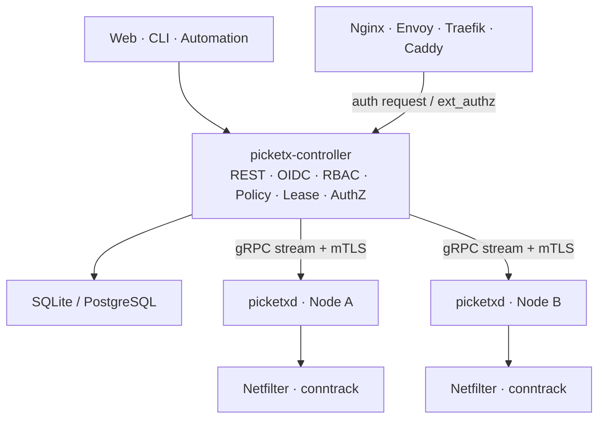

# PicketX

> English (Default) | [简体中文](README.zh-CN.md)

> A Linux service exposure gate and unified authorization plane. PicketX provides identity-, source-, and time-aware access control for SSH, databases, administrative consoles, and other services—without creating a VPN tunnel or requiring application changes.

> **Project status: architecture and design.** This repository currently contains design documents and does not yet provide a runnable release. The roadmap, interfaces, and component boundaries may still change.

## Why PicketX

Many internal services must be remotely accessible but should not remain exposed to the entire Internet. Traditional approaches often require maintaining static IP allowlists, deploying a VPN, or adding authentication logic to every application. PicketX moves access control to the system network boundary: only sources that satisfy policy may connect to a protected service during an approved time window.

PicketX makes decisions at two levels:

- **Service Exposure Gate:** decides at the Linux network layer whether a source may connect to a service now.
- **Authorization Plane:** provides a unified API that decides whether a request received by a proxy or gateway may proceed.

Applications remain responsible for their own accounts and business-level permissions. PicketX controls whether their service entry points are reachable.

## Core capabilities

- Declarative access policies based on IPv4, IPv6, protocol, port, identity, resource, and contextual conditions.
- Time-limited access through Leases, with planned support for approval, self-service source registration, and activity-based renewal.
- Policy enforcement and connection revocation at the host network layer using nftables/Netfilter and conntrack.
- Centralized management through a Controller or standalone operation using local static manifests.
- Unified authorization for existing Web services through Nginx `auth_request`, Envoy `ext_authz`, Traefik `ForwardAuth`, and similar mechanisms.
- Operational safeguards including Last Known Good state, declarative reconciliation, drift recovery, auditing, and policy simulation.
- A planned External Plugin model and WASM Policy Runtime for incorporating CMDB, ticketing, organization, and device-posture context.
- First-class IPv6 support. Dynamic access normally binds to a single IPv6 `/128` or IPv4 `/32` source.

## Use cases

- Temporarily expose high-value services such as SSH, MySQL, Proxmox VE, and internal administrative consoles.
- Centrally manage network entry across Linux hosts instead of maintaining firewall allowlists one machine at a time.
- Let users authenticate through Web/OIDC and request time-limited access for their current source address.
- Add unified identity and entry policy to legacy Web applications that are difficult to modify.
- Manage policy through local YAML in homelabs, edge devices, isolated environments, or GitOps workflows.
- Embed the Agent in gateways, NAS products, routers, or other OEM devices.

## What PicketX is not

PicketX does not create VPN tunnels, and it is not intended to replace:

- a WAF or IDS/IPS;
- reverse proxies such as Nginx, Envoy, Traefik, or Caddy;
- application-internal RBAC and business permissions;
- service-mesh features such as discovery, load balancing, retries, or circuit breaking.

## Architecture

| Component | Responsibility |
| --- | --- |
| `picketx-controller` | Manages identities, resources, policies, Leases, node state, authorization decisions, and audit records. |
| `picketxd` | Reconciles desired state on a Linux node, manages PicketX-owned nftables objects, and observes conntrack. |
| `picketx` CLI | Calls the Controller API or manages a local Agent through a Unix socket. |
| Web SPA | Provides policy management, self-service access, approvals, auditing, and operational status; it may be embedded in the Controller. |

Only `picketxd` modifies the host firewall; the Controller never manipulates nftables on a node directly. PicketX also does not terminate application TLS in the authorization path. Existing proxies remain responsible for TLS and traffic forwarding.

## Deployment modes

PicketX is designed around two fundamental operating modes:

1. **Static Manifest Mode:** a local YAML directory is the sole authoritative configuration source. This mode targets standalone hosts, homelabs, GitOps, and isolated environments.
2. **Controller Mode:** the Controller is the sole authoritative configuration source and adds OIDC, self-service access, approvals, centralized auditing, and multi-node management.

Both modes use the same validation, compilation, reconciliation, apply, and Last Known Good pipeline. Security policy from the two sources is never merged implicitly.

## Status and roadmap

| Milestone | Goal | Status |
| --- | --- | --- |
| M0 | Validate the nftables, conntrack, connection-revocation, and container host-namespace data plane | Planned |
| M1 | Static manifests, Controller, CLI, OIDC, Resource/Policy, Lease, IPv4, and IPv6 | Planned |
| M2 | PostgreSQL, gRPC streams, multi-node reconciliation, LKG, auditing, and Controller HA | Planned |
| M3 | Generic Authorization API and proxy adapters | Planned |
| M4+ | Plugins, WASM, enterprise governance, hosted control plane, and OEM support | Planned |

## Documentation

- [Architecture (English)](docs/ARCHITECTURE.md)
- [架构设计（简体中文）](docs/ARCHITECTURE.zh-CN.md)

The architecture documents describe the domain model, Linux data plane, policy semantics, Lease lifecycle, authorization service, plugin system, high availability, security boundaries, and phased implementation plan in detail.

## Contributing

PicketX is still in its design and validation phase. Feedback and contributions around use cases, threat models, the Linux data plane, policy semantics, deployment constraints, and interoperability requirements are welcome. Please read the architecture document before starting an implementation change. Changes to a major architectural decision should explicitly document their rationale and trade-offs.

## Planned licensing

The current architecture proposes GPL-3.0-or-later for `picketxd`, with an alternative commercial license for OEM use. The Controller, CLI, public protocols, and SDKs are planned to use Apache-2.0. Final licensing is governed by the formal license files added to the repository in a future release.
