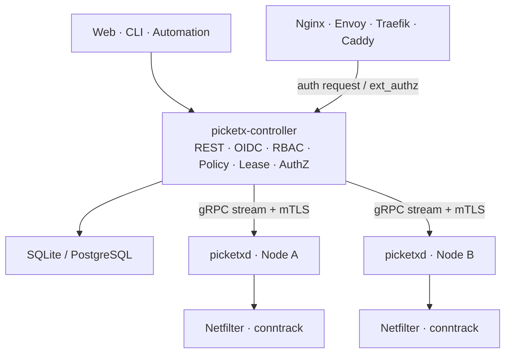

# PicketX

> [English (Default)](README.md) | 简体中文

> 面向 Linux 的服务暴露控制层与统一授权平面，在不建立 VPN 隧道、尽量不改造业务应用的前提下，为 SSH、数据库、管理后台等服务提供按身份、来源和时效控制的访问入口。

> **项目状态：架构设计阶段。** 当前仓库主要包含设计文档，尚未提供可运行版本。路线图、接口和组件边界仍可能调整。

## 为什么需要 PicketX

许多内部服务必须能够被远程访问，却不适合长期向整个公网开放。传统做法通常需要维护静态 IP 白名单、接入 VPN，或者逐个修改应用的认证逻辑。PicketX 将访问控制前移到系统网络入口：只有满足策略的来源才能在指定时间内连接受保护服务。

PicketX 在两个层面做出决策：

- **Service Exposure Gate：**在 Linux 网络层判断“这个来源现在能否连接该服务”。
- **Authorization Plane：**通过统一授权 API 判断“代理或网关收到的这个请求能否继续”。

应用仍然负责自身的账户体系和业务权限；PicketX 负责服务入口是否可达。

## 核心能力

- 基于 IPv4、IPv6、协议、端口、身份、资源和条件的声明式访问策略。
- 通过具有 TTL 的 Lease 提供临时访问，并支持审批、自助登记来源和活动续期。
- 使用 nftables/Netfilter 与 conntrack 在主机网络层执行策略和撤销连接。
- 支持 Controller 集中管理，也支持无 Controller 的 Static Manifest 独立运行。
- 通过 Nginx `auth_request`、Envoy `ext_authz`、Traefik `ForwardAuth` 等机制为现有 Web 服务接入统一授权。
- 以 Last Known Good、声明状态协调、漂移恢复、审计和策略模拟提升可运维性。
- 规划 External Plugin 与 WASM Policy Runtime，用于接入 CMDB、工单、组织和设备状态等外部上下文。
- 将 IPv6 作为一等公民，动态访问默认绑定到单个 IPv6 `/128` 或 IPv4 `/32` 来源。

## 适用场景

- 临时开放 SSH、MySQL、Proxmox VE、内部管理后台等高价值服务。
- 集中管理多台 Linux 主机的网络入口，替代逐台维护防火墙白名单。
- 用户通过 Web/OIDC 认证后，为当前来源申请限时访问。
- 为不便修改的老旧 Web 应用补充统一身份与入口策略。
- 在 Homelab、边缘设备、隔离环境或 GitOps 流程中使用本地 YAML 管理策略。
- 将 Agent 集成到网关、NAS、路由器或其他 OEM 设备中。

## PicketX 不是什么

PicketX 不创建 VPN 隧道，也不试图替代以下系统：

- WAF 或 IDS/IPS；
- Nginx、Envoy、Traefik、Caddy 等反向代理；
- 应用内部的 RBAC 和业务权限；
- Service Mesh 的服务发现、负载均衡、重试和熔断能力。

## 系统架构



| 组件 | 职责 |
| --- | --- |
| `picketx-controller` | 管理身份、资源、策略、Lease、节点状态、授权决策和审计。 |
| `picketxd` | 在 Linux 节点上协调期望状态，管理 PicketX 自有 nftables 对象，并观察 conntrack。 |
| `picketx` CLI | 调用 Controller API，或通过 Unix socket 管理本地 Agent。 |
| Web SPA | 提供策略管理、自助访问、审批、审计和运行状态界面；可嵌入 Controller。 |

只有 `picketxd` 修改主机防火墙；Controller 不直接操作节点上的 nftables。PicketX 在授权路径中也不终止业务 TLS，TLS 和流量转发继续由现有代理负责。

## 部署模式

PicketX 规划支持两种基础运行方式：

1. **Static Manifest Mode**：本地 YAML 目录是唯一权威配置源，适合单机、Homelab、GitOps 和隔离环境。
2. **Controller Mode**：Controller 是唯一权威配置源，提供 OIDC、自助访问、审批、集中审计和多节点管理。

两种模式复用同一套校验、编译、协调、应用和 Last Known Good 流程，但不会隐式合并两个来源的安全策略。

## 当前进度与路线图

| 阶段 | 目标 | 状态 |
| --- | --- | --- |
| M0 | 验证 nftables、conntrack、连接撤销和容器 Host Namespace 数据面 | 规划中 |
| M1 | Static Manifest、Controller、CLI、OIDC、Resource/Policy、Lease、IPv4/IPv6 | 规划中 |
| M2 | PostgreSQL、gRPC Stream、多节点协调、LKG、审计和 Controller HA | 规划中 |
| M3 | 通用 Authorization API 与代理适配器 | 规划中 |
| M4+ | 插件、WASM、企业治理、托管控制面与 OEM | 规划中 |

## 文档

- [架构设计（简体中文）](docs/ARCHITECTURE.zh-CN.md)
- [Architecture (English)](docs/ARCHITECTURE.md)

架构文档详细描述了领域模型、Linux 数据面、策略语义、Lease 生命周期、授权服务、插件体系、高可用、安全边界和分阶段实施计划。

## 开发

仓库采用 Rust Workspace 组织。Web SPA 在 `apps/web` 下保持独立边界，待前端技术选型确定后再生成具体工程。

```text
crates/              可复用的领域与基础设施库
apps/controller/     Controller 与授权服务
apps/agent/picketxd/ Linux 特权数据面 Agent
apps/cli/            命令行客户端
apps/web/            Web SPA
```

使用以下命令验证当前 Workspace：

```bash
cargo fmt --check
cargo check --workspace
cargo test --workspace
cargo clippy --workspace --all-targets
```

## 参与项目

项目仍处于设计与验证阶段。欢迎围绕使用场景、威胁模型、Linux 数据面、策略模型、部署约束和互操作需求提出 Issue 或参与讨论。开始实现前，请先阅读架构文档，确保变更符合项目边界；如需改变关键决策，应通过明确的设计记录说明取舍。

## 许可证计划

当前架构计划将 `picketxd` 以 GPL-3.0-or-later 发布，并为 OEM 场景提供替代商业授权；Controller、CLI、公开协议与 SDK 默认采用 Apache-2.0。最终授权以仓库后续发布的正式许可证文件为准。
