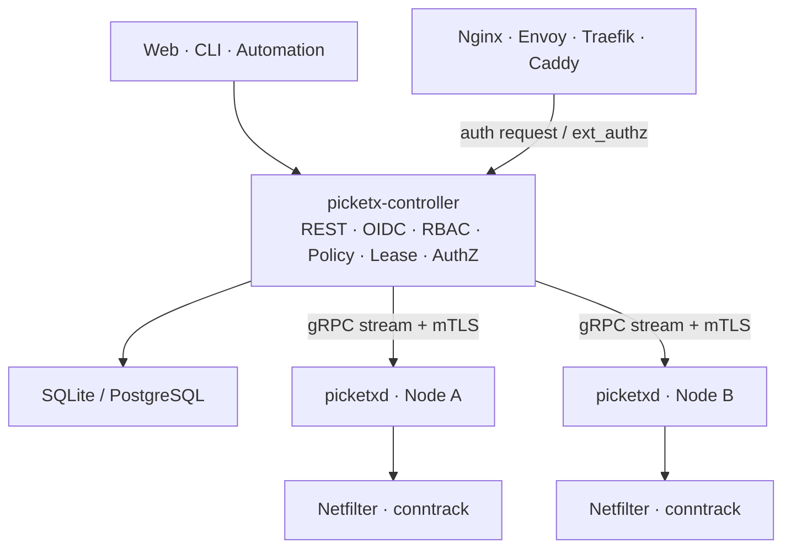
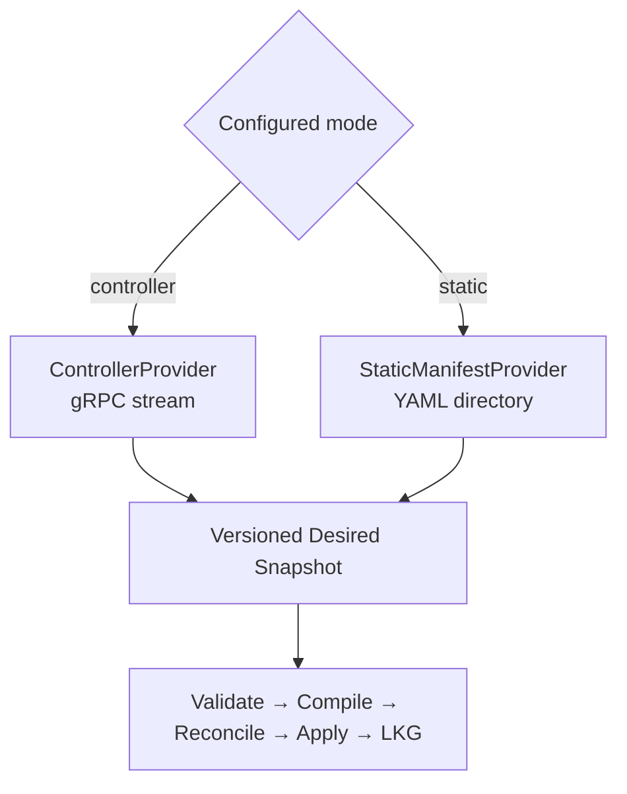
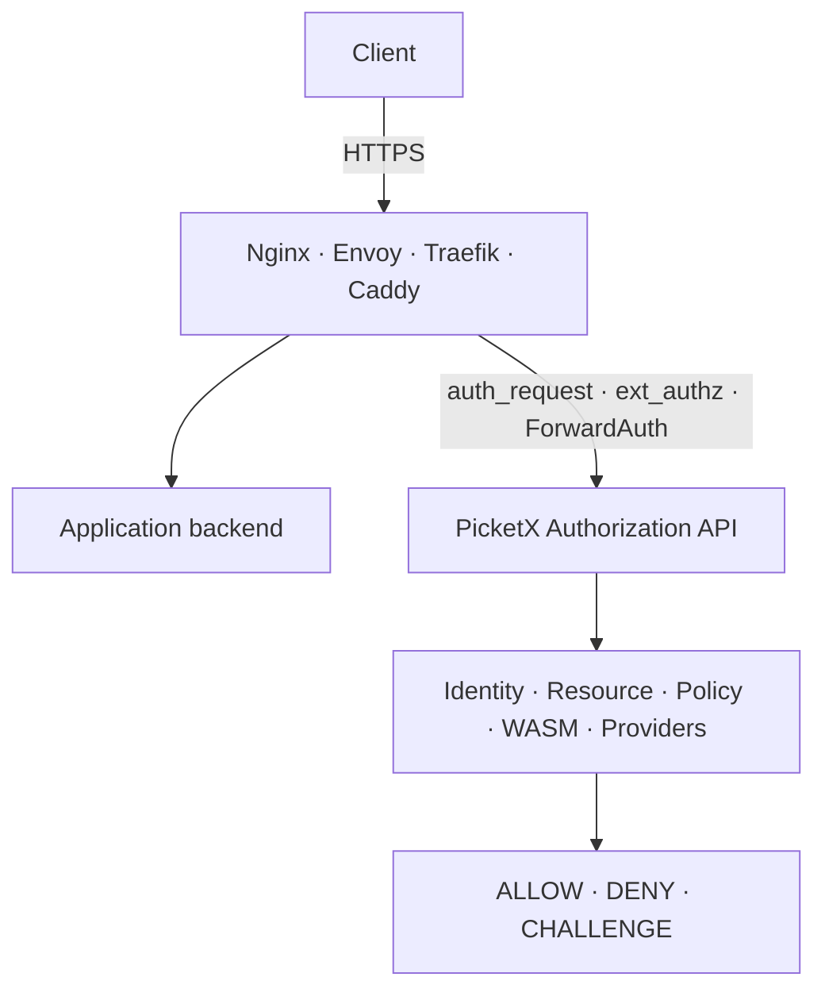
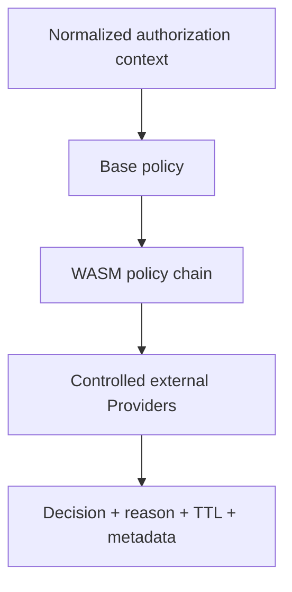
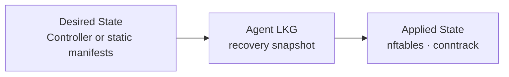

# PicketX Architecture

> English (default) | [简体中文](./ARCHITECTURE.zh-CN.md)

| Field | Value |
| --- | --- |
| Version | v0.4 |
| Date | 2026-09-02 |
| Status | Design draft |
| Project | PicketX |

**Design principles:** service availability first · minimal application changes · verifiable data plane · governable control plane · evolvable extension model

## Document purpose

This document is the top-level product and system architecture for PicketX. It defines the product boundary, domain model, functional architecture, deployment models, Linux data plane, control plane, authorization service, plugin and WASM model, reliability, security, licensing boundaries, and phased delivery plan.

Product requirements, APIs, database schemas, protocol specifications, implementation ADRs, and operational runbooks should conform to this document unless an explicit superseding decision is recorded.

## Current architectural decisions

| Decision | Current direction |
| --- | --- |
| Product position | A Linux system-level **Service Exposure Gate + Authorization Plane** that decides whether a service is reachable and provides unified authorization decisions to proxies and gateways. |
| Core data plane | nftables/Netfilter + conntrack; NFQUEUE for bounded first-packet or initial-flow inspection; TPROXY for optional advanced interception. |
| Core processes | `picketx-controller`, `picketxd`, and the `picketx` CLI. The Web SPA may be embedded in the Controller. |
| Authorization | A generic Authorization API. Nginx `auth_request`, Envoy `ext_authz`, Traefik `ForwardAuth`, and similar mechanisms are adapters. |
| HTTPS boundary | PicketX does not terminate application TLS in the authorization path. TLS termination and HTTP forwarding remain the responsibility of Nginx, Envoy, Traefik, Caddy, or another proxy. |
| Extensibility | Public external-plugin protocol and WASM policy runtime. Native and external plugins have distinct trust and licensing boundaries. |
| `picketxd` licensing | GPL-3.0-or-later community license, an alternative OEM commercial license, and contributor agreements granting the project the rights needed for approved relicensing. |
| Other component licensing | Controller, CLI, public protocols and SDKs, and external-plugin SDK use Apache-2.0 by default. |

## Contents

1. [Product position and design principles](#1-product-position-and-design-principles)
2. [Target scenarios and non-goals](#2-target-scenarios-and-non-goals)
3. [Business architecture and domain model](#3-business-architecture-and-domain-model)
4. [Overall system architecture](#4-overall-system-architecture)
5. [Control-plane design](#5-control-plane-design)
6. [Agent and Linux data plane](#6-agent-and-linux-data-plane)
7. [Network policy and permission model](#7-network-policy-and-permission-model)
8. [Leases, activity renewal, and connection lifecycle](#8-leases-activity-renewal-and-connection-lifecycle)
9. [Authorization Service](#9-authorization-service)
10. [Plugin and WASM architecture](#10-plugin-and-wasm-architecture)
11. [APIs and protocols](#11-apis-and-protocols)
12. [Data and state architecture](#12-data-and-state-architecture)
13. [High availability, synchronization, and consistency](#13-high-availability-synchronization-and-consistency)
14. [Security design](#14-security-design)
15. [Observability and operations](#15-observability-and-operations)
16. [Deployment models](#16-deployment-models)
17. [Licensing and code boundaries](#17-licensing-and-code-boundaries)
18. [Phased delivery plan](#18-phased-delivery-plan)
19. [Risks and design constraints](#19-risks-and-design-constraints)
20. [Appendix](#20-appendix)

## 1. Product position and design principles

PicketX is first and foremost a **Service Exposure Gate**. It operates before application authentication and controls whether a network source may connect to a resource during a given time window.

It is not a traditional VPN and does not create a tunnel. It is not a full WAF or IDS, and it does not replace an application's own accounts and business-level authorization.

> **In one sentence:** PicketX provides VPN-like access without a tunnel, plus a system-level authorization plane. The network layer answers “may this source connect?”, the Authorization Service answers “may this entry request proceed?”, and the application remains responsible for its own internal accounts and business permissions.

The following principles govern the design:

- **IPv6 is a first-class citizen.** Dynamic self-service access normally binds to an IPv6 `/128` or IPv4 `/32`. CIDRs are primarily an administrative policy mechanism, not the default representation of a dynamic session.
- **Prefer zero application changes.** SSH, MySQL, PVE, internal Web systems, and vendor software should normally be protected at the host network layer or through an existing proxy authorization hook.
- **Do not rebuild mature infrastructure.** Linux, Nginx, Envoy, Traefik, Caddy, and similar systems continue to provide forwarding, TLS, HTTP/2 and HTTP/3, WAF, and proxy functions.
- **Use declarative control.** The authoritative source produces Desired State, the Agent persists a Last Known Good snapshot, and nftables/conntrack represent Applied State.
- **Separate policy from enforcement.** Domain objects, policy compilation, Netfilter enforcement, and authorization adapters are separate layers.
- **Make security behavior explicit.** Safety/performance trade-offs must be policy switches with documented data-plane behavior, not hard-coded hidden choices.
- **Prefer explainability, auditability, and rollback.** PicketX should not become an unconstrained DPI platform.

## 2. Target scenarios and non-goals

### 2.1 Target scenarios

- Expose SSH, databases, PVE, administrative consoles, and other high-value services to the Internet or office network while allowing only authenticated or approved sources temporary access.
- Manage network entry across multiple nodes and environments without manually maintaining iptables or nftables on each host.
- Let a user register the current source IP through Web/OIDC and receive a time-limited Source Lease.
- Add unified identity and policy to legacy Web applications through Nginx `auth_request`, Envoy `ext_authz`, or a ForwardAuth integration, without changing application code.
- Use CMDB, ticketing, organization, on-call, device posture, and other enterprise context in access decisions.
- Embed the Agent in security gateways, NAS products, routers, or operations platforms through an OEM model.
- Run a single host, edge device, isolated environment, or GitOps-managed installation without a Controller.

### 2.2 Explicit non-goals

| Capability | Core capability? | Boundary |
| --- | --- | --- |
| VPN tunnel | No | PicketX creates no overlay or tunnel; it controls reachability over the real network. |
| Full WAF | No | HTTP metadata may participate in authorization, but PicketX does not perform general SQL injection, XSS, or body inspection. |
| Full IDS/IPS | No | NFQUEUE performs bounded initial-flow inspection and authorization support, not long-lived DPI. |
| Reverse proxy | No | The Authorization Service does not terminate application TLS or forward application traffic. |
| Application-internal RBAC | No | PicketX controls the entry boundary; the application retains its business permissions. |
| Service mesh | No | PicketX does not provide discovery, load balancing, retry, circuit breaking, or general mesh behavior. |

## 3. Business architecture and domain model

The domain model deliberately separates network source, resource, permission, lifetime, identity, and authorization decision. IP addresses, users, policies, and sessions must not collapse into one object.

| Domain object | Responsibility | Key semantics |
| --- | --- | --- |
| Node | A host running `picketxd` | Labels, capabilities, desired/applied revision, status |
| Resource | A service or entry point governed by PicketX | Name, selector, destination, protocol, port, labels |
| Source | A network origin | IPv4/IPv6 address or CIDR; a Source is not a user identity |
| Subject | An identity principal | User, group, service identity, OIDC claims, external attributes |
| Grant / Permission | A Subject's permission to access a Resource | Allow/deny, scope, hard expiry |
| Lease | Time-bounded source or authorization state | `expires_at`, renewal policy, activity state |
| Policy | A declarative access rule | Subjects, sources, resources, conditions, effect |
| Authorization Request | One entry-level authorization evaluation | Subject + Source + Resource + request context |
| Decision | The result of an authorization evaluation | Allow/deny/challenge, reason, TTL, metadata |
| Plugin | An extension capability | Capability, version, sandbox, configuration |

> **Definition of ALL:** `ALL` means all Resources managed by PicketX. It never means every port or all traffic on a host.

## 4. Overall system architecture



- **Northbound:** Web, CLI, and automation clients use the Controller's REST/JSON/OpenAPI interface.
- **Southbound:** Agents initiate long-lived gRPC/protobuf connections to the Controller using mTLS.
- **Local administration:** `picketx agent status`, `doctor`, `dump`, `reconcile`, and `reload` use a local Unix socket.
- **Authorization:** Proxies and gateways call the Controller or a dedicated AuthZ endpoint.
- **Enforcement:** Only `picketxd` modifies `table inet picketx`. The Controller never manipulates a host firewall directly.

## 5. Control-plane design

### 5.1 Controller responsibilities

- Users, groups, OIDC, RBAC, and organization mapping.
- Resource, Node, Policy, Lease, label, and selector management.
- Compilation of global Desired State into per-node Desired State.
- Agent enrollment, capability discovery, heartbeats, revision synchronization, and status aggregation.
- Authorization Engine for generic authorization, `auth_request`, `ext_authz`, and ForwardAuth integrations.
- Audit, approval, policy simulation, WASM policy, and external Provider management.
- SQLite for lightweight single-controller deployments and PostgreSQL for clustered deployments.

### 5.2 Kubernetes-inspired, not Kubernetes-reimplemented

| Borrowed concept | Use in PicketX | Deliberately excluded |
| --- | --- | --- |
| `spec` / `status` | Separate declared and observed state | No generic CRD platform |
| Labels / selectors | Select Nodes for Resource placement | No nested NodeGroup hierarchy in v1 |
| `generation` / `observedGeneration` | Track desired and applied progress | No etcd dependency for the initial design |
| Reconciliation | Eventual consistency and drift recovery | No scheduler |
| Watch / revision | Incremental distribution and wake-up | `LISTEN/NOTIFY` is not treated as a reliable log |

## 6. Agent and Linux data plane

`picketxd` is the only privileged data-plane process. It must run independently of the Controller. The default binary includes Agent/Reconcile, nftables, NFQUEUE Inspector, and TPROXY-related capabilities; NFQUEUE and TPROXY may be explicitly disabled.

Missing core nftables/conntrack capabilities are fatal. Missing optional capabilities only disable the affected feature.

| Module | Responsibility |
| --- | --- |
| Desired State Provider | Receives state from the Controller in Controller Mode or scans local YAML manifests in Static Manifest Mode. Exactly one provider is authoritative. |
| Controller Client | Establishes the mTLS stream, receives snapshots or deltas, and reports applied status. |
| Static Manifest Watcher | Watches a directory, parses all YAML manifests, validates them, and builds a candidate Desired Snapshot. |
| Desired/LKG Store | Persists the last valid configuration, absolute expiry times, provider identity, `boot_id`, and recovery metadata. |
| Reconciler | Compiles and applies unified Desired State to PicketX-owned nftables objects. |
| nftables Backend | Uses libnftnl/libmnl to operate nf_tables. |
| Conntrack Backend | Uses libnetfilter_conntrack/ctnetlink to observe and delete connections. |
| Activity Monitor | Derives Source/Lease activity from conntrack lifecycle events. |
| NFQUEUE Inspector | Performs bounded initial-packet inspection with strict byte, packet, and time budgets. |
| TPROXY Runtime | Supports optional advanced capabilities that require continued userspace interception. |
| Drift Monitor | Combines Netlink events and periodic consistency scans to repair drift. |
| Local Admin API | Exposes status, doctor, dump, reconcile, and reload over a Unix socket. |

### 6.1 Controller Mode and Static Manifest Mode

Controller availability is not a runtime prerequisite for `picketxd`. The two modes only change the authoritative Desired State source. Both reuse the same validation, compilation, reconciliation, apply, and LKG pipeline.



The following rules are mandatory:

1. Startup configuration explicitly selects `controller` or `static`. One `picketxd` instance has exactly one authoritative Desired State Provider at a time.
2. **Controller Mode:** the Controller is the sole authority for Security Desired State. Local manifests containing Resource, Policy, Lease, Authorization Rule, or other security objects never merge with or override Controller state.
3. Local `/etc/picketx/picketxd.yaml` remains valid in Controller Mode, but it contains only Agent Runtime Configuration: Controller endpoint, certificates, logging, data directory, NFQUEUE/TPROXY switches, health/metrics endpoints, and LKG location.
4. Runtime Configuration and Security Desired State are separate namespaces and models.
5. If static manifests are present in Controller Mode, `picketxd` ignores them and emits a prominent warning. A strict deployment option may reject startup instead.
6. **Static Manifest Mode:** the manifest directory is the sole authority for Security Desired State. The Controller does not distribute policy to the Agent.
7. Switching provider replaces the complete Desired Snapshot atomically. State from two providers is never layered or implicitly merged.
8. LKG records the provider type and identity. An LKG produced by one provider cannot be restored as authoritative state for another provider.

#### Static Manifest semantics

- The default directory is conceptually `/etc/picketx/manifests/`; the exact path is runtime-configurable.
- All `*.yaml` and `*.yml` files, including multi-document YAML, form one complete Desired State snapshot.
- Create, write, rename, and delete events trigger a debounced full rescan.
- The new snapshot is parsed, schema-validated, cross-resource validated, and compiled in full. Only a completely valid candidate is atomically committed.
- Any invalid file leaves the previous LKG and Applied State active. Partial application is forbidden.
- Object identity, normally `(apiVersion, kind, metadata.name)`, must be unique. Duplicate objects invalidate the candidate; “last file wins” is not allowed.
- inotify/fsnotify reduces latency, while a low-frequency directory rescan protects against event loss, rename-write behavior, and mounted-filesystem differences.
- `SIGHUP` and `picketx agent reload` trigger an explicit rescan.
- `status` and `doctor` expose generation, source files, content hash, last successful reload, last failure, and validation errors.
- Static and Controller modes use the same versioned domain schema so Resources and Policies can migrate between them.
- Git, Ansible, Salt, Puppet, cloud-init, Ignition, NixOS, OCI extraction, or another external mechanism updates the directory. `picketxd` does not embed a Git client in v1.

Example static manifest:

```yaml
apiVersion: picketx.io/v1alpha1
kind: Resource
metadata:
  name: ssh-admin
  labels:
    environment: production
spec:
  destination: local
  protocol: tcp
  ports: [22]
---
apiVersion: picketx.io/v1alpha1
kind: NetworkPolicy
metadata:
  name: office-ssh
spec:
  sources:
    - 2001:db8:100::/64
  resources:
    - ssh-admin
  effect: allow
```

Static Manifest Mode initially targets static Resources and Policies, fixed or absolute-expiry Leases, and local enforcement. OIDC self-service, centralized approval, and multi-node aggregation require Controller Mode.

A future **Emergency Override / Break-glass** capability may exist, but it must not become an ordinary Controller-plus-static merge. It requires its own ownership domain, precedence, audit, narrow scope, and automatic expiry. It is outside v1.

### 6.2 nftables ownership

- PicketX owns the fixed table `table inet picketx`.
- All objects use the `picketx_` prefix; internal objects may use `picketx__`.
- PicketX does not modify tables owned by Docker, firewalld, or another manager.
- The recommended primary hook is host-namespace `PREROUTING` around priority `-110`, after conntrack and before DNAT, so external destination information remains visible.

### 6.3 Netfilter C dependencies

| Library | Purpose | License |
| --- | --- | --- |
| libmnl | Netlink socket and attribute helpers | LGPL-2.1+ |
| libnftnl | Low-level nf_tables Netlink API | GPL-2.0+ |
| libnetfilter_conntrack | Conntrack query, update, and deletion | GPL-2.0+ |

The initial implementation uses mature Netfilter userspace libraries for development speed and reliability. If a proprietary OEM build must avoid linking third-party GPL libraries, the backend boundary should allow a permissively licensed or pure-Rust nf_tables/ctnetlink implementation.

## 7. Network policy and permission model

The effective rule tuple is:

```text
Source CIDR × Destination CIDR/LOCAL × Protocol(TCP/UDP) × Port/Range
```

ALLOW and DENY use separate membership sets. DENY takes precedence over ALLOW in the effective policy.

- nftables concatenated interval sets represent CIDR, destination, protocol, and port-range combinations without expanding them into large discrete rule lists.
- Semantically equivalent membership may be auto-merged, but original policy provenance and TTL remain in the Controller. Kernel sets are not an audit database.
- Dynamic sessions default to exact hosts: IPv4 `/32` and IPv6 `/128`. CIDR-based dynamic renewal is an explicit advanced policy.
- Policy deletion or expiry blocks new connections by default while established connections continue gracefully.
- Strict revoke first updates Desired State, then deletes matching PicketX conntrack entries.
- Where multiple permissions or Leases overlap, expiry synchronization is a policy choice: immediate recompilation for high-security use, or fixed-interval batch refresh to reduce control-plane and kernel update load.

## 8. Leases, activity renewal, and connection lifecycle

### 8.1 Separate Lease from Activity

The Controller is authoritative for hard expiry. The Agent only reports observed activity. Activity renewal must not refresh nftables timeout on every packet or turn the database into a real-time data plane.

| Renewal policy | Meaning | Recommended use |
| --- | --- | --- |
| `disabled` | Fixed absolute expiry only | Simple or high-security deployments |
| `unique-only` | Renew only when exactly one renewable SourceLease matches | Recommended safe default |
| `most-specific` | Renew the longest-prefix match | Balance exact sources and managed CIDRs |
| `least-specific` | Renew the shortest-prefix match | Specialized administrative policies only |
| `all-matched` | Renew every matching prefix | Most convenient and highest risk |

The runtime SourceLeaseIndex should use IPv4 and IPv6 Patricia or compressed radix tries. One path lookup can produce the first, last, or all matches. A first scalability target is 100,000 active dynamic sources.

### 8.2 Conntrack semantics

- A legal new flow receives `ct mark = PICKETX_ALLOW`.
- The Agent subscribes to conntrack `NEW`, `UPDATE`, and `DESTROY` events and recovers through dump/reconcile after event loss or restart.
- TCP creates a new PicketX authorization only for the initial SYN (`SYN && !ACK`). After conntrack deletion, an old ACK/PSH packet cannot resurrect authorization.
- **Force Re-authenticate** invalidates the SourceSession and deletes matching PicketX conntrack entries. It is not a blacklist.
- After a UDP conntrack entry is deleted, the next datagram begins a new pseudo-flow and must be authorized again.

## 9. Authorization Service

The Authorization Service is a second enforcement integration, independent of TPROXY. It does not proxy application traffic. It accepts authorization callbacks from Nginx, Envoy, Traefik, Caddy, and other gateways, then evaluates PicketX Identity, Resource, Policy, WASM, Providers, and audit rules.



### 9.1 Normalized authorization context

| Context | Examples |
| --- | --- |
| Subject | User, groups, OIDC claims, service identity |
| Source | Source IP, Lease, device context |
| Resource | Resource ID, environment, owner, labels |
| Request | Host, method, path, selected headers |
| Node | Region, environment, capabilities |
| External Attributes | CMDB, ticket, on-call state, risk score |
| Decision Metadata | Reason, TTL, response headers, policy ID |

### 9.2 Adapters

- Nginx `auth_request`
- Envoy `ext_authz` over HTTP or gRPC
- Traefik `ForwardAuth`
- Caddy `forward_auth`
- Generic HTTP Authorization API

PicketX may return integration headers such as identity, groups, decision reason, or matched policy. The upstream application does not need to understand PicketX unless it chooses to consume those headers.

### 9.3 HTTPS boundary

PicketX does not need to read encrypted application traffic. The proxy terminates TLS and sends only the identity and HTTP metadata required for authorization. This supports expressive authorization without turning PicketX into an HTTPS proxy, WAF, or service mesh.

### 9.4 Fail behavior and caching

- Each Resource explicitly selects fail-closed or fail-open behavior. Security-sensitive Resources default to fail-closed.
- Timeouts are bounded and included in adapter configuration guidance.
- Positive and negative decisions may be cached only within the TTL returned by the Authorization Engine and within the revocation guarantees of the selected policy.
- Audit records must preserve the normalized request, decision reason, policy provenance, and correlation ID without indiscriminately storing sensitive headers.

## 10. Plugin and WASM architecture

### 10.1 Extension layers

| Type | Process boundary | Purpose | Licensing direction |
| --- | --- | --- | --- |
| Native Plugin | Same process/address space | Very high-performance, tightly coupled data-plane capabilities | GPL-compatible by default; expose cautiously |
| External Plugin | Separate process over Unix socket/gRPC | Enterprise integrations, Providers, extension logic | Apache-2.0 SDK; plugin license is independent |
| WASM Policy | Sandboxed runtime | Authorization and policy decision extensions | Module distribution policy may vary |

The public ecosystem should prefer External Plugins and WASM. Native plugins are reserved for capabilities that cannot meet latency or data-access needs over RPC/WASM, reducing trust and copyleft expansion.

### 10.2 WASM execution position

WASM belongs in the policy decision path, not the packet fast path.



The WASM Host API may expose:

- `get_subject`, `get_resource`, `get_request`, and `get_source`
- `get_attribute` and labels
- namespace-scoped `kv_get`
- `call_provider(name, request)` through a controlled Provider proxy
- `log` and `metric`
- return of `decision`, `reason`, `ttl`, and metadata

Arbitrary networking, filesystem access, and system calls are denied by default. All external access passes through controlled Host APIs with auditing, timeout, circuit breaking, and permission checks.

## 11. APIs and protocols

| Interface | Protocol | Consumers | Design principles |
| --- | --- | --- | --- |
| Northbound API | HTTPS REST/JSON/OpenAPI | Web, CLI, automation | Stable, versioned, resource-oriented |
| Southbound protocol | gRPC/protobuf + mTLS | `picketxd` | Agent-initiated, bidirectional stream, snapshot/delta |
| Authorization API | HTTP/gRPC adapters | Nginx, Envoy, Traefik, Caddy, others | Low latency, explicit timeout and fail mode, cacheable |
| Local Agent API | Unix socket | Local CLI and diagnostics | No external TCP listener by default |
| External Plugin Protocol | Unix socket/gRPC | External plugins | Public and stable, capability registration, structured context |

All public protocols are explicitly versioned. Backward compatibility rules belong in protocol-specific specifications, not implicit implementation behavior.

## 12. Data and state architecture

PicketX has three state layers:



- The Reconciler never needs to know whether the snapshot came from a Controller or YAML. Both providers first produce the same versioned Desired Snapshot.
- In Static Manifest Mode, the directory is the declarative source of truth. LKG is only the last successfully compiled and applied recovery copy; it never overwrites the manifests.
- LKG records provider type and identity to prevent restoration from the wrong source after a mode change or restart.
- Core CIDR, TTL, overlap, and renewal semantics live in the Rust domain layer so SQLite and PostgreSQL behave consistently.
- SQLite supports a single lightweight Controller. PostgreSQL supports multiple Controllers sharing authoritative state.
- Rebuildable in-memory indexes serve high-frequency queries. The database is not scanned for every connection or renewal.
- The Controller maintains monotonic revisions. Agents report observed revision and semantic hash for synchronization and drift detection.
- Persistence stores absolute `expires_at`, not relative TTL values that are meaningful only within one boot.

## 13. High availability, synchronization, and consistency

- Do not build a custom Raft implementation.
- In PostgreSQL mode, Controllers are as stateless as practical; each instance owns its current Agent streams.
- PostgreSQL `LISTEN/NOTIFY` is a wake-up mechanism only. Correctness depends on rereading by revision.
- Singleton scheduled jobs may use PostgreSQL advisory locks.
- An Agent that falls too far behind receives a full snapshot rather than an indefinitely complex replay history.
- The Agent reads `boot_id` on startup and reconstructs the PicketX table from a valid provider-bound LKG after host restart.
- nftables semantic hashes are canonicalized and exclude handles, counters, remaining TTL, and other volatile fields.
- Controller loss does not erase current enforcement. The Agent continues from LKG until state expires according to absolute policy semantics.

## 14. Security design

| Risk | Architectural response |
| --- | --- |
| Controller compromise | mTLS, least privilege, audit, approval, and optional multi-party change control |
| Agent compromise | Only the Agent receives `NET_ADMIN`; local API protected by Unix socket permissions |
| Policy misconfiguration | Dry run, policy simulation, revisions, LKG, and fast rollback |
| Authorization timeout | Per-Resource fail mode; security-sensitive Resources default to fail-closed |
| NFQUEUE congestion | Strict timeout, bounded prefix, selected bypass/failure policy, queue-depth monitoring |
| Plugin risk | External process isolation, WASM sandboxing, and Host API allowlists |
| Source impersonation | IP/CIDR is explicitly a network identity; Subject identity comes from OIDC/session/Provider |
| Replay or stale connection | Only TCP SYN creates new authorization; strict revoke deletes conntrack |
| Configuration-source confusion | Exactly one authoritative Desired State Provider; provider-bound LKG; no implicit merge |

Privilege separation should be tightened over time. Components that do not require `CAP_NET_ADMIN` should run without it, and the public network surface of the privileged Agent should remain minimal.

## 15. Observability and operations

- **Metrics:** policy compile latency, apply latency, Agent connectivity, authorization decision latency, allow/deny counts, NFQUEUE queue depth, conntrack reconciliation, WASM latency, provider errors, and LKG age.
- **Audit:** policy changes, Lease requests and approvals, matched authorization policies, strict revocation, mode changes, and reload outcomes.
- **Logs:** structured JSON with Node, Resource, Policy, revision, provider identity, trace ID, and decision correlation where applicable.
- **Health:** Controller readiness/liveness, local Agent health, and Netfilter capability probes.
- **Doctor:** kernel modules, nftables capabilities, conntrack, NFQUEUE, TPROXY, routing, permissions, configuration source, manifest validation, and Controller connectivity.

## 16. Deployment models

| Model | Controller | Agent | Typical use |
| --- | --- | --- | --- |
| Static Manifest | None | One or more standalone Agents watching local YAML | Homelab, single server, GitOps, rescue or isolated environment |
| Local Controller | Single Controller + SQLite | One to a few Nodes | Homelab or PoC requiring Web/OIDC/self-service |
| Team | One or two Controllers + PostgreSQL | Tens to hundreds of Nodes | Teams and small-to-medium organizations |
| Enterprise | Multiple Controllers + PostgreSQL HA | Hundreds to thousands of Nodes | Central governance and compliance |
| Cloud | PicketX-hosted Controller | Customer Nodes connect outbound | SaaS |
| OEM | No Controller, vendor control plane, or PicketX Controller | Embedded Agent | Gateway, NAS, router, or security appliance |

If a containerized Agent controls the host firewall, use host networking and `CAP_NET_ADMIN` where possible instead of full `privileged` mode. nftables and Netfilter operate within a network namespace, so the deployment must intentionally target the host namespace.

## 17. Licensing and code boundaries

| Component | Default license or grant | Rationale |
| --- | --- | --- |
| `picketxd` | GPL-3.0-or-later + alternative OEM Commercial License | Keep the data plane open while preserving a commercial OEM path. |
| Controller | Apache-2.0 | Encourage integration, modification, and enterprise adoption. |
| CLI | Apache-2.0 | Avoid copyleft friction at the primary tooling boundary. |
| Protocols / public SDKs | Apache-2.0 | Permit integration from any language or commercial system. |
| External Plugin SDK | Apache-2.0 | Maximize ecosystem adoption. |
| Native plugin ABI | Inside the GPL Agent boundary | In-process plugins must be GPL-compatible by default unless a later legal and licensing design states otherwise. |

### 17.1 Contributor mechanism

To preserve the ability to distribute `picketxd` under the community GPL license and approved OEM commercial licenses, contributors retain copyright in their contributions but must grant the project entity the permanent, worldwide, irrevocable, and sublicensable rights needed for those distributions and approved relicensing.

The final CLA or contribution agreement must be reviewed by qualified open-source counsel before publication. This architecture document records product intent, not legal advice.

### 17.2 Current third-party GPL constraint

An OEM Commercial License can cover only code the project has the right to relicense. If a commercial binary links libnftnl or libnetfilter_conntrack, the project cannot waive the Netfilter copyright holders' GPL terms.

A genuinely proprietary OEM Agent may therefore require a permissively licensed or pure-Rust nftables/ctnetlink backend that replaces those userspace GPL dependencies.

## 18. Phased delivery plan

| Phase | Goal | Scope |
| --- | --- | --- |
| M0 Architecture PoC | Validate the Linux data plane | libnftnl/libnetfilter_conntrack, table/chain/set management, conntrack revoke, Docker host namespace |
| M1 Core Gate | Deliver a usable open-source network entry gate | Static Manifest hot reload, Controller, CLI, Resource/Policy, OIDC self-service, Lease, IPv4/IPv6, SQLite |
| M2 Distributed | Manage Nodes at scale | PostgreSQL, gRPC streams, labels/selectors, LKG/reconcile, audit, Controller HA |
| M3 Authorization Plane | Add Web and gateway authorization | Generic Auth API, Nginx/Traefik adapters, visual rules, decision audit |
| M4 Extensibility | Establish an ecosystem | External Plugin SDK, WASM runtime, Provider API, policy simulation |
| M5 Enterprise | Commercialize governance | Advanced approval, SCIM/LDAP, long-term audit, SIEM, HA/SLA, advanced policy |
| M6 Cloud/OEM | Scale revenue channels | Hosted control plane, billing, organizations, multi-tenancy, OEM backend and licensing |

## 19. Risks and design constraints

| Risk | Consequence | Control |
| --- | --- | --- |
| Scope expands into Cilium, WAF, or Envoy | Unsustainable implementation scope | Maintain an explicit non-goal list; inspect only the minimum context required for decisions |
| GPL and OEM conflict | Proprietary distribution blocked by third-party dependencies | Backend isolation, contributor agreement, future permissive Netlink backend |
| IP used as a complete identity | NAT and shared addresses create ambiguity | Define IP as network identity, never a replacement for OIDC/Subject |
| Authorization latency | Every Web request may be affected | Caching, short-circuiting, local/edge AuthZ, explicit timeout budgets |
| Policy overlap or conflict | Accidental allow or deny | Deny precedence, compiler validation, simulation, provenance, audit |
| Configuration-source conflict | Operators misunderstand effective policy | Exactly one authoritative provider, no merge, warnings, provider-bound LKG |
| Large state volume | Controller or Agent memory pressure | Per-node compilation, tries, snapshot/delta, 100k and 1M benchmarks |
| Optional inspection overload | Packet loss or service outage | Strict NFQUEUE/TPROXY budgets, feature switches, measurable failure policy |

## 20. Appendix

### 20.1 Recommended Rust workspace

```text
crates/
  domain/          # Apache-2.0, pure domain model
  api/             # Apache-2.0, REST DTOs and OpenAPI
  protocol/        # Apache-2.0, gRPC and protobuf
  compiler/        # Apache-2.0, global to per-node Desired State
  selector/        # Apache-2.0
  storage/         # Apache-2.0, SQLite and PostgreSQL
  authz/           # Apache-2.0, Authorization Engine
  wasm-runtime/    # Apache-2.0
  plugin-sdk/      # Apache-2.0, external plugins
  agent-state/     # Agent-internal state and snapshot model
  netfilter/       # Inside the picketxd GPL boundary
apps/
  controller/      # Apache-2.0
  agent/picketxd/  # GPL-3.0-or-later + OEM option
  cli/             # Apache-2.0
  web/             # Apache-2.0
```

### 20.2 Recommended configuration layout

```text
/etc/picketx/
  picketxd.yaml             # Agent Runtime Configuration only
  manifests/                # Security Desired State in Static Manifest Mode
    resources/
    policies/
    authz/
```

### 20.3 Normative follow-up documents

This architecture should be refined through focused documents rather than expanded indefinitely:

- Domain model and schema specification
- Static Manifest schema and validation rules
- Policy evaluation and conflict semantics
- Southbound protocol specification
- Authorization API and adapter contracts
- nftables compilation and ownership specification
- Lease and activity-renewal specification
- Threat model
- Plugin protocol and WASM Host API
- Contributor agreement and licensing policy

### 20.4 References

- [GNU GPL FAQ](https://www.gnu.org/licenses/gpl-faq.en.html) — GPL version compatibility, linking, multiple licensing, and additional permissions.
- [Apache License v2.0 and GPL compatibility](https://www.apache.org/licenses/GPL-compatibility) — Apache-2.0 compatibility with GPLv3 and incompatibility with GPLv2-only.
- [libmnl](https://netfilter.org/projects/libmnl/) — official Netlink helper library and LGPL-2.1+ licensing information.
- [libnftnl](https://www.netfilter.org/projects/libnftnl/) — official low-level nf_tables API and licensing information.
- [libnetfilter_conntrack](https://netfilter.org/projects/libnetfilter_conntrack/) — official conntrack API and licensing information.
