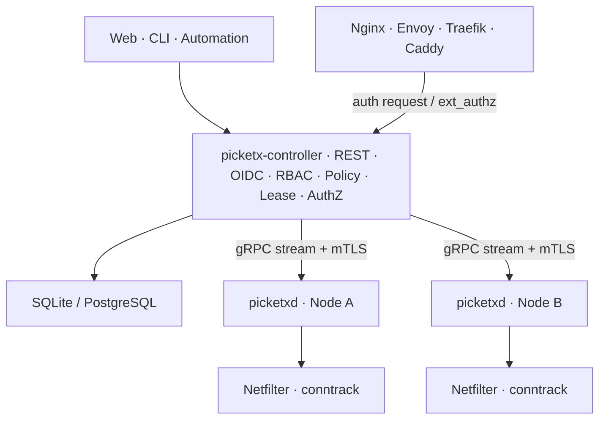
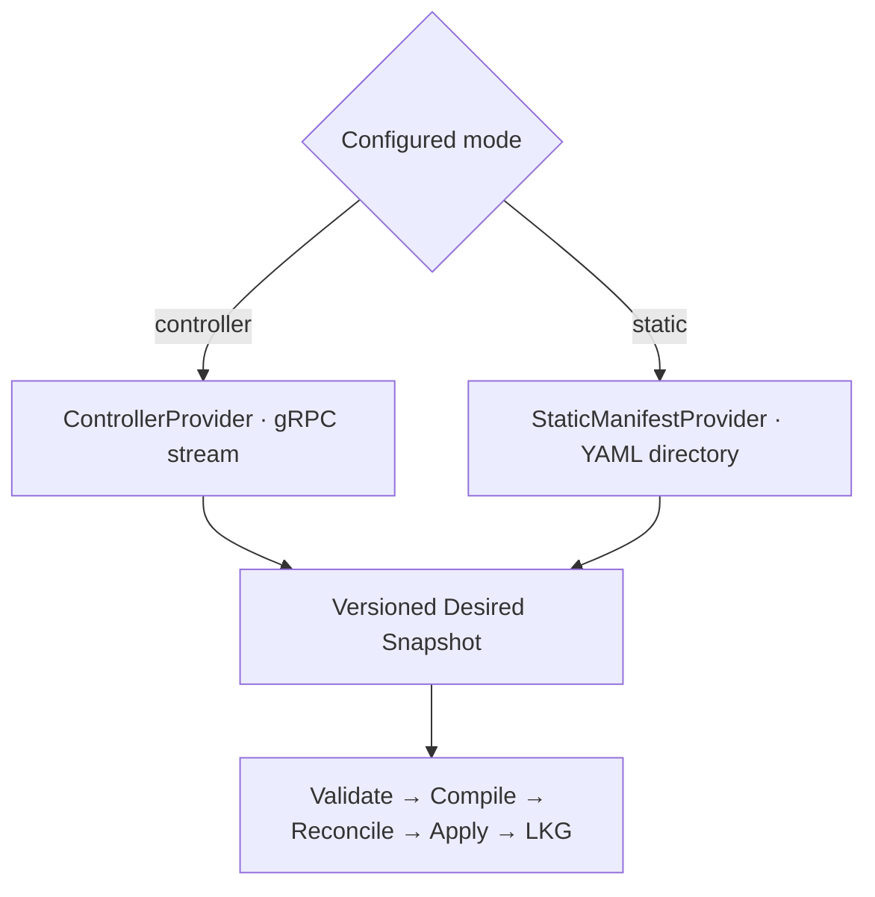
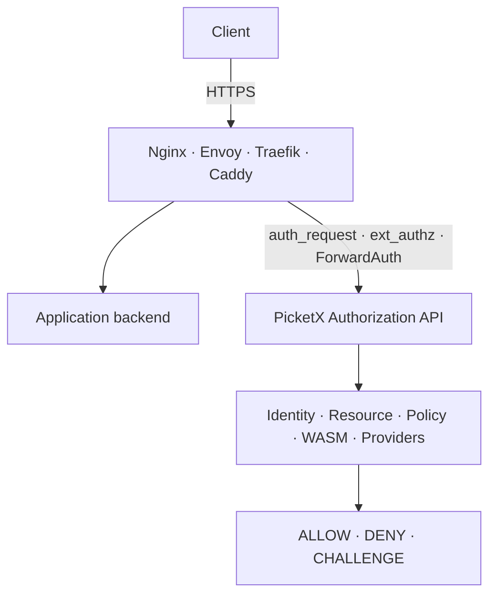
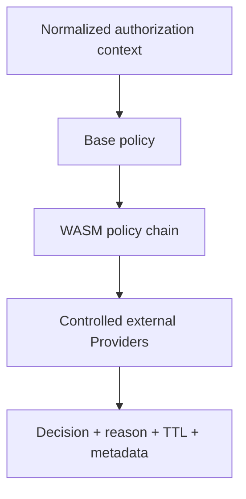

# PicketX Architecture

> English (default) | [简体中文](./ARCHITECTURE.zh-CN.md)

| Field | Value |
| --- | --- |
| Version | v0.7.0 |
| Date | 2026-10-08 |
| Status | Agreed design baseline; implementation status not asserted |
| Project | PicketX |

**Design principles:** simple access workflows · explicit IP/CIDR authorization · reliable permission lifecycle · minimal application changes · extensible enforcement

## Document purpose

This document implements the product baseline in [PRODUCT_DESIGN.md](./PRODUCT_DESIGN.md). It is the top-level system architecture for PicketX. It defines the product boundary, domain model, functional architecture, deployment models, Linux data plane, control plane, authorization service, plugin and WASM model, reliability, security, licensing boundaries, and phased delivery plan.

Product requirements, APIs, database schemas, protocol specifications, implementation ADRs, and operational runbooks should conform to this document unless an explicit superseding decision is recorded.

## Current architectural decisions

| Decision | Current direction |
| --- | --- |
| Product position | Simple, dedicated-client-free, on-demand access authorization using IP/CIDR network subjects; independent deployment or complementary protection for existing networks. |
| Network grant model | Union of active matching source grants, subject to explicit denies and conditions; requesters and approvers are provenance, not connection identities. |
| Product scope | No organization-size restriction. Authorization records are core; application behavior recording is outside scope. |
| Core data plane | nftables/Netfilter + conntrack; NFQUEUE for bounded first-packet or initial-flow inspection; TPROXY for optional advanced interception. |
| Core processes | `picketx-controller`, `picketxd`, and the `picketx` CLI. The Web SPA may be embedded in the Controller. |
| Authorization | A generic Authorization API. Nginx `auth_request`, Envoy `ext_authz`, Traefik `ForwardAuth`, and similar mechanisms are adapters. |
| HTTPS boundary | PicketX does not terminate application TLS in the authorization path. TLS termination and HTTP forwarding remain the responsibility of Nginx, Envoy, Traefik, Caddy, or another proxy. |
| Extensibility | Public external-plugin protocol and WASM policy runtime. Native and external plugins have distinct trust and licensing boundaries. |
| `picketxd` licensing | GPL-3.0-or-later community license, an alternative OEM commercial license, and contributor agreements granting the project the rights needed for approved relicensing. |
| Other component licensing | Controller, CLI, public protocols and SDKs, and external-plugin SDK use Apache-2.0 by default. |
| Backend language and repositories | Go; PicketX owns control plane/Core/Web, PicketXD owns the official Linux Agent. |
| Configuration contract | Shared versioned semantics for remote and static input; Resource/Endpoint/Grant/Binding are separate from workflow and execution models; no Namespace. |
| Frontend | React, TypeScript, Vite, shadcn/ui, Tailwind CSS, i18next, npm; separate official primitives from project compositions. |

## Contents

1. [Product position and design principles](#1-product-position-and-design-principles)
2. [Target scenarios and non-goals](#2-target-scenarios-and-non-goals)
3. [Business architecture and domain model](#3-business-architecture-and-domain-model)
4. [Overall system architecture](#4-overall-system-architecture)
5. [Control-plane design](#5-control-plane-design)
6. [Agent and Linux data plane](#6-agent-and-linux-data-plane)
7. [Network policy and permission model](#7-network-policy-and-permission-model)
8. [Leases, activity renewal, and connection lifecycle](#8-leases-activity-renewal-and-connection-lifecycle)
9. [Authorization Service](#9-authorization-service)
10. [Plugin and WASM architecture](#10-plugin-and-wasm-architecture)
11. [APIs and protocols](#11-apis-and-protocols)
12. [Data and state architecture](#12-data-and-state-architecture)
13. [High availability, synchronization, and consistency](#13-high-availability-synchronization-and-consistency)
14. [Security design](#14-security-design)
15. [Observability and operations](#15-observability-and-operations)
16. [Deployment models](#16-deployment-models)
17. [Licensing and code boundaries](#17-licensing-and-code-boundaries)
18. [Phased delivery plan](#18-phased-delivery-plan)
19. [Risks and design constraints](#19-risks-and-design-constraints)
20. [Appendix](#20-appendix)

## 1. Product position and design principles

PicketX is a simple, dedicated-client-free, on-demand access authorization system. It uses IP addresses and CIDRs as network authorization subjects, dynamically opens specified resources through predefined policies, self-service requests, or approval, and manages permission expiry and revocation. It supports shared access across devices and applications from an authorized network source, can operate independently or complement existing VPN and application authentication systems, and can evolve toward finer protocol-level authorization.

The network gate controls whether a source may establish a connection. Protocol adapters may add authenticated user, session, or request constraints. Requester authentication establishes who may request a grant; it does not authenticate every subsequent connection from the authorized address.

Shared access from an authorized source is intentional. The product does not require per-device enrollment. A VPN may supply connectivity and encryption while PicketX adds resource-specific time-bounded access. A grant does not create a route or tunnel. “Client-free” means no dedicated PicketX endpoint software; ordinary browsers and protocol clients remain necessary.

The following principles govern the design:

- **IPv6 is a first-class citizen.** Dynamic self-service access normally binds to an IPv6 `/128` or IPv4 `/32`. CIDRs are primarily an administrative policy mechanism, not the default representation of a dynamic session.
- **Prefer zero application changes.** SSH, MySQL, PVE, internal Web systems, and vendor software should normally be protected at the host network layer or through an existing proxy authorization hook.
- **Do not rebuild mature infrastructure.** Linux, Nginx, Envoy, Traefik, Caddy, and similar systems continue to provide forwarding, TLS, HTTP/2 and HTTP/3, WAF, and proxy functions.
- **Use declarative control.** The authoritative source produces Desired State, the Agent persists a Last Known Good snapshot, and nftables/conntrack represent Applied State.
- **Separate policy from enforcement.** Domain objects, policy compilation, Netfilter enforcement, and authorization adapters are separate layers.
- **Make security behavior explicit.** Safety/performance trade-offs must be policy switches with documented data-plane behavior, not hard-coded hidden choices.
- **Prefer explainability, auditability, and rollback.** PicketX should not become an unconstrained DPI platform.

## 2. Target scenarios and non-goals

### 2.1 Target scenarios

| Scenario | Intended outcome |
| --- | --- |
| Personal and development services | Websites, management interfaces, test systems, and selected databases remain restricted until access is needed. |
| Multiple devices | One authorization covers devices whose traffic matches the approved IP/CIDR; no per-device PicketX client installation. |
| Multiple applications accessing one service | One source authorization is shared by IDEs, database clients, development applications, CLIs and scripts without individual PicketX integration. |
| Temporary testing and external collaboration | A tester, customer, or collaborator requests a resource and duration; an authorized approver grants access and the permission expires automatically. |
| Existing VPN or internal network | Add resource-level, time-bounded access without replacing the existing network connection. |
| Explicit static source policy | Administrators declare IP/CIDR access with permanent or absolute-expiry policy, including standalone YAML operation. |

Organization size is not part of the product definition. Fit depends on the access workflow, source-sharing policy, and operational requirements. Request frequency and willingness to pay remain validation questions, not established market facts.

Protocol-level authorization, richer providers, Cloud, and OEM remain expansion directions. They are not all prerequisites for the first usable release.

### 2.2 Explicit non-goals

| Capability | Core capability? | Boundary |
| --- | --- | --- |
| VPN tunnel | No | PicketX creates no overlay or tunnel; it controls reachability over the real network. |
| Full WAF | No | HTTP metadata may participate in authorization, but PicketX does not perform general SQL injection, XSS, or body inspection. |
| Full IDS/IPS | No | NFQUEUE performs bounded initial-flow inspection and authorization support, not long-lived DPI. |
| Reverse proxy | No | The Authorization Service does not terminate application TLS or forward application traffic. |
| Application-internal RBAC | No | PicketX controls the entry boundary; the application retains its business permissions. |
| Application behavior recording | No | No SQL histories, command recordings, page histories, or file-content capture; authorization records remain core. |
| Service mesh | No | PicketX does not provide discovery, load balancing, retry, circuit breaking, or general mesh behavior. |

## 3. Business architecture and domain model

The domain separates workflow actors, granted subjects, logical services, entry points, and execution results. The focused [Configuration and Domain Model](CONFIGURATION_MODEL.md) records the agreed selection and binding semantics and identifies schemas still under design.

| Domain object | Responsibility | Key semantics |
| --- | --- | --- |
| Agent (Node) | An execution identity; the official Linux implementation is `picketxd` | Enrollment or static local identity, labels, capabilities, desired/applied status |
| Resource | A logical protected service | Contains multiple named Endpoints; not a single destination tuple |
| Endpoint | One independently selectable service entry | Default type `network`; protocol, port, optional destination `addresses` containing IPs/CIDRs |
| Subject / Source | Typed recipient of authorization; Source is the IP/CIDR type | IPv4 and IPv6; requester identity is not packet identity |
| Scope | Resource selection, optional Endpoint restriction, and actions | Missing Endpoint restriction means all entries including future additions; network action defaults to `connect` |
| Grant | One independent permission contribution | One Subject, multiple Scopes, shared validity/conditions, provenance and revocation |
| EnforcementBinding | Resource-entry placement onto Agents | Nonempty `resources[]` and `agents[]`; selected entries apply to every selected Agent |
| Requester / Approver / AccessRequest | Control-plane workflow and provenance | Requested and approved content stay separate; Agent does not execute approval workflows |
| Policy | Eligibility, enforcement restriction, or protocol evaluation | Separate contexts; exact schema split remains a follow-up decision |
| EffectivePermissionSet / Lease | Derived permissions and optional lifetime machinery | Not independent sources of access; no mandatory SourceSession per Grant |
| AuthorizationContext / Decision | A request-time protocol authorization evaluation | Verified identity/trust provenance where required; distinct from AccessRequest |
| AuditEvent / ExecutionStatus | Lifecycle evidence and observed outcomes | Approval, Grant validity and confirmed application are separate facts |
| Plugin | Extension capability | Capability, version, sandbox, configuration; detailed schema follows actual integration needs |

### 3.1 Business, configuration, and execution boundaries

Control-plane Web/API/persistence models manage identity, requests, approval, and audit. A publication boundary converts authorized business outcomes into the versioned configuration contract. Agents consume configuration and provenance identifiers, not raw database rows or UI workflow objects. Execution plans, LKG, and status are separate runtime models.

ControllerProvider and StaticManifestProvider converge on the same validated/defaulted local semantics and compile/reconcile pipeline. They remain mutually exclusive authorities; global Controller payloads and local manifest sets need not be identical. Shared Go packages and protocol conformance keep authorization semantics consistent as the control plane and Agent evolve independently.

### 3.2 Selection, placement, and isolation

A Resource contains multiple Endpoints. For each resource-selection item, omit both `endpointNames` and `endpointSelector` to select all current and future Endpoints; provide exactly one nonempty restriction for a narrower scope. Explicit empty/null restrictions are invalid. There is no `allEndpoints` field. Label selectors use `matchLabels` and `In`/`NotIn`/`Exists`/`DoesNotExist`; `NotIn` includes missing keys and is not an explicit deny.

EnforcementBinding groups multiple Resource selections and multiple Agent references/selectors. Agent matches are unioned and deduplicated; all selected entries apply to every selected Agent, not positional pairs. Different execution settings require separate Bindings. Host deployment is the default; gateway enforcement requires an explicit, capability-checked transit contract.

The Controller projects only related protection, permissions, restrictions, deadlines, and cleanup inventory to each Agent. Aggregate overlapping Grants rather than generating one rule per Grant, while preserving provenance and independent expiry. Removing the last Grant keeps a bound entry protected; removing the last Binding withdraws that target's protection responsibility.

No Namespace is introduced. Object identity, authorized references, contribution tracking and conflict checks provide configuration isolation. Labels and distinct Resource names cannot create traffic isolation where the enforcement backend cannot distinguish the entries. See the focused model for destination arrays, scope defaults, status, validation targets, and unresolved lifecycle decisions.

> **Definition of ALL:** at the product level this means all PicketX-managed Resources, never all host traffic. Omitting an Endpoint restriction only selects all entries inside the explicitly selected Resource set; it does not implicitly select all Resources or Agents. The global ALL encoding is not specified here.

## 4. Overall system architecture



- **Northbound:** Web, CLI, and automation clients use the Controller's REST/JSON/OpenAPI interface.
- **Southbound:** Agents initiate long-lived gRPC/protobuf connections to the Controller using mTLS.
- **Local administration:** `picketx agent status`, `doctor`, `dump`, `reconcile`, and `reload` use a local Unix socket.
- **Authorization:** Proxies and gateways call the Controller or a dedicated AuthZ endpoint.
- **Enforcement:** Only `picketxd` modifies `table inet picketx`. The Controller never manipulates a host firewall directly.

### 4.1 Authorization Core, Controller, and Agent Runtime

PicketX separates reusable authorization semantics from deployment and enforcement. The core model is **typed Subject–Resource–Action–Conditions**. A network Source is one subject type; a verified user or service identity is another. Source Grants retain the IP/CIDR semantics in sections 7–8. Typed identity grants and request decisions must not be compiled into IP allows unless that explicitly matches the policy's meaning.

| Layer | Owns | Boundary |
| --- | --- | --- |
| Authorization Core | Typed domain objects, validation, Grant contributions, conditions, permission aggregation, decision explanations, and backend-neutral planning | Reusable Go packages; no dependency on the Controller database, HTTP server, or Linux syscalls |
| Controller | Authentication, workflow/RBAC, persistence, global resource placement, revisions, distribution, status aggregation, and AuthZ API | Uses the core; does not directly write Linux firewall state |
| Agent Runtime | Authoritative provider, local validation, synchronization, LKG, expiry, reconcile/retry, adapter lifecycle, and status | Can operate with Controller or Static Manifest provider |
| Enforcement Adapter | Capability validation, observation, translation, and application to an owned target | Linux is the first official implementation; appliance, cloud, and gateway adapters can follow |

Shared semantics are implemented once and reused by the official Go components. The Controller computes global/per-target intent; the Agent validates the received contract and translates it into local operations. Third-party Agents may use other languages and must pass protocol and semantic conformance checks.

### 4.2 Repositories and implementation language

| Repository | Responsibility | Default license intent |
| --- | --- | --- |
| `PicketX/PicketX` | Controller, Authorization Core, Web portal/admin UI, management CLI, public schemas/protocols and SDKs | Apache-2.0 |
| `PicketX/PicketXD` | Official Linux Agent, binary/service `picketxd`, local runtime, Linux adapters and diagnostics | GPL-3.0-or-later, alternative OEM terms, contributor relicensing mechanism |

**Go is the primary implementation language for both repositories' backend/runtime code.** React and TypeScript remain the Web stack. This supersedes the Rust workspace design; a Rust rewrite is not a planned milestone. Normal network enforcement stays in the Linux kernel; Go handles control, synchronization, and selected userspace work. Optional inspection paths still require separate performance measurements.

The core and public protocol packages initially live in the PicketX repository and are consumed through versioned Go modules. Dependencies point from PicketXD to the public/core packages, not from the Apache control plane into Agent implementation code. Avoid copying shared rules between repositories. Exact module splits and public package names are implementation details; public contracts remain language-neutral.

### 4.3 Adapter contract and truthful execution

The conceptual contract includes `Capabilities`, `Validate`, `Observe`, optional `Plan`, and idempotent `Apply`. Its input is revisioned desired state with owned-object identifiers and absolute deadlines, not isolated imperative `grant(ip)` / `revoke(ip)` calls that lose overlapping Grant contributions.

Capabilities declare supported subject types, IPv4/IPv6/CIDR, resource/action scope, native expiry, local expiry fallback, strict connection revocation, atomic replacement, and observable confirmation. The planner rejects unsupported requirements unless the operator explicitly selects an exposed weaker contract. A user-identity requirement must never silently degrade to source-IP filtering.

Adapters change only their owned objects and report desired/applied revision, observed time, errors, and partial outcomes. Atomicity is per supported target operation: cross-device updates and firewall/route/conntrack changes are not one global transaction. If a multi-step apply fails, retain/recover the prior valid state where supported and report the actual result; irreversible connection termination cannot be rolled back.

State-push Agents and request-time AuthZ hooks are separate integration paths. A new vendor generally needs an adapter inside a runtime before it needs an entirely new Agent. WASM remains an optional extension, not a prerequisite for the first release.

## 5. Control-plane design

### 5.1 Controller responsibilities

- Users, groups, OIDC, and administrative/request RBAC. These identities govern workflow actions, not packet attribution.
- Basic self-service and approval workflows, independent source Grants, provenance, and effective permission aggregation.
- Resource/Endpoint, Agent, Grant, EnforcementBinding, enforcement Policy, label and selector management; workflow storage models remain separate.
- Compilation of global Desired State into per-node Desired State.
- Agent enrollment, capability discovery, heartbeats, revision synchronization, and status aggregation.
- Authorization Engine for generic authorization, `auth_request`, `ext_authz`, and ForwardAuth integrations.
- Authorization lifecycle records are core. Advanced approval, policy simulation, WASM, and external Provider management are staged extensions.
- SQLite for lightweight single-controller deployments and PostgreSQL for clustered deployments.

### 5.2 Kubernetes-inspired, not Kubernetes-reimplemented

| Borrowed concept | Use in PicketX | Deliberately excluded |
| --- | --- | --- |
| `spec` / `status` | Separate declared and observed state | No generic CRD platform |
| Labels / selectors | Select Resource entries and Agent placement through explicit bindings | No Namespace or nested NodeGroup hierarchy in v1 |
| `generation` / `observedGeneration` | Track desired and applied progress | No etcd dependency for the initial design |
| Reconciliation | Eventual consistency and drift recovery | No scheduler |
| Watch / revision | Incremental distribution and wake-up | `LISTEN/NOTIFY` is not treated as a reliable log |

## 6. Agent and Linux data plane

`picketxd` is the only privileged data-plane process. It must run independently of the Controller. The default binary includes Agent/Reconcile, nftables, NFQUEUE Inspector, and TPROXY-related capabilities; NFQUEUE and TPROXY may be explicitly disabled.

Missing core nftables/conntrack capabilities are fatal. Missing optional capabilities only disable the affected feature.

| Module | Responsibility |
| --- | --- |
| Desired State Provider | Receives state from the Controller in Controller Mode or scans local YAML manifests in Static Manifest Mode. Exactly one provider is authoritative. |
| Controller Client | Establishes the mTLS stream, receives snapshots or deltas, and reports applied status. |
| Static Manifest Watcher | Watches a directory, parses all YAML manifests, validates them, and builds a candidate Desired Snapshot. |
| Desired/LKG Store | Persists the last valid configuration, absolute expiry times, provider identity, `boot_id`, and recovery metadata. |
| Reconciler | Compiles and applies unified Desired State to PicketX-owned nftables objects. |
| nftables Backend | Uses a validated Go Netlink backend to operate nf_tables. |
| Conntrack Backend | Uses a Go ctnetlink backend to observe and delete connections. |
| Activity Monitor | Derives Source/Lease activity from conntrack lifecycle events. |
| NFQUEUE Inspector | Performs bounded initial-packet inspection with strict byte, packet, and time budgets. |
| TPROXY Runtime | Supports optional advanced capabilities that require continued userspace interception. |
| Drift Monitor | Combines Netlink events and periodic consistency scans to repair drift. |
| Local Admin API | Exposes status, doctor, dump, reconcile, and reload over a Unix socket. |

### 6.1 Controller Mode and Static Manifest Mode

Controller availability is not a runtime prerequisite for `picketxd`. The two modes only change the authoritative Desired State source. Both reuse the same validation, compilation, reconciliation, apply, and LKG pipeline.



The following rules are mandatory:

1. Startup configuration explicitly selects `controller` or `static`. One `picketxd` instance has exactly one authoritative Desired State Provider at a time.
2. **Controller Mode:** the Controller is the sole authority for Security Desired State. Local manifests containing Resource, Grant, EnforcementBinding, Policy, Authorization Rule, or other security objects never merge with or override Controller state.
3. Local `/etc/picketx/picketxd.yaml` remains valid in Controller Mode, but it contains only Agent Runtime Configuration: Controller endpoint, certificates, logging, data directory, NFQUEUE/TPROXY switches, health/metrics endpoints, and LKG location.
4. Runtime Configuration and Security Desired State are separate configuration domains and models; this does not introduce a Namespace API object.
5. If static manifests are present in Controller Mode, `picketxd` ignores them and emits a prominent warning. A strict deployment option may reject startup instead.
6. **Static Manifest Mode:** the manifest directory is the sole authority for Security Desired State. The Controller does not distribute policy to the Agent.
7. Switching provider replaces the complete Desired Snapshot atomically. State from two providers is never layered or implicitly merged.
8. LKG records the provider type and identity. An LKG produced by one provider cannot be restored as authoritative state for another provider.

#### Static Manifest semantics

- The default directory is conceptually `/etc/picketx/manifests/`; the exact path is runtime-configurable.
- All `*.yaml` and `*.yml` files, including multi-document YAML, form one complete Desired State snapshot.
- Create, write, rename, and delete events trigger a debounced full rescan.
- The new snapshot is parsed, schema-validated, cross-resource validated, and compiled in full. Only a completely valid candidate is atomically committed.
- Any invalid file leaves the previous LKG and Applied State active. Partial application is forbidden.
- Object identity is `(kind, metadata.name)` after API-version normalization; `apiVersion` selects the schema and cannot create a second logical object with the same identity. Identity must be unique. Duplicate objects invalidate the candidate; “last file wins” is not allowed.
- inotify/fsnotify reduces latency, while a low-frequency directory rescan protects against event loss, rename-write behavior, and mounted-filesystem differences.
- `SIGHUP` and `picketx agent reload` trigger an explicit rescan.
- `status` and `doctor` expose generation, source files, content hash, last successful reload, last failure, and validation errors.
- Static and Controller modes use the same versioned domain schema so Resources and Policies can migrate between them.
- Git, Ansible, Salt, Puppet, cloud-init, Ignition, NixOS, OCI extraction, or another external mechanism updates the directory. `picketxd` does not embed a Git client in v1.

Illustrative static Resource fragment in the current model (not a complete runnable policy):

```yaml
apiVersion: picketx.io/v1alpha1
kind: Resource
metadata:
  name: ssh-admin
  labels:
    environment: production
spec:
  endpoints:
    - name: ssh
      network:
        protocol: TCP
        port: 22
```

See [Configuration and Domain Model](CONFIGURATION_MODEL.md) for bindings and Grant scope fragments. A Resource declaration alone does not grant access; the complete configuration needs applicable protection bindings and authorized permissions. Static local identity/binding resolution and full Grant/Policy schemas remain follow-up specifications.

Static Manifest Mode targets local protection using the same configuration semantics, including time-bounded Grants with absolute deadlines. Agent restart or manifest reload does not reset those deadlines. OIDC self-service, centralized approval, and multi-node aggregation belong to Controller Mode.

A future **Emergency Override / Break-glass** capability may exist, but it must not become an ordinary Controller-plus-static merge. It requires its own ownership domain, precedence, audit, narrow scope, and automatic expiry. It is outside v1.

### 6.2 nftables ownership

- PicketX owns the fixed table `table inet picketx`.
- All objects use the `picketx_` prefix; internal objects may use `picketx__`.
- PicketX does not modify tables owned by Docker, firewalld, or another manager.
- The recommended primary hook is host-namespace `PREROUTING` around priority `-110`, after conntrack and before DNAT, so external destination information remains visible.

### 6.3 Go backend direction

The Linux backend prioritizes Go Netlink integrations rather than making libnftnl/libmnl/libnetfilter_conntrack a mandatory default dependency. Candidate libraries include `google/nftables`, `ti-mo/conntrack`, and `florianl/go-nfqueue`; `cilium/ebpf` is a candidate only if a later requirement justifies an eBPF adapter. These are evaluation candidates, not pinned or fully validated dependencies.

Validate interval/concatenated-set coverage, atomic batch behavior, IPv4/IPv6, conntrack loss recovery and filtered deletion, NFQUEUE budgets, kernel compatibility, and dependency licenses before adoption. Keep backend interfaces replaceable. The nftables/conntrack architecture remains the initial enforcement choice; moving to Go does not commit the product to eBPF or eliminate third-party license review.

## 7. Network policy and permission model

The effective rule tuple is:

```text
Source CIDR × Destination CIDR/LOCAL × Protocol(TCP/UDP) × Port/Range
```

ALLOW and DENY use separate membership sets. DENY takes precedence over ALLOW in the effective policy.

- nftables concatenated interval sets represent CIDR, destination, protocol, and port-range combinations without expanding them into large discrete rule lists.
- Semantically equivalent membership may be auto-merged, but original policy provenance and TTL remain in the Controller. Kernel sets are not an audit database.
- Dynamic sessions default to exact hosts: IPv4 `/32` and IPv6 `/128`. CIDR-based dynamic renewal is an explicit advanced policy.
- Policy deletion or expiry blocks new connections by default while established connections continue gracefully.
- Grant revocation first recomputes effective permissions and updates Desired State. Strict mode then invalidates PicketX conntrack entries for the access being withdrawn; unrelated or independently authorized access is preserved.
- Where multiple permissions or Leases overlap, expiry synchronization is a policy choice: immediate recompilation for high-security use, or fixed-interval batch refresh to reduce control-plane and kernel update load.

### 7.1 Source-based permission aggregation

For a source address `s` at time `t`, find every Grant whose IP/CIDR contains `s`, whose validity interval contains `t`, and whose conditions and any explicitly configured lease/renewal constraints are valid. Union the resource permissions contributed by these Grants, then apply matching explicit deny constraints. No matching allow means deny for a protected resource. PicketX does not implicitly protect every host port.

CIDR overlap is normal: an exact-host Grant and a wider-prefix Grant may both contribute. Longest-prefix matching used for an activity-renewal policy does not replace permission-union semantics. One Grant's expiry cannot delete a shared kernel element still needed by another Grant, nor extend unrelated permissions to the latest expiry of all Grants.

Example: Grant A permits a website until 16:00 and Grant B permits a database until 18:00 for the same IP. Before 16:00 both permissions apply; afterwards only the database remains. If Grant C still permits the website, expiry of A does not remove that permission. New matching denies still take precedence.

The compiler retains the contributing Grant IDs and calculates effective lifetimes per resource/tuple. Any batching policy must publish its maximum enforcement delay. It must not describe a delayed expiry as instantaneous. Controller disconnection must not make a time-bounded authorization permanent; the backend needs absolute expiry or a bounded local expiry schedule sufficient to enforce the declared contract.

### 7.2 Source observation and topology

- Self-service defaults to the observed /32 or /128. CIDR grants require explicit range selection and policy/approver authority; never silently expand an observed host to a subnet.
- The portal must show the approved source, resource scope, expiry, and shared-access meaning. Same Wi-Fi does not guarantee the same source address.
- Record the source observed at the enforcement point. VPN routing, SNAT, proxies, IPv4/IPv6 selection, and split routing may make it differ from the portal source. An integration must establish a trustworthy mapping or report the mismatch.
- Only configured trusted proxies may supply forwarded client addresses. Browser-supplied headers do not prove source identity.
- A network grant supplies no tunnel, route, encryption, or application credential. Other firewalls and application authentication may still reject access.
- IP/port enforcement cannot distinguish websites sharing the same endpoint. Fine website/user controls require an appropriate protocol adapter; initial SNI/Host classification alone does not prove user identity.

### 7.3 Shared network permissions across applications

Network Grants determine reachability from source, resource, conditions and lifetime. Client application names, process IDs and portal cookies are not implicit matching criteria. IDEs, database clients, development applications, CLIs and scripts using a matching IP/CIDR can share network access to the same service without implementing PicketX authentication individually.

The compiler and reconciler do not duplicate Grants per application. Each connection follows its normal lifecycle under the same effective permission set. Authorization records preserve source and approval provenance; use by multiple applications does not establish application or person identity. Other applications using the same source and matching resource are covered by the same network permissions.

Portal login serves the authorization workflow and does not require business clients to carry portal cookies. Application credentials, TLS and optional protocol identity authorization retain their separate responsibilities. If a container, remote development host or proxy changes the source, match the address observed at the enforcement point; do not infer permission from a common device or developer. Expiry, revocation and overlapping independent Grants still follow sections 7.1 and 8.

## 8. Leases, activity renewal, and connection lifecycle

### 8.1 Separate Lease from Activity

In Controller Mode, the Controller is authoritative for hard expiry; Static Manifest Mode uses the provider-bound manifest deadlines without a Controller dependency. The Agent only reports observed activity. Activity renewal must not refresh nftables timeout on every packet or turn the database into a real-time data plane.

| Renewal policy | Meaning | Recommended use |
| --- | --- | --- |
| `disabled` | Fixed absolute expiry only | Simple or high-security deployments |
| `unique-only` | Renew only when exactly one renewable SourceLease matches | Recommended safe default |
| `most-specific` | Renew the longest-prefix match | Balance exact sources and managed CIDRs |
| `least-specific` | Renew the shortest-prefix match | Specialized administrative policies only |
| `all-matched` | Renew every matching prefix | Most convenient and highest risk |

The runtime SourceLeaseIndex should use IPv4 and IPv6 Patricia or compressed radix tries. One path lookup can produce the first, last, or all matches. Retain 100,000 active dynamic sources as a later scalability exploration target, not an initial product acceptance gate or a measured capacity claim.

### 8.2 Conntrack semantics

- A legal new flow receives `ct mark = PICKETX_ALLOW`.
- The Agent subscribes to conntrack `NEW`, `UPDATE`, and `DESTROY` events and recovers through dump/reconcile after event loss or restart.
- TCP creates a new PicketX authorization only for the initial SYN (`SYN && !ACK`). After conntrack deletion, an old ACK/PSH packet cannot resurrect authorization.
- **Force Re-authenticate** is an explicitly scoped source-session invalidation, distinct from revoking one Grant. It must state which permissions and flows are withdrawn and whether other valid Grants still allow access. It cannot guarantee that every device behind a shared IP individually reauthenticates. It is not a blacklist.
- Conntrack deletion is not a TCP reset packet. Strict network revocation blocks further authorized forwarding according to the rule design; protocol session termination requires an appropriate adapter. Graceful expiry blocks new connections while existing authorized flows may continue.
- Activity may renew only eligible, still-valid source state and never exceed a hard deadline. Portal logout, source-session invalidation, and protocol logout are distinct events.
- After a UDP conntrack entry is deleted, the next datagram begins a new pseudo-flow and must be authorized again.

## 9. Authorization Service

The Authorization Service is a second enforcement integration, independent of TPROXY. It does not proxy application traffic. It accepts authorization callbacks from Nginx, Envoy, Traefik, Caddy, and other gateways, then evaluates PicketX Identity, Resource, Policy, WASM, Providers, and audit rules.



### 9.1 Normalized authorization context

| Context | Examples |
| --- | --- |
| ProtocolSubject | Verified user, groups, claims or service identity, plus authentication provenance; never inferred from the IP Grant requester |
| Source | Source IP, Lease, device context |
| Resource | Resource ID, environment, owner, labels |
| Request | Host, method, path, selected headers |
| Node | Region, environment, capabilities |
| External Attributes | CMDB, ticket, on-call state, risk score |
| Decision Metadata | Reason, TTL, response headers, policy ID |

Protocol parsing obtains context; it does not by itself authenticate a username. An adapter must distinguish claimed and verified identities and bind a verified identity to the evaluated request/session. If a policy requires verified identity and it is unavailable, the identity requirement is not satisfied. Do not silently fall back to the requester or an IP-only allow.

For resources configured with both layers, network permission and protocol authorization are conjunctive requirements. A protocol allow does not widen network Grants. A resource may instead use only its explicitly configured enforcement integration. Authentication secrets and TLS termination remain with the selected trusted component; ordinary packet inspection cannot read identities inside opaque encrypted sessions.

### 9.2 Adapters

- Nginx `auth_request`
- Envoy `ext_authz` over HTTP or gRPC
- Traefik `ForwardAuth`
- Caddy `forward_auth`
- Generic HTTP Authorization API

PicketX may return integration headers such as identity, groups, decision reason, or matched policy. The upstream application does not need to understand PicketX unless it chooses to consume those headers.

### 9.3 HTTPS boundary

PicketX does not need to read encrypted application traffic. The proxy terminates TLS and sends only the identity and HTTP metadata required for authorization. This supports expressive authorization without turning PicketX into an HTTPS proxy, WAF, or service mesh.

### 9.4 Fail behavior and caching

- Each Resource explicitly selects fail-closed or fail-open behavior. Security-sensitive Resources default to fail-closed.
- Timeouts are bounded and included in adapter configuration guidance.
- Positive and negative decisions may be cached only within the TTL returned by the Authorization Engine and within the revocation guarantees of the selected policy.
- Authorization records retain the minimum decision metadata, verified identity provenance where relevant, policy IDs, reason, and correlation ID. Do not store full requests, credentials, arbitrary headers, or application behavior content by default.

## 10. Plugin and WASM architecture

### 10.1 Extension layers

| Type | Process boundary | Purpose | Licensing direction |
| --- | --- | --- | --- |
| Native Plugin | Same process/address space | Very high-performance, tightly coupled data-plane capabilities | GPL-compatible by default; expose cautiously |
| External Plugin | Separate process over Unix socket/gRPC | Enterprise integrations, Providers, extension logic | Apache-2.0 SDK; plugin license is independent |
| WASM Policy | Sandboxed runtime | Authorization and policy decision extensions | Module distribution policy may vary |

The public ecosystem should prefer External Plugins and WASM. Native plugins are reserved for capabilities that cannot meet latency or data-access needs over RPC/WASM, reducing trust and copyleft expansion.

Native extensions initially mean trusted built-in Go modules, not a promised Go dynamic `plugin` ABI. External processes use restricted RPC; a process boundary alone is not a security sandbox and needs OS privilege and credential isolation. WASM has memory, execution/time, and Host API capability limits; it cannot override an explicit base-policy deny or extend a hard deadline. The WASM runtime implementation is not yet selected.

### 10.2 WASM execution position

WASM belongs in the policy decision path, not the packet fast path.



The WASM Host API may expose:

- `get_subject`, `get_resource`, `get_request`, and `get_source`
- `get_attribute` and labels
- plugin-scoped `kv_get` (storage isolation, not a Namespace API object)
- `call_provider(name, request)` through a controlled Provider proxy
- `log` and `metric`
- return of `decision`, `reason`, `ttl`, and metadata

Arbitrary networking, filesystem access, and system calls are denied by default. All external access passes through controlled Host APIs with auditing, timeout, circuit breaking, and permission checks.

## 11. APIs and protocols

| Interface | Protocol | Consumers | Design principles |
| --- | --- | --- | --- |
| Northbound API | HTTPS REST/JSON/OpenAPI | Web, CLI, automation | Stable, versioned, resource-oriented |
| Southbound protocol | gRPC/protobuf + mTLS | Agents, including `picketxd` | Agent-initiated, bidirectional stream, snapshot/delta |
| Authorization API | HTTP/gRPC adapters | Nginx, Envoy, Traefik, Caddy, others | Low latency, explicit timeout and fail mode, cacheable |
| Local Agent API | Unix socket | Local CLI and diagnostics | No external TCP listener by default |
| External Plugin Protocol | Unix socket/gRPC | External plugins | Public and stable, capability registration, structured context |

All public protocols are explicitly versioned. Backward compatibility rules belong in protocol-specific specifications, not implicit implementation behavior.

## 12. Data and state architecture

PicketX has three state layers:


- The Reconciler consumes normalized local desired state regardless of provider. Controller projection and static manifests share versioned semantics, not necessarily identical global payloads; see [Configuration and Domain Model](CONFIGURATION_MODEL.md).
- In Static Manifest Mode, the directory is the declarative source of truth. LKG is only the last successfully compiled and applied recovery copy; it never overwrites the manifests.
- LKG records provider type and identity to prevent restoration from the wrong source after a mode change or restart.
- Core CIDR, TTL, overlap, and renewal semantics live in the Go core domain layer so SQLite and PostgreSQL behave consistently.
- SQLite supports a single lightweight Controller. PostgreSQL supports multiple Controllers sharing authoritative state.
- Rebuildable in-memory indexes serve high-frequency queries. The database is not scanned for every connection or renewal.
- The Controller maintains monotonic revisions. Agents report observed revision and semantic hash for synchronization and drift detection.
- Persistence stores absolute `expires_at`, not relative TTL values that are meaningful only within one boot.

## 13. High availability, synchronization, and consistency

- Do not build a custom Raft implementation.
- In PostgreSQL mode, Controllers are as stateless as practical; each instance owns its current Agent streams.
- PostgreSQL `LISTEN/NOTIFY` is a wake-up mechanism only. Correctness depends on rereading by revision.
- Singleton scheduled jobs may use PostgreSQL advisory locks.
- An Agent that falls too far behind receives a full snapshot rather than an indefinitely complex replay history.
- The Agent reads `boot_id` on startup and reconstructs the PicketX table from a valid provider-bound LKG after host restart.
- nftables semantic hashes are canonicalized and exclude handles, counters, remaining TTL, and other volatile fields.
- Controller loss does not erase current enforcement. The Agent continues from LKG until state expires according to absolute policy semantics.

## 14. Security design

| Risk | Architectural response |
| --- | --- |
| Controller compromise | mTLS, least privilege, audit, approval, and optional multi-party change control |
| Agent compromise | Only the Agent receives `NET_ADMIN`; local API protected by Unix socket permissions |
| Policy misconfiguration | Dry run, policy simulation, revisions, LKG, and fast rollback |
| Authorization timeout | Per-Resource fail mode; security-sensitive Resources default to fail-closed |
| NFQUEUE congestion | Strict timeout, bounded prefix, selected bypass/failure policy, queue-depth monitoring |
| Plugin risk | External process isolation, WASM sandboxing, and Host API allowlists |
| Identity confusion | IP/CIDR is the network authorization subject; workflow actors and verified protocol identities are separate; shared access is explicit |
| Replay or stale connection | Only TCP SYN creates new authorization; strict revoke deletes conntrack |
| Configuration-source confusion | Exactly one authoritative Desired State Provider; provider-bound LKG; no implicit merge |

Privilege separation should be tightened over time. Components that do not require `CAP_NET_ADMIN` should run without it, and the public network surface of the privileged Agent should remain minimal.

## 15. Observability and operations

- **Metrics:** policy compile latency, apply latency, Agent connectivity, authorization decision latency, allow/deny counts, NFQUEUE queue depth, conntrack reconciliation, WASM latency, provider errors, and LKG age.
- **Audit:** policy changes, Lease requests and approvals, matched authorization policies, strict revocation, mode changes, and reload outcomes.
- **Logs:** structured JSON with Node, Resource, Policy, revision, provider identity, trace ID, and decision correlation where applicable.
- **Health:** Controller readiness/liveness, local Agent health, and Netfilter capability probes.
- **Doctor:** kernel modules, nftables capabilities, conntrack, NFQUEUE, TPROXY, routing, permissions, configuration source, manifest validation, and Controller connectivity.

### 15.1 Authorization records and visible state

Record requester/approver, source IP/CIDR, resource scope, grant IDs, request and approved duration, policy/reason, desired revision, per-node apply outcome, expiry, and revocation outcome. A source's traffic is not attributed to its requester. SQL, commands, page histories, and file contents belong to application or dedicated audit systems.

The UI distinguishes pending approval, rejected, approved but applying, applied, partially applied, failed, expired, and revoked outcomes. Show last successful observation, pending changes, and stale/unreachable nodes. These are presentation outcomes, not a frozen storage enum. Never report “access enabled” solely because the approval write succeeded. Multi-node convergence is not a distributed atomic transaction.

### 15.2 Frontend technology and application structure

The agreed stack is **React + TypeScript + Vite + shadcn/ui + Tailwind CSS + i18next + npm**. shadcn/ui replaces the earlier Ant Design 6 Core choice. Use the official component appearance initially, with shared theme tokens for branding. The underlying primitive family (Base UI, Radix UI, or another officially supported choice), router, form library, and exact package versions are not finalized by this decision.

Sharing a repository does not mean sharing build tools: the Go backend uses Go modules, while `apps/web` has its own `package.json`, lockfile, and Vite build. Development servers and build tasks are separate. Production may embed static assets in the Controller or host them separately with appropriate API origin/proxy and authentication configuration. A third Git repository for UI is not an approved decision.

One Web application serves a user access portal and an administration area with separate layouts/routes. They share theme, UI components, translations, API client, and session handling. The portal covers resources, access requests and current permissions; administration covers approval, policy, targets and authorization records. Server-side authorization remains mandatory; hiding a route or button is not a security boundary.

| Layer | Location convention | Responsibility |
| --- | --- | --- |
| Official UI components | `src/components/ui/` | Keep close to upstream; use public props/events and composition |
| Shared composed components | `src/components/shared/` | Project pagination, reusable data table, source display and freshness indicators |
| Feature components/pages | `src/features/` | Requests, approvals, resource management, API actions and business states |
| Theme and localization | `src/styles/`, `src/locales/` | Shared Tailwind/CSS tokens and English/Chinese resources |
| API and hooks | `src/lib/`, `src/hooks/` | Typed requests, cancellation, error handling, polling |

These are directory conventions, not a claim that the files already exist. Avoid introducing a second UI suite for the administration area.

### 15.3 Component behavior, pagination, and business logic

Components provide appearance and their documented interaction behavior. A page passes props and handlers, such as `onClick` on a Button, to open a dialog or submit an access request. Business code lives outside the official component source. Merely using a callback does not require modifying `button.tsx`.

The official Pagination is a set of composable navigation controls. The project supplies page state, page-number generation, total/page-size handling, and data requests. Build a reusable project pagination component once instead of duplicating this work on each screen. This project-owned wrapper is distinct from editing every upstream primitive.

The official Data Table guide combines shadcn Table with TanStack Table for pagination, sorting, filtering and selection. TanStack Table is an optional table-state tool, independent of TanStack Query; it does not require adopting request caching. If needed, compose one project data table from the official guide. Complex tables have a real integration/maintenance cost; shadcn/ui is not a preassembled administrative CRUD platform.

Use server-side pagination/filtering/sorting for growing authorization records and permission lists. Send the current query to the API on page changes. Do not locally paginate one returned page and describe it as the complete dataset. Reset/clamp the page after filtering or deletion where appropriate. Show loading, empty, failure and retry states, and prevent stale responses for older query parameters from replacing the current result.

### 15.4 Freshness and internationalization

Initial implementation uses explicit API requests and a small shared `usePolling` hook, implemented locally or adopted from an evaluated library. TanStack Query is not part of the initial baseline; SSE/WebSocket is not required. Each page entry and relevant parameter change requests fresh data. Selected status pages poll at a configurable bounded interval; successful mutations trigger a refresh of affected views.

Polling must avoid overlapping requests, cancel or ignore obsolete responses, clean up on unmount, and handle timeout/failure. If paused in a hidden tab, resuming the view triggers a refresh. Show loading/refreshing, last successful refresh, error/offline and stale states explicitly. Previously displayed data may remain for context only when visibly marked; it must not masquerade as a successful refresh or enforcement confirmation. The API response is an observation at a point in time, not a guarantee of instantaneous reality. Client fetch freshness does not replace per-Agent observed timestamps and revisions.

i18next manages English (default) and Simplified Chinese application text, including labels, validation messages, pagination text and accessible names. Use locale-aware number/date formatting and the selected date component's locale integration when needed. shadcn/ui does not replace application translation management; locale details must also be checked in composed components. API errors should expose stable codes that the UI translates, without leaking secrets or raw internal errors.

### 15.5 Component updates and ownership

Treat npm dependencies and copied component source as separate update surfaces. Updating React, Tailwind or a primitive dependency does not automatically refresh `src/components/ui/`. Running the latest CLI also does not update existing components until a command changes them.

Official CLI workflow, run from the Web project directory after committing current work:

```bash
# Preview without changing files.
npx shadcn@latest add button --dry-run
# Inspect differences.
npx shadcn@latest add button --diff
# After review, replace the selected component source.
npx shadcn@latest add button --overwrite
# Discover supported specific migrations.
npx shadcn@latest migrate --list
```

`--overwrite` replaces local files; it is not an automatic merge preserving custom edits. Specific `migrate` scripts cover supported transformations, not every possible upgrade. Upgrade selected installed components rather than adding all registry components. Review the Git diff, dependency/lockfile changes, affected shared wrappers and theme compatibility; run type/build checks and exercise impacted request/approval flows. Preserve `package-lock.json`; CI installs from the lockfile. Record the CLI version used for a deliberate update when reproducibility matters.

Keep business logic out of official UI files, centralize theme changes, and isolate reusable compositions. This reduces upgrade conflicts but does not remove responsibility for reviewing and testing updates. The accepted trade-off is maintaining a small set of project compositions while using official components with minimal internal changes.

## 16. Deployment models

| Model | Controller | Agent | Typical use |
| --- | --- | --- | --- |
| Static Manifest | None | Standalone Agents watching YAML | Local enforcement, GitOps, isolated operation |
| Single Controller | One Controller + SQLite | According to validated capacity | Browser portal, self-service and basic approval |
| Distributed Controller | PostgreSQL-backed Controller(s) | Multiple Nodes | Centralized access management across environments |
| HA Controller | Multiple Controllers + PostgreSQL HA | According to measured capacity | Availability requirements, independent of organization size |
| Cloud | Hosted Controller | Customer Nodes connect outbound | Future hosted operation |
| OEM | Vendor or PicketX control plane, or static mode | Embedded Agent | Future appliance/platform integration |

These are deployment options, not organization-size restrictions or measured capacity claims.

Host installation is the default. Explicit gateway bindings can protect transit traffic on an existing route without making PicketX a router or application proxy. Host/container path coverage and gateway NAT matching need adapter-specific validation; neither may widen the binding scope silently. Controller/Static mode selects configuration authority, independently of enforcement placement.

If a containerized Agent controls the host firewall, use host networking and `CAP_NET_ADMIN` where possible instead of full `privileged` mode. nftables and Netfilter operate within a network namespace, so the deployment must intentionally target the host namespace.

## 17. Licensing and code boundaries

| Component | Default license or grant | Rationale |
| --- | --- | --- |
| `picketxd` | GPL-3.0-or-later + alternative OEM Commercial License | Keep the data plane open while preserving a commercial OEM path. |
| Controller | Apache-2.0 | Encourage integration, modification, and enterprise adoption. |
| Core / Web | Apache-2.0 | Core does not depend on Agent implementation; Web shares the control-plane repository. |
| CLI | Apache-2.0 | Avoid copyleft friction at the primary tooling boundary. |
| Protocols / public SDKs | Apache-2.0 | Permit integration from any language or commercial system. |
| External Plugin SDK | Apache-2.0 | Maximize ecosystem adoption. |
| Native plugin ABI | Inside the GPL Agent boundary | In-process plugins must be GPL-compatible by default unless a later legal and licensing design states otherwise. |

### 17.1 Contributor mechanism

To preserve the ability to distribute `picketxd` under the community GPL license and approved OEM commercial licenses, contributors retain copyright in their contributions but must grant the project entity the permanent, worldwide, irrevocable, and sublicensable rights needed for those distributions and approved relicensing.

The final CLA or contribution agreement must be reviewed by qualified open-source counsel before publication. This architecture document records product intent, not legal advice.

### 17.2 Third-party dependencies and OEM boundary

An OEM Commercial License can cover only code the project has the right to relicense. If a commercial binary links libnftnl or libnetfilter_conntrack, the project cannot waive the Netfilter copyright holders' GPL terms.

The Go backend direction no longer defaults to these C libraries, but “pure Go” is not a licensing conclusion. OEM delivery still requires review of actual dependencies, copied code, and relicensing rights. Backend replaceability remains required.

## 18. Phased delivery plan

The product baseline fixes the purpose and boundaries, not a claim that all listed capabilities are implemented. Historical scope is retained as architecture options; protocol adapters and enterprise integrations are staged by demonstrated need.

| Phase | Goal | Scope |
| --- | --- | --- |
| M0 Data-plane validation | Prove reliable source enforcement | nftables/conntrack, IPv4/IPv6, overlapping IP/CIDR grants, hard expiry, strict/graceful revoke, restart and Linux network-namespace behavior |
| M1 Usable access workflow | Complete request, approval, apply and expiry | Browser/OIDC self-service, basic approval, source Grants, permission union, Resource scope, status and authorization records; Controller/SQLite/Agent/CLI and Static Manifest Mode |
| M2 Operational scale | Reliable multi-node operation | PostgreSQL, mTLS streams, labels/selectors, drift/reconcile, LKG recovery, per-node status; HA as required |
| M3 Protocol authorization | Add finer enforcement where needed | Generic AuthZ API, HTTP proxy adapters, verified protocol user/session context; other protocols evaluated individually |
| M4 Extension and delivery options | Expand against actual demand | WASM, external Providers/plugins, advanced approval, Cloud/OEM and commercial packaging |

The architecture retains the full Agent capability model, with NFQUEUE and TPROXY explicitly disableable. Merely compiling or enabling a capability does not send all traffic through it. No milestone requires implementing a universal proxy, full behavior recording, or every protocol parser.

Basic approval and authorization records belong to M1, not only to a future enterprise tier. Large-scale benchmarks are engineering exploration, not adoption or commercial acceptance gates for the first usable product.

The first end-to-end scenario is Gitea: after portal source authorization, browsers, Git CLI and IDEs from the matching source can reach the declared HTTP(S)/SSH entries while retaining Gitea credentials. Git clients need no portal cookies. Unapproved sources and new connections after expiry are denied, subject to other valid Grants and the configured existing-connection policy. Opening HTTP(S) does not implicitly open SSH, or vice versa.

## 19. Risks and design constraints

| Risk | Consequence | Control |
| --- | --- | --- |
| Scope expands into Cilium, WAF, or Envoy | Unsustainable implementation scope | Maintain an explicit non-goal list; inspect only the minimum context required for decisions |
| GPL and OEM conflict | Proprietary distribution blocked by third-party dependencies | Backend isolation, contributor agreement, actual dependency review and replaceable Netlink backends |
| IP mistaken for a person | Incorrect attribution of shared traffic | Explicit source authorization, requester provenance, and separately verified protocol identity |
| Authorization latency | Every Web request may be affected | Caching, short-circuiting, local/edge AuthZ, explicit timeout budgets |
| Policy overlap or conflict | Accidental allow or deny | Deny precedence, compiler validation, simulation, provenance, audit |
| Configuration-source conflict | Operators misunderstand effective policy | Exactly one authoritative provider, no merge, warnings, provider-bound LKG |
| Large state volume | Controller or Agent memory pressure | Per-node compilation, tries, snapshot/delta, 100k and 1M benchmarks |
| Optional inspection overload | Packet loss or service outage | Strict NFQUEUE/TPROXY budgets, feature switches, measurable failure policy |

## 20. Appendix

### 20.1 Suggested two-repository Go layout

```text
PicketX/                       # Apache-2.0
  go.mod
  cmd/picketx-controller/
  cmd/picketx/
  pkg/core/
  pkg/protocol/
  pkg/pluginapi/
  internal/controller/
  internal/storage/
  apps/web/
  docs/

PicketXD/                      # GPL-3.0-or-later + OEM option
  go.mod
  cmd/picketxd/
  internal/runtime/
  internal/provider/
  internal/reconcile/
  internal/backend/nftables/
  internal/backend/conntrack/
  internal/inspector/
  internal/localapi/
  docs/
```

This is a suggested layout; implementation ADRs define module boundaries. This documentation update does not create or migrate repositories.

### 20.2 Recommended configuration layout

```text
/etc/picketx/
  picketxd.yaml             # Agent Runtime Configuration only
  manifests/                # Security Desired State in Static Manifest Mode
    resources/
    grants/
    bindings/
    policies/
    authz/
```

### 20.3 Normative follow-up documents

This architecture should be refined through focused documents rather than expanded indefinitely:

- [Configuration and Domain Model v0.1.0](CONFIGURATION_MODEL.md): current model decisions and open schema questions
- Static Manifest schema and validation rules
- Policy evaluation and conflict semantics
- Southbound protocol specification
- Authorization API and adapter contracts
- nftables compilation and ownership specification
- Lease and activity-renewal specification
- Threat model
- Plugin protocol and WASM Host API
- Contributor agreement and licensing policy

### 20.4 References

- [GNU GPL FAQ](https://www.gnu.org/licenses/gpl-faq.en.html) — GPL version compatibility, linking, multiple licensing, and additional permissions.
- [Apache License v2.0 and GPL compatibility](https://www.apache.org/licenses/GPL-compatibility) — Apache-2.0 compatibility with GPLv3 and incompatibility with GPLv2-only.
- [libmnl](https://netfilter.org/projects/libmnl/) — official Netlink helper library and LGPL-2.1+ licensing information.
- [libnftnl](https://www.netfilter.org/projects/libnftnl/) — official low-level nf_tables API and licensing information.
- [libnetfilter_conntrack](https://netfilter.org/projects/libnetfilter_conntrack/) — official conntrack API and licensing information.

- [shadcn/ui introduction](https://ui.shadcn.com/docs)
- [shadcn CLI](https://ui.shadcn.com/docs/cli)
- [shadcn Pagination](https://ui.shadcn.com/docs/components/pagination)
- [shadcn Data Table](https://ui.shadcn.com/docs/components/data-table)
- [Go nftables candidate](https://github.com/google/nftables)
- [Go conntrack candidate](https://github.com/ti-mo/conntrack)
- [Go NFQUEUE candidate](https://github.com/florianl/go-nfqueue)

## Revision history

| Version | Date | Change |
| --- | --- | --- |
| v0.7.0 | 2026-10-08 | Separated business/configuration/execution models; documented multi-Endpoint Resources, destination arrays, multi-resource/multi-Agent bindings, node projection and isolation without Namespace; replaced the old static example. |
| v0.6.0 | 2026-10-01 | Defined Authorization Core and extensible Agent/adapter boundaries; adopted PicketX/PicketXD repositories and Go; selected shadcn/ui/Tailwind with composition, update, i18n and freshness rules; added Gitea acceptance. |
| v0.5.1 | 2026-09-30 | Added cross-application access to one service; specified client-independent source authorization, portal-cookie independence, protocol authentication and egress boundaries. |
| v0.5 | 2026-09-30 | Adopted simple client-free source authorization positioning; separated workflow and protocol identities; defined Grant aggregation and shared access; scoped authorization records; moved basic approval into the initial workflow; retained Linux backend, provider isolation and licensing decisions. |
| v0.4 | 2026-09-02 | Previous bilingual architecture baseline, preserved under the historical documentation archive. |

See [README.md](./README.md) for document precedence and the archive inventory. Detailed API/schema choices remain subject to implementation ADRs; the repository remains a scaffold; see the root README for current implementation status.
