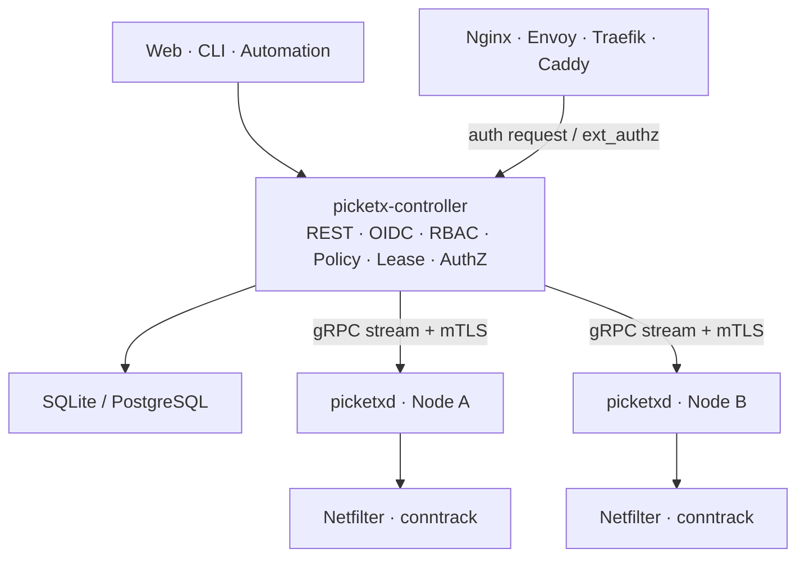
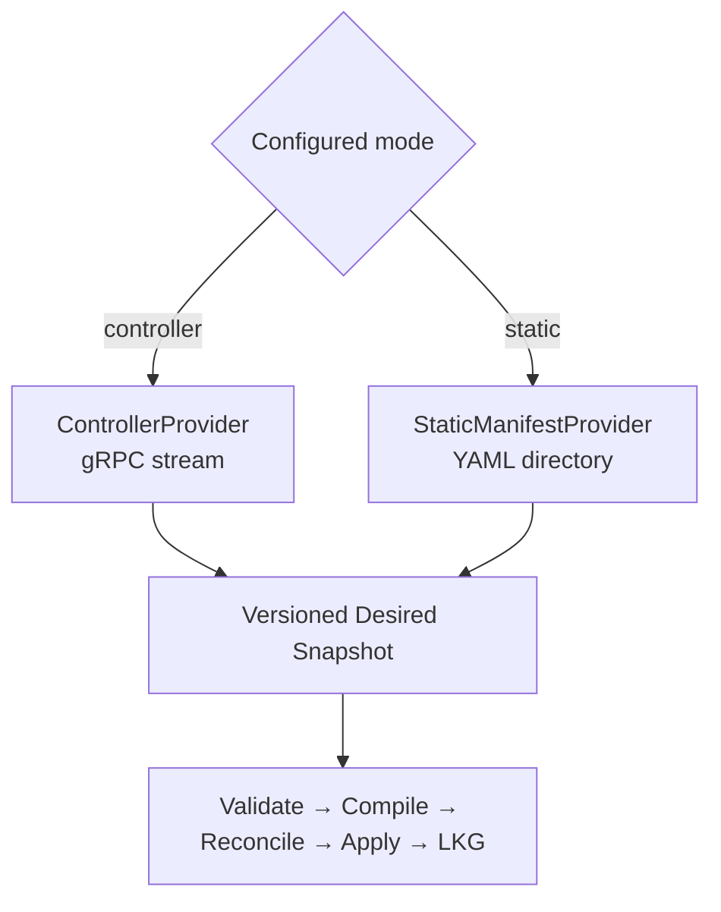
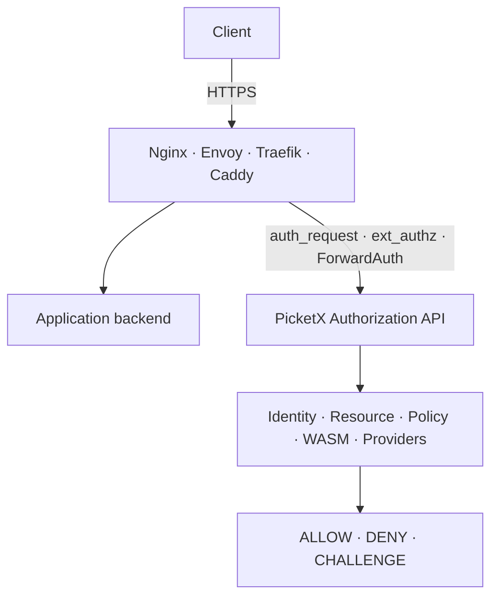
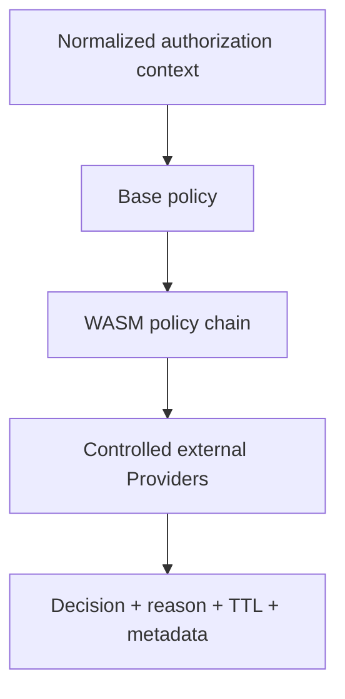

# PicketX 架构设计

> [English (Default)](./ARCHITECTURE.md) | 简体中文

| 字段 | 内容 |
| --- | --- |
| 版本 | v0.4 |
| 日期 | 2026-09-02 |
| 状态 | 设计草案 |
| 项目 | PicketX |

**设计原则：**服务可达性优先 · 业务零改造优先 · 数据面可验证 · 控制面可治理 · 扩展能力可演进

## 文档定位

本文档是 PicketX 的产品与系统上位架构设计，统一定义产品边界、领域模型、功能架构、部署形态、Linux 数据面、控制面、授权服务、插件与 WASM、可靠性、安全性、许可证边界和分阶段实施路线。

后续 PRD、API、数据库模型、协议规范、实现 ADR 和运维手册均应遵循本文档；如需偏离，应以新的正式决策明确替代关系。

## 当前架构决策

| 决策项 | 当前结论 |
| --- | --- |
| 产品定位 | Linux 系统层的 **Service Exposure Gate + Authorization Plane**；决定服务是否可达，并可向代理和网关提供统一授权决策。 |
| 核心数据面 | nftables/Netfilter + conntrack；NFQUEUE 用于有限首包或初始流探测；TPROXY 用于可选高级拦截能力。 |
| 核心进程 | `picketx-controller`、`picketxd` 和 `picketx` CLI；Web SPA 可嵌入 Controller。 |
| 授权服务 | 提供通用 Authorization API；Nginx `auth_request`、Envoy `ext_authz`、Traefik `ForwardAuth` 等均为适配器。 |
| HTTPS 边界 | PicketX 在授权路径中不终止业务 TLS；TLS 终止与 HTTP 转发继续由 Nginx、Envoy、Traefik、Caddy 等承担。 |
| 扩展机制 | 公开外部插件协议与 WASM Policy Runtime；Native Plugin 与 External Plugin 使用不同的信任和许可证边界。 |
| `picketxd` 许可证 | 社区版本使用 GPL-3.0-or-later；另行提供 OEM Commercial License；贡献协议授予项目方实施经批准再许可所需的权利。 |
| 其他组件许可证 | Controller、CLI、公开协议与 SDK、External Plugin SDK 默认使用 Apache-2.0。 |

## 目录

1. [产品定位与设计原则](#1-产品定位与设计原则)
2. [目标场景与非目标](#2-目标场景与非目标)
3. [业务架构与领域模型](#3-业务架构与领域模型)
4. [总体系统架构](#4-总体系统架构)
5. [控制面设计](#5-控制面设计)
6. [Agent 与 Linux 数据面](#6-agent-与-linux-数据面)
7. [网络策略与权限模型](#7-网络策略与权限模型)
8. [Lease、活动续期与连接生命周期](#8-lease活动续期与连接生命周期)
9. [Authorization Service](#9-authorization-service)
10. [插件与 WASM 架构](#10-插件与-wasm-架构)
11. [API 与协议](#11-api-与协议)
12. [数据与状态架构](#12-数据与状态架构)
13. [高可用、同步与一致性](#13-高可用同步与一致性)
14. [安全设计](#14-安全设计)
15. [可观测性与运维](#15-可观测性与运维)
16. [部署形态](#16-部署形态)
17. [许可证与代码边界](#17-许可证与代码边界)
18. [分阶段实施路线](#18-分阶段实施路线)
19. [风险与设计约束](#19-风险与设计约束)
20. [附录](#20-附录)

## 1. 产品定位与设计原则

PicketX 的第一性定位是 **Service Exposure Gate（服务暴露控制层）**。它位于业务认证之前，控制某个网络来源在指定时间窗口内能否连接某项资源。

PicketX 不是传统 VPN，不创建隧道；不是完整 WAF 或 IDS；也不替代应用自身的账户体系和业务权限。

> **一句话定位：**PicketX 提供不依赖隧道的 VPN-like access，并提供系统级 Authorization Plane。网络层回答“这个来源能不能连接”，Authorization Service 回答“这个入口请求能不能继续”，应用仍负责其内部账户与业务权限。

整体设计遵循以下原则：

- **IPv6 是一等公民。**动态自助访问通常绑定 IPv6 `/128` 或 IPv4 `/32`；CIDR 主要是管理策略，而不是动态会话的默认表达方式。
- **业务零改造优先。**SSH、MySQL、PVE、内部 Web、厂商软件等应优先在主机网络层或现有代理的授权 hook 中实施控制。
- **不重复建设成熟基础设施。**转发、TLS、HTTP/2、HTTP/3、WAF 和代理能力继续由 Linux、Nginx、Envoy、Traefik、Caddy 等承担。
- **控制面声明式。**权威配置源产生 Desired State，Agent 保存 Last Known Good（LKG），nftables/conntrack 是 Applied State。
- **策略与执行解耦。**领域对象、策略编译、Netfilter enforcement、Authorization Adapter 分层实现。
- **安全取舍显式化。**安全与性能之间的取舍应成为有文档的数据面策略开关，而不是隐藏的硬编码行为。
- **可解释、可审计、可回滚优先。**PicketX 不演变为无边界的 DPI 平台。

## 2. 目标场景与非目标

### 2.1 目标场景

- 向互联网或办公网暴露 SSH、数据库、PVE、管理后台等高价值服务，但只允许经过认证或审批的来源临时访问。
- 在多节点、多环境中统一管理网络入口，避免逐台人工维护 iptables/nftables。
- 用户通过 Web/OIDC 登记当前来源 IP，获得具有 TTL 的 Source Lease。
- 通过 Nginx `auth_request`、Envoy `ext_authz` 或 ForwardAuth 为老旧 Web 应用接入统一身份与策略，无需修改业务代码。
- 将 CMDB、工单、组织、值班、设备状态等企业上下文引入访问决策。
- 通过 OEM 方式把 Agent 嵌入安全网关、NAS、路由器或运维平台。
- 在没有 Controller 的情况下运行单机、边缘设备、隔离环境或 GitOps 管理的部署。

### 2.2 明确非目标

| 能力 | 是否核心 | 边界说明 |
| --- | --- | --- |
| VPN 隧道 | 否 | 不创建 overlay 或 tunnel；控制真实网络上的服务可达性。 |
| 完整 WAF | 否 | HTTP 元数据可以参与授权，但不负责通用 SQL 注入、XSS 或 body 检测。 |
| 完整 IDS/IPS | 否 | NFQUEUE 仅做有限初始流探测和授权辅助，不做长期 DPI。 |
| 反向代理 | 否 | Authorization Service 不终止业务 TLS，也不转发业务流量。 |
| 应用内部 RBAC | 否 | PicketX 控制入口边界，应用保留业务权限。 |
| Service Mesh | 否 | 不提供服务发现、负载均衡、重试、熔断等通用 Mesh 能力。 |

## 3. 业务架构与领域模型

领域模型需要明确拆分网络来源、资源、权限、有效期、身份与授权决策，不能将 IP、用户、规则和会话混成同一对象。

| 领域对象 | 职责 | 关键语义 |
| --- | --- | --- |
| Node | 运行 `picketxd` 的节点 | Labels、capabilities、desired/applied revision、status |
| Resource | 由 PicketX 管理的服务或入口 | Name、selector、destination、protocol、port、labels |
| Source | 网络来源 | IPv4/IPv6 地址或 CIDR；Source 不是用户身份 |
| Subject | 身份主体 | User、group、service identity、OIDC claims、external attributes |
| Grant / Permission | Subject 对 Resource 的访问能力 | Allow/deny、scope、hard expiry |
| Lease | 具有时效的来源或授权状态 | `expires_at`、renewal policy、activity state |
| Policy | 声明式访问策略 | Subjects、sources、resources、conditions、effect |
| Authorization Request | 一次入口级授权评估 | Subject + Source + Resource + request context |
| Decision | 授权评估结果 | Allow/deny/challenge、reason、TTL、metadata |
| Plugin | 扩展能力 | Capability、version、sandbox、config |

> **ALL 的定义：**`ALL` 只表示“所有由 PicketX 管理的 Resource”，绝不表示主机上的全部端口或所有网络流量。

## 4. 总体系统架构



- **Northbound：**Web、CLI 和自动化工具调用 Controller 的 REST/JSON/OpenAPI。
- **Southbound：**Agent 主动通过 mTLS 与 Controller 建立 gRPC/protobuf 长连接。
- **Local Administration：**`picketx agent status`、`doctor`、`dump`、`reconcile`、`reload` 通过本地 Unix socket 调用。
- **Authorization：**代理与网关调用 Controller 或独立 AuthZ endpoint。
- **Enforcement：**只有 `picketxd` 修改 `table inet picketx`，Controller 不直接操作主机防火墙。

## 5. 控制面设计

### 5.1 Controller 职责

- 用户、组、OIDC、RBAC 与组织映射。
- Resource、Node、Policy、Lease、Label 和 Selector 管理。
- 将全局 Desired State 编译为 per-node Desired State。
- Agent 注册、能力发现、心跳、revision 同步和状态聚合。
- Authorization Engine：处理通用授权、`auth_request`、`ext_authz` 和 ForwardAuth。
- 审计、审批、策略模拟、WASM Policy 与 External Provider 管理。
- SQLite 支持轻量单 Controller，PostgreSQL 支持集群部署。

### 5.2 借鉴 Kubernetes，但不复制 Kubernetes

| 借鉴概念 | 在 PicketX 中的用途 | 明确不做 |
| --- | --- | --- |
| `spec` / `status` | 分离声明状态与观察状态 | 不实现通用 CRD 平台 |
| Labels / selectors | 选择部署 Resource 的 Node | v1 不做嵌套 NodeGroup 体系 |
| `generation` / `observedGeneration` | 追踪期望与应用进度 | 初期不依赖 etcd |
| Reconcile | 最终一致性与漂移恢复 | 不做 scheduler |
| Watch / revision | 增量分发与唤醒 | 不把 `LISTEN/NOTIFY` 当作可靠日志 |

## 6. Agent 与 Linux 数据面

`picketxd` 是唯一的特权数据面进程，并且必须能够脱离 Controller 独立运行。默认二进制包含 Agent/Reconcile、nftables、NFQUEUE Inspector 和 TPROXY 相关能力；NFQUEUE 与 TPROXY 均可通过配置显式关闭。

核心 nftables/conntrack 能力缺失属于 fatal；可选能力缺失只禁用对应功能。

| 模块 | 职责 |
| --- | --- |
| Desired State Provider | Controller Mode 从 Controller 接收状态；Static Manifest Mode 扫描本地 YAML；同一时刻只有一个权威 Provider。 |
| Controller Client | 建立 mTLS stream，接收 snapshot 或 delta，报告 applied status。 |
| Static Manifest Watcher | 监听目录，解析全部 YAML，完成校验并构造 Candidate Desired Snapshot。 |
| Desired/LKG Store | 保存最近可用配置、绝对过期时间、provider identity、`boot_id` 和恢复元数据。 |
| Reconciler | 将统一 Desired State 编译并应用到 PicketX 自有 nftables 对象。 |
| nftables Backend | 通过 libnftnl/libmnl 操作 nf_tables。 |
| Conntrack Backend | 通过 libnetfilter_conntrack/ctnetlink 观察和删除连接。 |
| Activity Monitor | 根据 conntrack 生命周期推导 Source/Lease 活动。 |
| NFQUEUE Inspector | 在严格字节数、包数和时间预算内执行有限初始包探测。 |
| TPROXY Runtime | 支持需要持续用户态拦截的可选高级能力。 |
| Drift Monitor | 结合 Netlink 事件和周期一致性扫描恢复漂移。 |
| Local Admin API | 通过 Unix socket 提供 status、doctor、dump、reconcile 和 reload。 |

### 6.1 Controller Mode 与 Static Manifest Mode

Controller 不是 `picketxd` 的运行前置条件。两种模式只改变 Desired State 的权威来源，并复用完全相同的校验、编译、协调、应用和 LKG 流水线。



以下规则属于强制约束：

1. 启动配置显式选择 `controller` 或 `static`。同一 `picketxd` 实例在任一时刻只能存在一个 Authoritative Desired State Provider。
2. **Controller Mode：**Controller 是 Security Desired State 的唯一权威来源。本地 Manifest 中的 Resource、Policy、Lease、Authorization Rule 等安全对象永远不能与 Controller 状态合并，也不能覆盖 Controller 状态。
3. Controller Mode 仍允许本地 `/etc/picketx/picketxd.yaml`，但其中只能保存 Agent Runtime Configuration，例如 Controller endpoint、证书、日志、数据目录、NFQUEUE/TPROXY 开关、health/metrics endpoint 和 LKG 路径。
4. Runtime Configuration 与 Security Desired State 使用相互独立的模型和命名空间。
5. Controller Mode 下发现 Static Manifest 时，`picketxd` 默认忽略并输出显著告警；严格部署选项可以改为拒绝启动。
6. **Static Manifest Mode：**Manifest 目录是 Security Desired State 的唯一权威来源，Controller 不向该 Agent 下发策略。
7. 切换 Provider 时必须原子替换完整 Desired Snapshot，禁止把两个来源叠加或隐式合并。
8. LKG 必须记录 Provider 类型与 identity；一个 Provider 产生的 LKG 不能作为另一个 Provider 的权威状态恢复。

#### Static Manifest 语义

- 默认目录概念上为 `/etc/picketx/manifests/`，具体路径可通过 Runtime Configuration 修改。
- 目录下全部 `*.yaml`、`*.yml` 和 multi-document YAML 共同组成一份完整 Desired State Snapshot。
- Create、write、rename、delete 事件经过 debounce 后触发全目录重新扫描。
- 新快照必须完整完成解析、Schema Validation、Cross-resource Validation 和 Compile；只有完全成功的 Candidate 才能原子提交。
- 任意文件无效时继续保持上一版 LKG 和 Applied State，禁止半量应用。
- 对象标识通常为 `(apiVersion, kind, metadata.name)`，必须唯一；重复对象导致 Candidate 失败，不允许“后加载覆盖前加载”。
- inotify/fsnotify 用于降低延迟，同时保留低频目录 rescan，防止事件丢失、编辑器 rename-write 和挂载文件系统差异造成漏更新。
- `SIGHUP` 与 `picketx agent reload` 可以主动触发扫描。
- `status` 与 `doctor` 展示 generation、source files、content hash、最后成功/失败时间和 Validation Error。
- Static 与 Controller Mode 使用相同的版本化领域 Schema，使 Resource、Policy 可以在两种模式间迁移。
- Git、Ansible、Salt、Puppet、cloud-init、Ignition、NixOS、OCI 解包或其他外部机制负责更新目录；v1 不在 `picketxd` 内嵌 Git 客户端。

Static Manifest 示例：

```yaml
apiVersion: picketx.io/v1alpha1
kind: Resource
metadata:
  name: ssh-admin
  labels:
    environment: production
spec:
  destination: local
  protocol: tcp
  ports: [22]
---
apiVersion: picketx.io/v1alpha1
kind: NetworkPolicy
metadata:
  name: office-ssh
spec:
  sources:
    - 2001:db8:100::/64
  resources:
    - ssh-admin
  effect: allow
```

Static Manifest Mode 初期主要支持静态 Resource 与 Policy、固定或绝对过期 Lease、本机 enforcement。OIDC 自助申请、集中审批和跨节点聚合需要 Controller Mode。

未来可以独立设计 **Emergency Override / Break-glass**，但它不能演变成普通的 Controller + Static Merge。该能力必须具有独立 ownership domain、明确优先级、完整审计、受限范围和自动失效语义，不进入 v1。

### 6.2 nftables 所有权

- 固定使用 `table inet picketx`。
- 所有对象使用 `picketx_` 前缀；内部对象可使用 `picketx__`。
- 不修改 Docker、firewalld 或其他管理器拥有的 table。
- 推荐主 hook 位于 host namespace 的 `PREROUTING`，priority 约为 `-110`，即 conntrack 之后、DNAT 之前，从而保留外部目标地址信息。

### 6.3 Netfilter C 依赖

| 库 | 用途 | 许可证 |
| --- | --- | --- |
| libmnl | Netlink socket 与 attribute helper | LGPL-2.1+ |
| libnftnl | nf_tables 低层 Netlink API | GPL-2.0+ |
| libnetfilter_conntrack | conntrack 查询、更新和删除 | GPL-2.0+ |

初期实现优先使用成熟的 Netfilter 用户态库，以换取开发速度和可靠性。未来若 proprietary OEM 二进制需要摆脱第三方 GPL 链接，应通过现有 Backend 边界替换为 permissive 或纯 Rust 的 nf_tables/ctnetlink 实现。

## 7. 网络策略与权限模型

有效规则元组为：

```text
Source CIDR × Destination CIDR/LOCAL × Protocol(TCP/UDP) × Port/Range
```

ALLOW 与 DENY 使用独立 membership set；在有效策略中 DENY 优先于 ALLOW。

- 使用 nftables concatenated interval set 表达 CIDR、目的地址、协议和端口范围组合，避免展开为海量离散规则。
- 同语义 membership 可以 auto-merge，但原始 Policy provenance 与 TTL 必须保存在 Controller，不能把 Kernel Set 当成审计数据库。
- 动态会话默认使用精确主机：IPv4 `/32`、IPv6 `/128`；CIDR 动态续期必须是显式高级策略。
- Policy 删除或过期时默认阻止新连接，已建立连接优雅存活。
- Strict Revoke 先更新 Desired State，再删除匹配的 PicketX conntrack。
- 多个 Permission 或 Lease 重叠时，过期同步方式由策略显式选择：高安全场景可即时重新编译；也可按固定周期批量刷新，以降低控制面和内核更新压力。

## 8. Lease、活动续期与连接生命周期

### 8.1 Lease 与 Activity 分离

Controller 是 Hard Expiry 的权威来源，Agent 只报告观察到的活动。活动续期不能每包刷新 nftables timeout，也不能把数据库变成实时数据面。

| 续期策略 | 语义 | 推荐场景 |
| --- | --- | --- |
| `disabled` | 仅固定绝对过期 | 简单或高安全部署 |
| `unique-only` | 只有唯一可续期 SourceLease 匹配时才续期 | 推荐安全默认值 |
| `most-specific` | 续期最长前缀匹配 | 兼顾精确来源与管理 CIDR |
| `least-specific` | 续期最短前缀匹配 | 仅适用于特殊管理策略 |
| `all-matched` | 续期全部匹配前缀 | 最方便但风险最高 |

运行时 SourceLeaseIndex 建议使用 IPv4/IPv6 Patricia Trie 或 Compressed Radix Trie，一次路径查询即可得到 first、last 或 all matches。首个规模目标为 100,000 个活跃动态来源。

### 8.2 Conntrack 语义

- 合法新流设置 `ct mark = PICKETX_ALLOW`。
- Agent 订阅 conntrack `NEW`、`UPDATE`、`DESTROY`；事件丢失或重启后通过 dump/reconcile 恢复。
- TCP 仅允许初始 SYN（`SYN && !ACK`）创建新的 PicketX Authorization。conntrack 被删除后，旧 ACK/PSH 不能让授权“复活”。
- **Force Re-authenticate** 表示使 SourceSession 失效并删除匹配的 PicketX conntrack；它不是 blacklist。
- UDP conntrack 删除后，下一个数据报形成新 pseudo-flow，必须重新授权。

## 9. Authorization Service

Authorization Service 是独立于 TPROXY 的第二种 Enforcement Integration。它不代理业务流量，而是接收 Nginx、Envoy、Traefik、Caddy 等网关的授权回调，然后统一评估 PicketX Identity、Resource、Policy、WASM、Provider 与审计规则。



### 9.1 标准化授权上下文

| Context | 示例 |
| --- | --- |
| Subject | User、groups、OIDC claims、service identity |
| Source | Source IP、Lease、device context |
| Resource | Resource ID、environment、owner、labels |
| Request | Host、method、path、selected headers |
| Node | Region、environment、capabilities |
| External Attributes | CMDB、工单、值班状态、风险评级 |
| Decision Metadata | Reason、TTL、response headers、policy ID |

### 9.2 Adapter

- Nginx `auth_request`
- Envoy `ext_authz`（HTTP 或 gRPC）
- Traefik `ForwardAuth`
- Caddy `forward_auth`
- Generic HTTP Authorization API

PicketX 可以返回身份、组、Decision Reason、命中 Policy 等集成 Header；除非主动消费这些 Header，上游应用不需要理解 PicketX。

### 9.3 HTTPS 边界

PicketX 不需要读取加密后的业务流量。代理负责终止 TLS，并只把授权所需的身份和 HTTP 元数据提交给 PicketX。这样可以支持复杂授权，同时避免 PicketX 演变为 HTTPS Proxy、WAF 或 Service Mesh。

### 9.4 故障行为与缓存

- 每个 Resource 显式选择 fail-closed 或 fail-open；安全敏感 Resource 默认 fail-closed。
- Adapter 配置必须包含有界 Timeout。
- Allow 和 Deny Decision 只能在 Authorization Engine 返回的 TTL 内缓存，同时必须满足所选 Policy 的撤销保证。
- Audit 应保留标准化请求、Decision Reason、Policy Provenance 和 Correlation ID，但不能无差别保存敏感 Header。

## 10. 插件与 WASM 架构

### 10.1 扩展分层

| 类型 | 进程边界 | 定位 | 许可证方向 |
| --- | --- | --- | --- |
| Native Plugin | 同进程、共享地址空间 | 极高性能、紧耦合数据面能力 | 默认 GPL-compatible；谨慎开放 |
| External Plugin | 独立进程，通过 Unix socket/gRPC | 企业集成、Provider、扩展逻辑 | SDK 使用 Apache-2.0；插件许可证独立 |
| WASM Policy | 沙箱运行时 | 授权和策略决策扩展 | 模块发行策略可以独立制定 |

公开生态优先使用 External Plugin 与 WASM。Native Plugin 仅用于 RPC/WASM 无法满足延迟或数据访问要求的能力，避免扩大信任范围和 Copyleft 边界。

### 10.2 WASM 执行位置

WASM 应位于策略决策路径，而不是 Packet Fast Path。



WASM Host API 可以提供：

- `get_subject`、`get_resource`、`get_request`、`get_source`
- `get_attribute` 与 labels
- 受命名空间限制的 `kv_get`
- 通过受控 Provider Proxy 实现的 `call_provider(name, request)`
- `log` 与 `metric`
- 返回 `decision`、`reason`、`ttl` 和 metadata

默认禁止任意网络、文件系统和系统调用。所有外部访问必须经过受控 Host API，以便统一实施审计、超时、熔断和权限检查。

## 11. API 与协议

| 接口 | 协议 | 使用者 | 设计原则 |
| --- | --- | --- | --- |
| Northbound API | HTTPS REST/JSON/OpenAPI | Web、CLI、自动化 | 稳定、版本化、资源导向 |
| Southbound Protocol | gRPC/protobuf + mTLS | `picketxd` | Agent 主动连接、双向 stream、snapshot/delta |
| Authorization API | HTTP/gRPC Adapter | Nginx、Envoy、Traefik、Caddy 等 | 低延迟、明确 timeout 与 fail mode、可缓存 |
| Local Agent API | Unix socket | 本地 CLI 与诊断 | 默认不监听外部 TCP |
| External Plugin Protocol | Unix socket/gRPC | External Plugin | 公开稳定、能力注册、结构化 context |

所有公开协议必须显式版本化。向后兼容规则应进入对应协议规范，不能依赖实现中的隐式行为。

## 12. 数据与状态架构

PicketX 包含三层状态：


- Reconciler 不需要区分 Snapshot 来自 Controller 还是 YAML；两种 Provider 必须先输出同一版本化 Desired Snapshot。
- Static Manifest Mode 中，目录是声明式事实来源；LKG 只是最后一次成功编译和应用的恢复副本，不能反向覆盖 Manifest。
- LKG 记录 Provider 类型和 identity，避免模式切换或重启后恢复错误来源的状态。
- 核心 CIDR、TTL、重叠和 renewal 语义在 Rust Domain Layer 实现，保证 SQLite 与 PostgreSQL 行为一致。
- SQLite 支持轻量单 Controller；PostgreSQL 支持多个 Controller 共享权威状态。
- 高频查询使用可重建的内存索引，不能为每次连接或续期扫描数据库。
- Controller 维护单调递增 revision；Agent 报告 observed revision 与 semantic hash，用于同步和漂移检测。
- 持久化保存绝对 `expires_at`，不保存只在一次 boot 内有效的相对 TTL。

## 13. 高可用、同步与一致性

- 不自行实现 Raft。
- PostgreSQL 模式下 Controller 尽量无状态，每个实例拥有自己当前连接的 Agent Stream。
- PostgreSQL `LISTEN/NOTIFY` 仅用于唤醒；正确性依赖按 revision 重新读取。
- 单例定时任务可使用 PostgreSQL Advisory Lock。
- Agent 落后过多时直接接收 Full Snapshot，不无限维护复杂 Replay History。
- Agent 启动时读取 `boot_id`；宿主重启后从合法且 Provider 绑定的 LKG 重建 PicketX Table。
- nftables semantic hash 必须 canonicalize，并排除 handle、counter、remaining TTL 等易变字段。
- Controller 失联不会清除当前 Enforcement；Agent 根据 LKG 继续运行，直到状态按照绝对过期语义失效。

## 14. 安全设计

| 风险 | 架构响应 |
| --- | --- |
| Controller 被攻破 | mTLS、最小权限、审计、审批、可选多人变更控制 |
| Agent 被控制 | 只有 Agent 获得 `NET_ADMIN`；Local API 由 Unix socket 权限保护 |
| Policy 误配置 | Dry-run、Policy Simulation、Revision、LKG、快速回滚 |
| Authorization 超时 | Per-Resource Fail Mode；安全敏感 Resource 默认 fail-closed |
| NFQUEUE 堵塞 | 严格 Timeout、Bounded Prefix、可选绕过/失败策略、Queue Depth 监控 |
| Plugin 风险 | External Process Isolation、WASM Sandbox、Host API Allowlist |
| Source 冒充身份 | IP/CIDR 明确定义为 Network Identity；Subject 来自 OIDC/Session/Provider |
| 重放或旧连接 | TCP 仅 SYN 创建新授权；Strict Revoke 删除 conntrack |
| 配置源混淆 | 同一时刻只有一个权威 Provider；LKG 绑定 Provider；禁止隐式 Merge |

后续应持续收紧权限分离。不需要 `CAP_NET_ADMIN` 的组件不应获得该能力；特权 Agent 的公开网络面应保持最小化。

## 15. 可观测性与运维

- **Metrics：**Policy Compile Latency、Apply Latency、Agent Connectivity、Authorization Decision Latency、Allow/Deny Count、NFQUEUE Queue Depth、Conntrack Reconcile、WASM Latency、Provider Error、LKG Age。
- **Audit：**Policy 修改、Lease 申请与审批、Authorization 命中 Policy、Strict Revoke、Mode 切换和 Reload 结果。
- **Logs：**结构化 JSON；按场景包含 Node、Resource、Policy、Revision、Provider Identity、Trace ID 和 Decision Correlation。
- **Health：**Controller Readiness/Liveness、Agent Local Health、Netfilter Capability Probe。
- **Doctor：**内核模块、nftables capability、conntrack、NFQUEUE、TPROXY、routing、权限、配置源、Manifest Validation 和 Controller Connectivity。

## 16. 部署形态

| 形态 | Controller | Agent | 适用场景 |
| --- | --- | --- | --- |
| Static Manifest | 无 | 一个或多个 Standalone Agent 监听本地 YAML | Homelab、单机、GitOps、救援或隔离环境 |
| Local Controller | 单 Controller + SQLite | 1 至少量 Node | 需要 Web/OIDC/自助访问的 Homelab 或 PoC |
| Team | 单/双 Controller + PostgreSQL | 数十至数百 Node | 团队和中小组织 |
| Enterprise | 多 Controller + PostgreSQL HA | 数百至数千 Node | 集中治理与合规 |
| Cloud | PicketX 托管 Controller | 客户 Node 主动出站连接 | SaaS |
| OEM | 无 Controller、厂商控制面或 PicketX Controller | 嵌入式 Agent | 网关、NAS、路由器或安全设备 |

容器化 Agent 如需控制 Host Firewall，应优先使用 Host Network + `CAP_NET_ADMIN`，避免直接使用完整 `privileged`。nftables 与 Netfilter 受 Network Namespace 约束，部署时必须明确操作 Host Namespace。

## 17. 许可证与代码边界

| 组件 | 默认许可证或授权 | 理由 |
| --- | --- | --- |
| `picketxd` | GPL-3.0-or-later + 可替代的 OEM Commercial License | 保持数据面开放，同时保留商业 OEM 路径。 |
| Controller | Apache-2.0 | 促进企业集成、二次开发和生态采用。 |
| CLI | Apache-2.0 | 避免在主要工具入口制造 Copyleft 摩擦。 |
| Protocol / Public SDK | Apache-2.0 | 允许任意语言和商业系统集成。 |
| External Plugin SDK | Apache-2.0 | 最大化插件生态采用。 |
| Native Plugin ABI | 位于 GPL Agent 边界内 | 同进程插件默认需要 GPL-compatible，除非未来另行完成法律与许可证设计。 |

### 17.1 贡献者机制

为了保留 `picketxd` 同时使用社区 GPL 和经批准 OEM Commercial License 分发的能力，贡献者保留其贡献版权，但应向项目主体授予为上述发行和经批准再许可所需的永久、全球、不可撤销、可再许可权利。

正式 CLA 或 Contribution Agreement 发布前必须由具备开源许可证经验的律师审核。本文记录的是产品意图，不构成法律意见。

### 17.2 当前第三方 GPL 限制

OEM Commercial License 只能覆盖项目有权再许可的代码。如果商业二进制仍链接 libnftnl 或 libnetfilter_conntrack，项目方不能替 Netfilter 版权人豁免其 GPL 条件。

真正的 Proprietary OEM Agent 因此可能需要使用 permissive 或纯 Rust 的 nftables/ctnetlink Backend，替代这些 GPL 用户态依赖。

## 18. 分阶段实施路线

| 阶段 | 目标 | 范围 |
| --- | --- | --- |
| M0 架构 PoC | 验证 Linux 数据面 | libnftnl/libnetfilter_conntrack、table/chain/set 管理、conntrack revoke、Docker host namespace |
| M1 Core Gate | 交付可用的开源网络入口 | Static Manifest 热重载、Controller、CLI、Resource/Policy、OIDC 自助、Lease、IPv4/IPv6、SQLite |
| M2 Distributed | 规模化管理 Node | PostgreSQL、gRPC Stream、labels/selectors、LKG/reconcile、audit、Controller HA |
| M3 Authorization Plane | 增加 Web 与网关授权 | Generic Auth API、Nginx/Traefik Adapter、可视化规则、Decision Audit |
| M4 Extensibility | 形成扩展生态 | External Plugin SDK、WASM Runtime、Provider API、Policy Simulation |
| M5 Enterprise | 治理能力商业化 | 高级审批、SCIM/LDAP、长期审计、SIEM、HA/SLA、Advanced Policy |
| M6 Cloud/OEM | 扩展收入渠道 | 托管控制面、计费、组织、多租户、OEM Backend 与 Licensing |

## 19. 风险与设计约束

| 风险 | 后果 | 控制措施 |
| --- | --- | --- |
| 范围膨胀为 Cilium、WAF 或 Envoy | 项目规模不可持续 | 维护明确非目标；只检查做出决策所需的最少上下文 |
| GPL 与 OEM 冲突 | Proprietary Distribution 被第三方依赖阻塞 | Backend 隔离、贡献协议、未来 Permissive Netlink Backend |
| 把 IP 当成完整身份 | NAT 与共享地址造成歧义 | 将 IP 定义为 Network Identity，不替代 OIDC/Subject |
| Authorization Latency | 影响每次 Web 请求 | Cache、Short-circuit、Local/Edge AuthZ、明确 Timeout Budget |
| Policy 重叠或冲突 | 误放行或误拒绝 | Deny 优先、Compiler Validation、Simulation、Provenance、Audit |
| 配置源冲突 | 运维人员误判实际策略 | 唯一权威 Provider、禁止 Merge、显著告警、Provider-bound LKG |
| 大规模状态 | Controller 或 Agent 内存压力 | Per-node Compile、Trie、Snapshot/Delta、100k 与 1M Benchmark |
| 可选探测过载 | 丢包或服务中断 | 严格 NFQUEUE/TPROXY Budget、功能开关、可度量的失败策略 |

## 20. 附录

### 20.1 推荐 Rust Workspace

```text
crates/
  domain/          # Apache-2.0，纯领域模型
  api/             # Apache-2.0，REST DTO 与 OpenAPI
  protocol/        # Apache-2.0，gRPC 与 protobuf
  compiler/        # Apache-2.0，全局到 per-node Desired State
  selector/        # Apache-2.0
  storage/         # Apache-2.0，SQLite 与 PostgreSQL
  authz/           # Apache-2.0，Authorization Engine
  wasm-runtime/    # Apache-2.0
  plugin-sdk/      # Apache-2.0，External Plugin
  agent-state/     # Agent 内部状态与 Snapshot Model
  netfilter/       # 位于 picketxd GPL 边界内
apps/
  controller/      # Apache-2.0
  agent/picketxd/  # GPL-3.0-or-later + OEM Option
  cli/             # Apache-2.0
  web/             # Apache-2.0
```

### 20.2 推荐配置目录

```text
/etc/picketx/
  picketxd.yaml             # 仅保存 Agent Runtime Configuration
  manifests/                # Static Manifest Mode 的 Security Desired State
    resources/
    policies/
    authz/
```

### 20.3 后续规范文档

本架构应通过独立的聚焦文档继续细化，而不是无限扩张本文：

- 领域模型与 Schema 规范
- Static Manifest Schema 与 Validation Rule
- Policy Evaluation 与冲突语义
- Southbound Protocol 规范
- Authorization API 与 Adapter Contract
- nftables 编译与所有权规范
- Lease 与 Activity Renewal 规范
- Threat Model
- Plugin Protocol 与 WASM Host API
- Contribution Agreement 与 Licensing Policy

### 20.4 参考资料

- [GNU GPL FAQ](https://www.gnu.org/licenses/gpl-faq.en.html)：GPL 版本兼容、链接、多许可证和额外授权边界。
- [Apache License v2.0 与 GPL 兼容性](https://www.apache.org/licenses/GPL-compatibility)：Apache-2.0 与 GPLv3 兼容，但与 GPLv2-only 不兼容。
- [libmnl](https://netfilter.org/projects/libmnl/)：官方 Netlink Helper Library 与 LGPL-2.1+ 许可证信息。
- [libnftnl](https://www.netfilter.org/projects/libnftnl/)：官方 nf_tables 低层 API 与许可证信息。
- [libnetfilter_conntrack](https://netfilter.org/projects/libnetfilter_conntrack/)：官方 conntrack API 与许可证信息。
