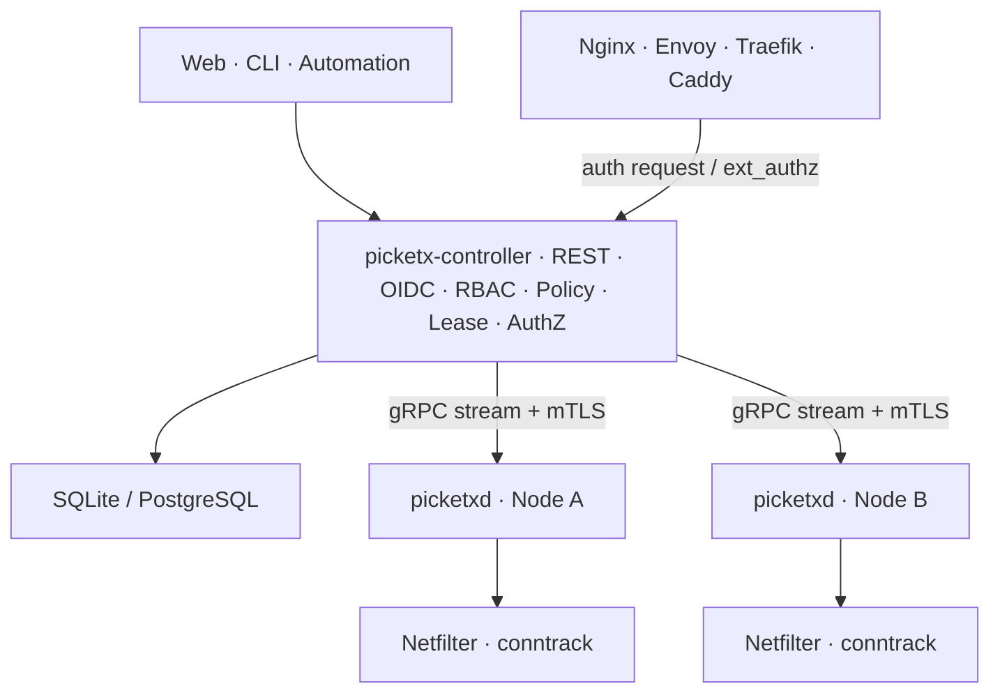
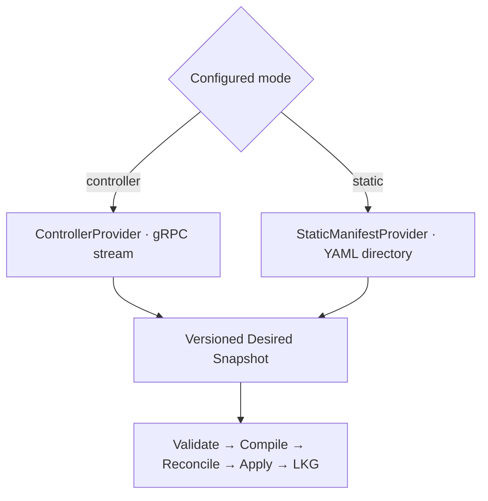
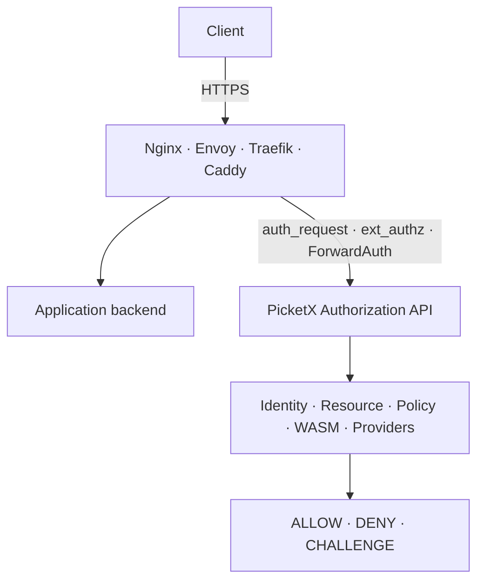
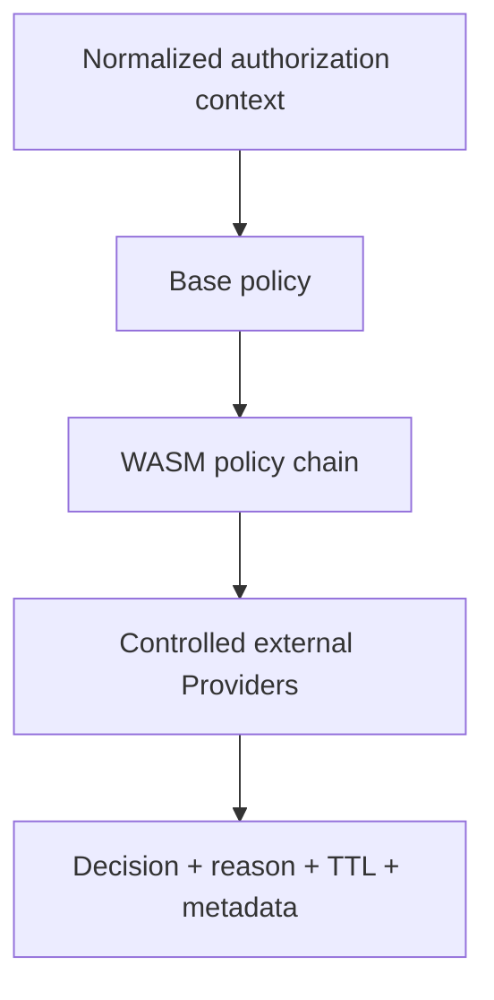

# PicketX 架构设计

> [English (Default)](./ARCHITECTURE.md) | 简体中文

| 字段 | 内容 |
| --- | --- |
| 版本 | v0.7.0 |
| 日期 | 2026-10-08 |
| 状态 | 已确认的设计基线；不代表已实现 |
| 项目 | PicketX |

**设计原则：**访问流程简单 · IP/CIDR 授权明确 · 权限生命周期可靠 · 业务零改造优先 · 执行能力可扩展

## 文档定位

本文档承接 [PRODUCT_DESIGN.zh-CN.md](./PRODUCT_DESIGN.zh-CN.md) 的产品基线，是 PicketX 的系统上位架构设计，统一定义产品边界、领域模型、功能架构、部署形态、Linux 数据面、控制面、授权服务、插件与 WASM、可靠性、安全性、许可证边界和分阶段实施路线。

后续 PRD、API、数据库模型、协议规范、实现 ADR 和运维手册均应遵循本文档；如需偏离，应以新的正式决策明确替代关系。

## 当前架构决策

| 决策项 | 当前结论 |
| --- | --- |
| 产品定位 | 简单易用、无需专用客户端，以 IP/CIDR 为网络授权对象的按需访问授权系统；独立使用或补充保护现有网络。 |
| 网络授权模型 | 聚合仍有效且匹配的来源授权，受显式拒绝与条件约束；申请人、审批人是授权来源，不是连接身份。 |
| 产品范围 | 不按组织规模限制适用范围；授权记录属于核心，应用行为记录不属于范围。 |
| 核心数据面 | nftables/Netfilter + conntrack；NFQUEUE 用于有限首包或初始流探测；TPROXY 用于可选高级拦截能力。 |
| 核心进程 | `picketx-controller`、`picketxd` 和 `picketx` CLI；Web SPA 可嵌入 Controller。 |
| 授权服务 | 提供通用 Authorization API；Nginx `auth_request`、Envoy `ext_authz`、Traefik `ForwardAuth` 等均为适配器。 |
| HTTPS 边界 | PicketX 在授权路径中不终止业务 TLS；TLS 终止与 HTTP 转发继续由 Nginx、Envoy、Traefik、Caddy 等承担。 |
| 扩展机制 | 公开外部插件协议与 WASM Policy Runtime；Native Plugin 与 External Plugin 使用不同的信任和许可证边界。 |
| `picketxd` 许可证 | 社区版本使用 GPL-3.0-or-later；另行提供 OEM Commercial License；贡献协议授予项目方实施经批准再许可所需的权利。 |
| 其他组件许可证 | Controller、CLI、公开协议与 SDK、External Plugin SDK 默认使用 Apache-2.0。 |
| 后端语言与仓库 | Go；PicketX 承载控制面/Core/Web，PicketXD 承载官方 Linux Agent。 |
| 配置契约 | 远程与静态输入共用版本化语义；Resource/Endpoint/Grant/Binding 与业务流程、执行模型分离；不引入 Namespace。 |
| 前端 | React、TypeScript、Vite、shadcn/ui、Tailwind CSS、i18next、npm；官方基础组件与项目组合分层。 |

## 目录

1. [产品定位与设计原则](#1-产品定位与设计原则)
2. [目标场景与非目标](#2-目标场景与非目标)
3. [业务架构与领域模型](#3-业务架构与领域模型)
4. [总体系统架构](#4-总体系统架构)
5. [控制面设计](#5-控制面设计)
6. [Agent 与 Linux 数据面](#6-agent-与-linux-数据面)
7. [网络策略与权限模型](#7-网络策略与权限模型)
8. [Lease、活动续期与连接生命周期](#8-lease活动续期与连接生命周期)
9. [Authorization Service](#9-authorization-service)
10. [插件与 WASM 架构](#10-插件与-wasm-架构)
11. [API 与协议](#11-api-与协议)
12. [数据与状态架构](#12-数据与状态架构)
13. [高可用、同步与一致性](#13-高可用同步与一致性)
14. [安全设计](#14-安全设计)
15. [可观测性与运维](#15-可观测性与运维)
16. [部署形态](#16-部署形态)
17. [许可证与代码边界](#17-许可证与代码边界)
18. [分阶段实施路线](#18-分阶段实施路线)
19. [风险与设计约束](#19-风险与设计约束)
20. [附录](#20-附录)

## 1. 产品定位与设计原则

PicketX 是一个简单易用、无需安装专用客户端的按需访问授权系统，以 IP / CIDR 为网络授权对象，通过预设策略、自助申请或审批，动态开放指定资源，并管理权限的有效期与回收。它支持同一授权来源下的多设备、跨应用共享访问，可独立使用，也可为现有 VPN 和应用认证体系提供补充保护，并逐步扩展协议级的细粒度授权。

网络门禁决定来源能否建立连接；协议适配器可增加经过认证的用户、会话或请求约束。申请人认证决定谁能申请授权，不会认证该地址之后的每一条连接。

同一授权来源下的共享访问是有意提供的能力，不要求逐设备登记。VPN 可以承担连通与加密，PicketX 增加资源级限时访问。授权不会创建路由或隧道。“无需客户端”指无需专用 PicketX 终端软件，浏览器和原有协议工具仍然需要。

整体设计遵循以下原则：

- **IPv6 是一等公民。**动态自助访问通常绑定 IPv6 `/128` 或 IPv4 `/32`；CIDR 主要是管理策略，而不是动态会话的默认表达方式。
- **业务零改造优先。**SSH、MySQL、PVE、内部 Web、厂商软件等应优先在主机网络层或现有代理的授权 hook 中实施控制。
- **不重复建设成熟基础设施。**转发、TLS、HTTP/2、HTTP/3、WAF 和代理能力继续由 Linux、Nginx、Envoy、Traefik、Caddy 等承担。
- **控制面声明式。**权威配置源产生 Desired State，Agent 保存 Last Known Good（LKG），nftables/conntrack 是 Applied State。
- **策略与执行解耦。**领域对象、策略编译、Netfilter enforcement、Authorization Adapter 分层实现。
- **安全取舍显式化。**安全与性能之间的取舍应成为有文档的数据面策略开关，而不是隐藏的硬编码行为。
- **可解释、可审计、可回滚优先。**PicketX 不演变为无边界的 DPI 平台。

## 2. 目标场景与非目标

### 2.1 目标场景

| 场景 | 期望结果 |
| --- | --- |
| 个人及开发资源 | 网站、管理后台、测试系统和部分数据库在需要时开放，平时限制访问。 |
| 多设备使用 | 一次授权覆盖流量匹配指定 IP/CIDR 的设备，不逐台安装 PicketX 客户端。 |
| 多个应用访问同一服务 | 同一来源授权可供 IDE、数据库客户端、开发程序、命令行和脚本共享，无需逐应用接入 PicketX。 |
| 临时测试与外部协作 | 测试人员、客户或协作者申请资源和时长，由有权限的人批准，到期自动回收权限。 |
| 现有 VPN 或内部网络 | 增加资源级限时授权，保留原有网络连接方式。 |
| 显式静态来源策略 | 管理员声明永久或绝对到期的 IP/CIDR 策略，支持独立 YAML 运行。 |

组织规模不属于产品定义。是否适用取决于访问流程、来源共享策略与运维要求。使用频率和付费意愿仍需验证，不作为既成市场结论。

协议级授权、丰富的外部 Provider、Cloud 和 OEM 保留为扩展方向，不是首个可用版本必须全部具备的条件。

### 2.2 明确非目标

| 能力 | 是否核心 | 边界说明 |
| --- | --- | --- |
| VPN 隧道 | 否 | 不创建 overlay 或 tunnel；控制真实网络上的服务可达性。 |
| 完整 WAF | 否 | HTTP 元数据可以参与授权，但不负责通用 SQL 注入、XSS 或 body 检测。 |
| 完整 IDS/IPS | 否 | NFQUEUE 仅做有限初始流探测和授权辅助，不做长期 DPI。 |
| 反向代理 | 否 | Authorization Service 不终止业务 TLS，也不转发业务流量。 |
| 应用内部 RBAC | 否 | PicketX 控制入口边界，应用保留业务权限。 |
| 应用行为记录 | 否 | 不记录完整 SQL、命令、页面操作或文件内容；授权记录仍是核心。 |
| Service Mesh | 否 | 不提供服务发现、负载均衡、重试、熔断等通用 Mesh 能力。 |

## 3. 业务架构与领域模型

领域模型区分流程操作者、获授权主体、逻辑服务、访问入口与执行结果。[配置与领域模型设计](CONFIGURATION_MODEL.zh-CN.md) 记录已确认的选择、绑定语义，并列出仍待细化的 Schema。

| 领域对象 | 职责 | 关键语义 |
| --- | --- | --- |
| Agent（Node） | 执行身份；Linux 官方实现为 `picketxd` | 注册或静态本地身份、标签、能力、期望/已应用状态 |
| Resource | 受保护的逻辑服务 | 包含多个具名 Endpoint，不是单个目标元组 |
| Endpoint | 可独立选择的服务入口 | 类型默认 `network`；协议、端口、可选目标 IP/CIDR 数组 `addresses` |
| Subject / Source | 带类型的授权接收者；Source 为 IP/CIDR 类型 | 同时支持 IPv4、IPv6；申请人身份不是数据包身份 |
| Scope | 资源选择、可选入口限制与动作 | 省略入口限制表示全部及未来新增入口；网络动作默认 `connect` |
| Grant | 一份独立权限贡献 | 一个 Subject、多个 Scope、共享有效期/条件、来源和撤销 |
| EnforcementBinding | 将资源入口部署到 Agent | 非空 `resources[]` 与 `agents[]`，选中入口应用到每个选中 Agent |
| Requester / Approver / AccessRequest | 控制面流程与来源 | 区分申请和批准内容；Agent 不执行审批流程 |
| Policy | 资格、执行限制或协议评估 | 评估上下文分开，具体 Schema 划分待后续确定 |
| EffectivePermissionSet / Lease | 派生权限与可选生命周期机制 | 不是独立授权来源；不要求每个 Grant 都有 SourceSession |
| AuthorizationContext / Decision | 请求时协议授权评估 | 按需提供可信身份与信任来源；不同于 AccessRequest |
| AuditEvent / ExecutionStatus | 生命周期证据与观察结果 | 审批通过、Grant 有效、确认实施分别记录 |
| Plugin | 扩展能力 | 能力、版本、沙箱与配置，详细 Schema 随实际集成需求推进 |

### 3.1 业务、配置与执行边界

控制面 Web/API/持久化模型管理身份、申请、审批与审计，经发布边界把获授权的业务结果转换成版本化配置契约。Agent 消费配置与来源标识，不消费数据库行或 UI 流程对象；执行计划、LKG 与状态是独立运行时模型。

ControllerProvider 与 StaticManifestProvider 使用相同的校验/默认值及本地编译、协调语义，同时仍是互斥权威来源。控制面全局数据与本地 Manifest 集合不必完全相同。共享 Go 包和协议一致性验证保证控制面与 Agent 独立演进时授权语义一致。

### 3.2 选择、部署与隔离

Resource 包含多个 Endpoint。每个资源选择项省略 `endpointNames` 和 `endpointSelector` 时，选择全部当前及未来入口；缩小范围时只能填写一个非空限制。显式空值或 null 无效，不设置 `allEndpoints` 字段。标签选择器使用 `matchLabels` 与 `In`/`NotIn`/`Exists`/`DoesNotExist`；`NotIn` 匹配缺失 Key，不是显式拒绝。

EnforcementBinding 组织多个 Resource 选择和多个 Agent 引用/选择器。Agent 匹配取并集去重，所有选中入口应用到所有选中 Agent，不按位置配对。执行参数不同需拆分 Binding。默认主机部署；网关实施需要显式且经过能力校验的转发契约。

Controller 只向每个 Agent 投影相关保护、权限、限制、截止时间及清理清单。重叠 Grant 先聚合，不逐 Grant 生成规则，同时保留来源与独立到期语义。最后一份 Grant 撤销后入口继续受保护；最后一份 Binding 删除则撤除相应位置的保护责任。

不引入 Namespace。对象身份、有权限的引用、贡献追踪与冲突校验实现配置隔离。后端无法区分的入口，不会因标签或 Resource 名称不同而获得流量隔离。目标地址数组、范围默认值、状态、校验目标与待决生命周期见专项模型文档。

> **ALL 的定义：**产品概念上的 ALL 表示所有 PicketX 管理的 Resource，不是主机全部流量。省略 Endpoint 限制仅选中显式 Resource 范围内的全部入口，不会隐式选中全部 Resource 或 Agent；本文不定义全局 ALL 的编码。

## 4. 总体系统架构



- **Northbound：**Web、CLI 和自动化工具调用 Controller 的 REST/JSON/OpenAPI。
- **Southbound：**Agent 主动通过 mTLS 与 Controller 建立 gRPC/protobuf 长连接。
- **Local Administration：**`picketx agent status`、`doctor`、`dump`、`reconcile`、`reload` 通过本地 Unix socket 调用。
- **Authorization：**代理与网关调用 Controller 或独立 AuthZ endpoint。
- **Enforcement：**只有 `picketxd` 修改 `table inet picketx`，Controller 不直接操作主机防火墙。

### 4.1 Authorization Core、Controller 与 Agent Runtime

PicketX 将可复用授权语义与部署、执行分离。核心模型为 **带类型的 Subject–Resource–Action–Conditions**。网络 Source 是一种主体，经过验证的用户或服务身份是其他主体类型。来源 Grant 继续遵守第 7–8 节 IP/CIDR 语义；身份授权和请求决策不能直接编译为 IP 放行，除非这明确符合策略本意。

| 层次 | 职责 | 边界 |
| --- | --- | --- |
| Authorization Core | 带类型领域对象、校验、Grant 贡献、条件、权限聚合、决策解释和与 Backend 无关的规划 | 可复用 Go 包；不依赖 Controller 数据库、HTTP 服务或 Linux 系统调用 |
| Controller | 认证、流程/RBAC、持久化、全局资源部署、版本、分发、状态汇总和 AuthZ API | 使用 Core；不直接修改 Linux 防火墙状态 |
| Agent Runtime | 权威 Provider、本地校验、同步、LKG、到期、Reconcile/重试、Adapter 生命周期和状态 | 支持 Controller 或 Static Manifest Provider |
| Enforcement Adapter | 能力校验、观察、转换和对自有目标的应用 | Linux 是首个官方实现；后续可增加设备、云和网关适配器 |

官方 Go 组件复用同一份核心语义。Controller 计算全局和各目标的期望，Agent 验证收到的约束并转换为本地操作。第三方 Agent 可使用其他语言，但必须通过协议与语义一致性验证。

### 4.2 仓库与实现语言

| 仓库 | 职责 | 默认许可证意图 |
| --- | --- | --- |
| `PicketX/PicketX` | Controller、Authorization Core、用户门户/管理 Web、管理 CLI、公开 Schema/协议和 SDK | Apache-2.0 |
| `PicketX/PicketXD` | 官方 Linux Agent，二进制/服务名 `picketxd`，本地 Runtime、Linux Adapter 与诊断 | GPL-3.0-or-later、可替代 OEM 条款、贡献者再许可机制 |

**两个仓库的后端与运行时以 Go 为主要开发语言。** Web 继续使用 React 与 TypeScript。此决策替代旧 Rust Workspace 方案，不预设未来必须用 Rust 重写。常规网络执行仍在 Linux 内核，Go 负责控制、同步和选定用户态工作；可选探测路径仍需单独测量性能。

Core 与公开协议包初期放在 PicketX 仓库，通过带版本的 Go Module 被 PicketXD 引用。依赖方向是 PicketXD 引用公开/Core 包，而不是 Apache 控制面引用 Agent 实现代码。禁止两仓库复制并各自维护核心规则。具体 Module 拆分和公开包名属于实现细节；公开协议保持语言无关。

### 4.3 Adapter 契约与真实执行状态

概念契约包含 `Capabilities`、`Validate`、`Observe`、可选 `Plan` 和幂等 `Apply`。输入是带版本、自有对象标识和绝对截止时间的 Desired State，而不是会丢失重叠 Grant 贡献关系的独立 `grant(ip)` / `revoke(ip)` 命令。

能力声明包含主体类型、IPv4/IPv6/CIDR、资源/动作范围、原生到期、本地到期补偿、Strict 连接撤销、原子替换和可观测确认。无法满足的要求应被拒绝，除非操作者明确选择已展示的较弱约束。用户身份要求绝不能静默降级成来源 IP 过滤。

Adapter 只修改自身拥有的对象，报告 Desired/Applied Revision、观测时间、错误和部分结果。原子性仅限目标支持的操作；跨设备以及防火墙/路由/conntrack 变更不是一个全局事务。多步骤执行失败时，在支持的范围内保留或恢复上一有效状态并报告实际结果；已经终止的连接不可回滚。

状态下发 Agent 与逐请求 AuthZ Hook 是独立集成路径。增加厂商集成通常先增加 Runtime 内的 Adapter，而非立即创建全新 Agent。WASM 是可选扩展，不是首期交付前置条件。

## 5. 控制面设计

### 5.1 Controller 职责

- 用户、组、OIDC 与管理/申请 RBAC；这些身份决定流程操作权限，不用于推断数据包归属。
- 基础自助与审批流程、独立来源 Grant、授权来源记录、有效权限聚合。
- Resource/Endpoint、Agent、Grant、EnforcementBinding、执行 Policy、Label 与 Selector 管理；业务存储模型保持独立。
- 将全局 Desired State 编译为 per-node Desired State。
- Agent 注册、能力发现、心跳、revision 同步和状态聚合。
- Authorization Engine：处理通用授权、`auth_request`、`ext_authz` 和 ForwardAuth。
- 授权生命周期记录属于核心；高级审批、策略模拟、WASM 和 External Provider 管理分阶段扩展。
- SQLite 支持轻量单 Controller，PostgreSQL 支持集群部署。

### 5.2 借鉴 Kubernetes，但不复制 Kubernetes

| 借鉴概念 | 在 PicketX 中的用途 | 明确不做 |
| --- | --- | --- |
| `spec` / `status` | 分离声明状态与观察状态 | 不实现通用 CRD 平台 |
| Labels / selectors | 通过显式 Binding 选择资源入口与执行 Agent | v1 不引入 Namespace 或嵌套 NodeGroup |
| `generation` / `observedGeneration` | 追踪期望与应用进度 | 初期不依赖 etcd |
| Reconcile | 最终一致性与漂移恢复 | 不做 scheduler |
| Watch / revision | 增量分发与唤醒 | 不把 `LISTEN/NOTIFY` 当作可靠日志 |

## 6. Agent 与 Linux 数据面

`picketxd` 是唯一的特权数据面进程，并且必须能够脱离 Controller 独立运行。默认二进制包含 Agent/Reconcile、nftables、NFQUEUE Inspector 和 TPROXY 相关能力；NFQUEUE 与 TPROXY 均可通过配置显式关闭。

核心 nftables/conntrack 能力缺失属于 fatal；可选能力缺失只禁用对应功能。

| 模块 | 职责 |
| --- | --- |
| Desired State Provider | Controller Mode 从 Controller 接收状态；Static Manifest Mode 扫描本地 YAML；同一时刻只有一个权威 Provider。 |
| Controller Client | 建立 mTLS stream，接收 snapshot 或 delta，报告 applied status。 |
| Static Manifest Watcher | 监听目录，解析全部 YAML，完成校验并构造 Candidate Desired Snapshot。 |
| Desired/LKG Store | 保存最近可用配置、绝对过期时间、provider identity、`boot_id` 和恢复元数据。 |
| Reconciler | 将统一 Desired State 编译并应用到 PicketX 自有 nftables 对象。 |
| nftables Backend | 通过经验证的 Go Netlink Backend 操作 nf_tables。 |
| Conntrack Backend | 通过 Go ctnetlink Backend 观察和删除连接。 |
| Activity Monitor | 根据 conntrack 生命周期推导 Source/Lease 活动。 |
| NFQUEUE Inspector | 在严格字节数、包数和时间预算内执行有限初始包探测。 |
| TPROXY Runtime | 支持需要持续用户态拦截的可选高级能力。 |
| Drift Monitor | 结合 Netlink 事件和周期一致性扫描恢复漂移。 |
| Local Admin API | 通过 Unix socket 提供 status、doctor、dump、reconcile 和 reload。 |

### 6.1 Controller Mode 与 Static Manifest Mode

Controller 不是 `picketxd` 的运行前置条件。两种模式只改变 Desired State 的权威来源，并复用完全相同的校验、编译、协调、应用和 LKG 流水线。



以下规则属于强制约束：

1. 启动配置显式选择 `controller` 或 `static`。同一 `picketxd` 实例在任一时刻只能存在一个 Authoritative Desired State Provider。
2. **Controller Mode：**Controller 是 Security Desired State 的唯一权威来源。本地 Manifest 中的 Resource、Grant、EnforcementBinding、Policy、Authorization Rule 等安全对象永远不能与 Controller 状态合并，也不能覆盖 Controller 状态。
3. Controller Mode 仍允许本地 `/etc/picketx/picketxd.yaml`，但其中只能保存 Agent Runtime Configuration，例如 Controller endpoint、证书、日志、数据目录、NFQUEUE/TPROXY 开关、health/metrics endpoint 和 LKG 路径。
4. Runtime Configuration 与 Security Desired State 使用独立的配置域和模型；不表示引入 Namespace API 对象。
5. Controller Mode 下发现 Static Manifest 时，`picketxd` 默认忽略并输出显著告警；严格部署选项可以改为拒绝启动。
6. **Static Manifest Mode：**Manifest 目录是 Security Desired State 的唯一权威来源，Controller 不向该 Agent 下发策略。
7. 切换 Provider 时必须原子替换完整 Desired Snapshot，禁止把两个来源叠加或隐式合并。
8. LKG 必须记录 Provider 类型与 identity；一个 Provider 产生的 LKG 不能作为另一个 Provider 的权威状态恢复。

#### Static Manifest 语义

- 默认目录概念上为 `/etc/picketx/manifests/`，具体路径可通过 Runtime Configuration 修改。
- 目录下全部 `*.yaml`、`*.yml` 和 multi-document YAML 共同组成一份完整 Desired State Snapshot。
- Create、write、rename、delete 事件经过 debounce 后触发全目录重新扫描。
- 新快照必须完整完成解析、Schema Validation、Cross-resource Validation 和 Compile；只有完全成功的 Candidate 才能原子提交。
- 任意文件无效时继续保持上一版 LKG 和 Applied State，禁止半量应用。
- 对象标识经 API 版本规范化后为 `(kind, metadata.name)`，必须唯一；`apiVersion` 选择 Schema，不能用不同版本创建相同身份的第二个逻辑对象。重复对象导致 Candidate 失败，不允许“后加载覆盖前加载”。
- inotify/fsnotify 用于降低延迟，同时保留低频目录 rescan，防止事件丢失、编辑器 rename-write 和挂载文件系统差异造成漏更新。
- `SIGHUP` 与 `picketx agent reload` 可以主动触发扫描。
- `status` 与 `doctor` 展示 generation、source files、content hash、最后成功/失败时间和 Validation Error。
- Static 与 Controller Mode 使用相同的版本化领域 Schema，使 Resource、Policy 可以在两种模式间迁移。
- Git、Ansible、Salt、Puppet、cloud-init、Ignition、NixOS、OCI 解包或其他外部机制负责更新目录；v1 不在 `picketxd` 内嵌 Git 客户端。

当前模型的静态 Resource 示例片段（不是完整可运行策略）：

```yaml
apiVersion: picketx.io/v1alpha1
kind: Resource
metadata:
  name: ssh-admin
  labels:
    environment: production
spec:
  endpoints:
    - name: ssh
      network:
        protocol: TCP
        port: 22
```

Binding 与 Grant Scope 片段见[配置与领域模型设计](CONFIGURATION_MODEL.zh-CN.md)。单独声明 Resource 不产生访问权限，完整配置需要适用的保护绑定与获授权的权限。静态本地身份/绑定解析及完整 Grant/Policy Schema 仍需后续规范。

Static Manifest Mode 使用相同配置语义实现本地保护，限时 Grant 保存绝对截止时间，重启或重载不能重置截止时间。OIDC 自助、集中审批和跨节点聚合属于 Controller Mode。

未来可以独立设计 **Emergency Override / Break-glass**，但它不能演变成普通的 Controller + Static Merge。该能力必须具有独立 ownership domain、明确优先级、完整审计、受限范围和自动失效语义，不进入 v1。

### 6.2 nftables 所有权

- 固定使用 `table inet picketx`。
- 所有对象使用 `picketx_` 前缀；内部对象可使用 `picketx__`。
- 不修改 Docker、firewalld 或其他管理器拥有的 table。
- 推荐主 hook 位于 host namespace 的 `PREROUTING`，priority 约为 `-110`，即 conntrack 之后、DNAT 之前，从而保留外部目标地址信息。

### 6.3 Go Backend 方向

Linux Backend 优先评估 Go Netlink 集成，不再将 libnftnl/libmnl/libnetfilter_conntrack 作为默认必须依赖。候选库包括 `google/nftables`、`ti-mo/conntrack` 和 `florianl/go-nfqueue`；只有后续需求证明需要 eBPF Adapter 时再评估 `cilium/ebpf`。这些是评估候选，不代表已锁定版本或完成验证。

采用前验证 Interval/Concatenated Set 覆盖、原子 Batch、IPv4/IPv6、conntrack 丢事件恢复与定向删除、NFQUEUE 预算、内核兼容和依赖许可证，保持 Backend 可替换。首期仍采用 nftables/conntrack；切换 Go 不意味着切换 eBPF，也不免除第三方许可证审查。

## 7. 网络策略与权限模型

有效规则元组为：

```text
Source CIDR × Destination CIDR/LOCAL × Protocol(TCP/UDP) × Port/Range
```

ALLOW 与 DENY 使用独立 membership set；在有效策略中 DENY 优先于 ALLOW。

- 使用 nftables concatenated interval set 表达 CIDR、目的地址、协议和端口范围组合，避免展开为海量离散规则。
- 同语义 membership 可以 auto-merge，但原始 Policy provenance 与 TTL 必须保存在 Controller，不能把 Kernel Set 当成审计数据库。
- 动态会话默认使用精确主机：IPv4 `/32`、IPv6 `/128`；CIDR 动态续期必须是显式高级策略。
- Policy 删除或过期时默认阻止新连接，已建立连接优雅存活。
- 撤销 Grant 时先重算有效权限并更新 Desired State；Strict 模式再使被收回访问对应的 PicketX conntrack 失效，保留无关访问及其他有效授权仍允许的访问。
- 多个 Permission 或 Lease 重叠时，过期同步方式由策略显式选择：高安全场景可即时重新编译；也可按固定周期批量刷新，以降低控制面和内核更新压力。

### 7.1 基于来源的权限聚合

对来源地址 `s` 与时间 `t`，找出 IP/CIDR 包含 `s`、有效期包含 `t`、自身条件与任何显式配置的 Lease/续约约束有效的所有 Grant。合并它们贡献的资源权限，再应用匹配的显式拒绝约束。受保护资源没有匹配的允许权限时拒绝；PicketX 不自动保护主机全部端口。

CIDR 重叠是正常情况：单主机和更大网段 Grant 可以同时贡献权限。活动续约策略中的最长前缀选择，不替代权限合集语义。某一 Grant 到期，不能删除其他 Grant 仍需要的共享内核元素，也不能把所有无关权限统一延长到最晚到期时间。

示例：同一 IP 的 Grant A 允许网站访问至 16:00，Grant B 允许数据库访问至 18:00。16:00 前两项权限均有效，之后仅剩数据库；如果另有 Grant C 仍允许网站，A 到期不会移除该项权限。新匹配的拒绝规则仍优先。

Compiler 保留贡献的 Grant ID，并按资源/规则元组计算有效期。批处理策略必须公开最大执行延迟，不能将延迟过期描述为即时回收。Controller 断连不能让限时授权永久有效；Backend 必须使用绝对过期或有界本地到期调度，满足声明的执行保证。

### 7.2 来源观测与网络拓扑

- 自助申请默认使用观测到的 /32 或 /128。CIDR 授权必须显式选择范围，并具备策略或审批权限；不把主机地址自动扩为网段。
- 门户展示授权来源、资源范围、到期时间和共享访问含义。同一 Wi-Fi 不保证来源地址相同。
- 以执行点看到的来源为执行依据。VPN 路由、SNAT、代理、IPv4/IPv6 选择和分流可能导致其不同于门户来源。接入必须建立可信映射，或明确报告不匹配。
- 仅配置过的可信代理可以提供转发来源地址；浏览器自行提交的 Header 不能证明来源身份。
- 网络授权不提供隧道、路由、加密或应用凭据；其他防火墙和应用认证仍可能拒绝访问。
- IP/端口执行无法区分共用端点的网站。网站或用户级控制需要相应协议适配器；初始 SNI/Host 分类本身不能证明用户身份。

### 7.3 跨应用共享网络权限

网络 Grant 只依据来源、资源、条件和生命周期决定可达性，不以客户端应用名称、进程 ID 或门户 Cookie 作为隐式匹配条件。来自匹配 IP/CIDR 的 IDE、数据库客户端、开发程序、CLI 和脚本可以共享同一服务的网络访问资格，无需逐应用实现 PicketX 认证。

Compiler 和 Reconciler 不为每个应用复制 Grant；不同连接分别进入正常连接生命周期，并受同一有效权限集合约束。授权记录保留原始来源与审批贡献，不因多个应用使用而推断调用应用或人员身份。其他应用若使用相同来源且匹配资源，也受相同网络权限覆盖。

门户登录用于授权流程，不要求业务客户端携带门户 Cookie。应用自身凭据、TLS 及可选协议级身份授权保持各自职责。容器、远程开发机或代理改变来源时，以执行点观测地址判断是否匹配；不从同一设备或相同开发者推导网络权限。到期、撤销和独立 Grant 叠加仍统一遵循第 7.1 与第 8 节。

## 8. Lease、活动续期与连接生命周期

### 8.1 Lease 与 Activity 分离

Controller Mode 下 Controller 是 Hard Expiry 的权威来源；Static Manifest Mode 使用绑定当前 Provider 的 Manifest 截止时间，不依赖 Controller，Agent 只报告观察到的活动。活动续期不能每包刷新 nftables timeout，也不能把数据库变成实时数据面。

| 续期策略 | 语义 | 推荐场景 |
| --- | --- | --- |
| `disabled` | 仅固定绝对过期 | 简单或高安全部署 |
| `unique-only` | 只有唯一可续期 SourceLease 匹配时才续期 | 推荐安全默认值 |
| `most-specific` | 续期最长前缀匹配 | 兼顾精确来源与管理 CIDR |
| `least-specific` | 续期最短前缀匹配 | 仅适用于特殊管理策略 |
| `all-matched` | 续期全部匹配前缀 | 最方便但风险最高 |

运行时 SourceLeaseIndex 建议使用 IPv4/IPv6 Patricia Trie 或 Compressed Radix Trie，一次路径查询即可得到 first、last 或 all matches。保留 100,000 个活跃动态来源作为后续规模探索目标，不作为首期产品验收门槛或已验证容量。

### 8.2 Conntrack 语义

- 合法新流设置 `ct mark = PICKETX_ALLOW`。
- Agent 订阅 conntrack `NEW`、`UPDATE`、`DESTROY`；事件丢失或重启后通过 dump/reconcile 恢复。
- TCP 仅允许初始 SYN（`SYN && !ACK`）创建新的 PicketX Authorization。conntrack 被删除后，旧 ACK/PSH 不能让授权“复活”。
- **Force Re-authenticate** 是有明确范围的来源会话失效操作，不同于撤销单个 Grant；必须说明收回哪些权限与连接、是否仍有其他 Grant 允许访问。它不能保证共享 IP 后的每台设备逐一重新认证，也不是 blacklist。
- 删除 conntrack 不等于发送 TCP Reset。Strict 网络撤销按规则设计阻止继续转发；协议会话终止需要相应 Adapter。Graceful 到期阻止新连接，已有合法连接可以继续。
- 活动仅可续约仍有效且具备续约资格的来源状态，不能越过 Hard Deadline；门户退出、来源会话失效和协议用户退出是不同事件。
- UDP conntrack 删除后，下一个数据报形成新 pseudo-flow，必须重新授权。

## 9. Authorization Service

Authorization Service 是独立于 TPROXY 的第二种 Enforcement Integration。它不代理业务流量，而是接收 Nginx、Envoy、Traefik、Caddy 等网关的授权回调，然后统一评估 PicketX Identity、Resource、Policy、WASM、Provider 与审计规则。



### 9.1 标准化授权上下文

| Context | 示例 |
| --- | --- |
| ProtocolSubject | 可信 user、groups、claims 或 service identity，以及认证来源；不能由 IP Grant 的申请人推断 |
| Source | Source IP、Lease、device context |
| Resource | Resource ID、environment、owner、labels |
| Request | Host、method、path、selected headers |
| Node | Region、environment、capabilities |
| External Attributes | CMDB、工单、值班状态、风险评级 |
| Decision Metadata | Reason、TTL、response headers、policy ID |

协议解析用于获取上下文，不会自动认证用户名。Adapter 必须区分声明身份与已验证身份，并把可信身份绑定到当前请求/会话。策略要求可信身份而无法获得时，身份条件不成立；不能退回申请人身份或仅凭 IP 放行。

资源同时配置两层控制时，网络权限和协议授权必须同时满足；协议 Allow 不扩大网络 Grant。资源也可只使用显式配置的执行集成。认证凭据与 TLS 终止由选定的可信组件负责，普通包检查无法读取不透明加密会话中的身份。

### 9.2 Adapter

- Nginx `auth_request`
- Envoy `ext_authz`（HTTP 或 gRPC）
- Traefik `ForwardAuth`
- Caddy `forward_auth`
- Generic HTTP Authorization API

PicketX 可以返回身份、组、Decision Reason、命中 Policy 等集成 Header；除非主动消费这些 Header，上游应用不需要理解 PicketX。

### 9.3 HTTPS 边界

PicketX 不需要读取加密后的业务流量。代理负责终止 TLS，并只把授权所需的身份和 HTTP 元数据提交给 PicketX。这样可以支持复杂授权，同时避免 PicketX 演变为 HTTPS Proxy、WAF 或 Service Mesh。

### 9.4 故障行为与缓存

- 每个 Resource 显式选择 fail-closed 或 fail-open；安全敏感 Resource 默认 fail-closed。
- Adapter 配置必须包含有界 Timeout。
- Allow 和 Deny Decision 只能在 Authorization Engine 返回的 TTL 内缓存，同时必须满足所选 Policy 的撤销保证。
- 授权记录保留必要的决策元数据、按需包含的可信身份来源、Policy ID、原因与 Correlation ID；默认不保存完整请求、凭据、任意 Header 或应用行为内容。

## 10. 插件与 WASM 架构

### 10.1 扩展分层

| 类型 | 进程边界 | 定位 | 许可证方向 |
| --- | --- | --- | --- |
| Native Plugin | 同进程、共享地址空间 | 极高性能、紧耦合数据面能力 | 默认 GPL-compatible；谨慎开放 |
| External Plugin | 独立进程，通过 Unix socket/gRPC | 企业集成、Provider、扩展逻辑 | SDK 使用 Apache-2.0；插件许可证独立 |
| WASM Policy | 沙箱运行时 | 授权和策略决策扩展 | 模块发行策略可以独立制定 |

公开生态优先使用 External Plugin 与 WASM。Native Plugin 仅用于 RPC/WASM 无法满足延迟或数据访问要求的能力，避免扩大信任范围和 Copyleft 边界。

Native 扩展初期采用受信任的内置 Go 模块，不承诺 Go 动态 `plugin` ABI。外部进程通过受限 RPC 接入，独立进程本身不等于安全沙箱，还需操作系统权限与凭据隔离。WASM 限制内存、执行量/时间和 Host API 能力；不能扩大基础策略明确拒绝的权限或延长硬截止时间。具体 WASM Runtime 尚未选定。

### 10.2 WASM 执行位置

WASM 应位于策略决策路径，而不是 Packet Fast Path。



WASM Host API 可以提供：

- `get_subject`、`get_resource`、`get_request`、`get_source`
- `get_attribute` 与 labels
- 受插件范围限制的 `kv_get`（存储隔离，不是 Namespace API 对象）
- 通过受控 Provider Proxy 实现的 `call_provider(name, request)`
- `log` 与 `metric`
- 返回 `decision`、`reason`、`ttl` 和 metadata

默认禁止任意网络、文件系统和系统调用。所有外部访问必须经过受控 Host API，以便统一实施审计、超时、熔断和权限检查。

## 11. API 与协议

| 接口 | 协议 | 使用者 | 设计原则 |
| --- | --- | --- | --- |
| Northbound API | HTTPS REST/JSON/OpenAPI | Web、CLI、自动化 | 稳定、版本化、资源导向 |
| Southbound Protocol | gRPC/protobuf + mTLS | Agent，包括 `picketxd` | Agent 主动连接、双向 stream、snapshot/delta |
| Authorization API | HTTP/gRPC Adapter | Nginx、Envoy、Traefik、Caddy 等 | 低延迟、明确 timeout 与 fail mode、可缓存 |
| Local Agent API | Unix socket | 本地 CLI 与诊断 | 默认不监听外部 TCP |
| External Plugin Protocol | Unix socket/gRPC | External Plugin | 公开稳定、能力注册、结构化 context |

所有公开协议必须显式版本化。向后兼容规则应进入对应协议规范，不能依赖实现中的隐式行为。

## 12. 数据与状态架构

PicketX 包含三层状态：


- Reconciler 消费规范化后的本地期望状态，不依赖 Provider。控制面投影与静态 Manifest 共用版本化语义，不要求全局数据完全相同；见[配置与领域模型设计](CONFIGURATION_MODEL.zh-CN.md)。
- Static Manifest Mode 中，目录是声明式事实来源；LKG 只是最后一次成功编译和应用的恢复副本，不能反向覆盖 Manifest。
- LKG 记录 Provider 类型和 identity，避免模式切换或重启后恢复错误来源的状态。
- 核心 CIDR、TTL、重叠和 renewal 语义在 Go Core Domain Layer 实现，保证 SQLite 与 PostgreSQL 行为一致。
- SQLite 支持轻量单 Controller；PostgreSQL 支持多个 Controller 共享权威状态。
- 高频查询使用可重建的内存索引，不能为每次连接或续期扫描数据库。
- Controller 维护单调递增 revision；Agent 报告 observed revision 与 semantic hash，用于同步和漂移检测。
- 持久化保存绝对 `expires_at`，不保存只在一次 boot 内有效的相对 TTL。

## 13. 高可用、同步与一致性

- 不自行实现 Raft。
- PostgreSQL 模式下 Controller 尽量无状态，每个实例拥有自己当前连接的 Agent Stream。
- PostgreSQL `LISTEN/NOTIFY` 仅用于唤醒；正确性依赖按 revision 重新读取。
- 单例定时任务可使用 PostgreSQL Advisory Lock。
- Agent 落后过多时直接接收 Full Snapshot，不无限维护复杂 Replay History。
- Agent 启动时读取 `boot_id`；宿主重启后从合法且 Provider 绑定的 LKG 重建 PicketX Table。
- nftables semantic hash 必须 canonicalize，并排除 handle、counter、remaining TTL 等易变字段。
- Controller 失联不会清除当前 Enforcement；Agent 根据 LKG 继续运行，直到状态按照绝对过期语义失效。

## 14. 安全设计

| 风险 | 架构响应 |
| --- | --- |
| Controller 被攻破 | mTLS、最小权限、审计、审批、可选多人变更控制 |
| Agent 被控制 | 只有 Agent 获得 `NET_ADMIN`；Local API 由 Unix socket 权限保护 |
| Policy 误配置 | Dry-run、Policy Simulation、Revision、LKG、快速回滚 |
| Authorization 超时 | Per-Resource Fail Mode；安全敏感 Resource 默认 fail-closed |
| NFQUEUE 堵塞 | 严格 Timeout、Bounded Prefix、可选绕过/失败策略、Queue Depth 监控 |
| Plugin 风险 | External Process Isolation、WASM Sandbox、Host API Allowlist |
| 身份混淆 | IP/CIDR 是网络授权主体；流程参与者和可信协议身份分离，共享访问必须明确 |
| 重放或旧连接 | TCP 仅 SYN 创建新授权；Strict Revoke 删除 conntrack |
| 配置源混淆 | 同一时刻只有一个权威 Provider；LKG 绑定 Provider；禁止隐式 Merge |

后续应持续收紧权限分离。不需要 `CAP_NET_ADMIN` 的组件不应获得该能力；特权 Agent 的公开网络面应保持最小化。

## 15. 可观测性与运维

- **Metrics：**Policy Compile Latency、Apply Latency、Agent Connectivity、Authorization Decision Latency、Allow/Deny Count、NFQUEUE Queue Depth、Conntrack Reconcile、WASM Latency、Provider Error、LKG Age。
- **Audit：**Policy 修改、Lease 申请与审批、Authorization 命中 Policy、Strict Revoke、Mode 切换和 Reload 结果。
- **Logs：**结构化 JSON；按场景包含 Node、Resource、Policy、Revision、Provider Identity、Trace ID 和 Decision Correlation。
- **Health：**Controller Readiness/Liveness、Agent Local Health、Netfilter Capability Probe。
- **Doctor：**内核模块、nftables capability、conntrack、NFQUEUE、TPROXY、routing、权限、配置源、Manifest Validation 和 Controller Connectivity。

### 15.1 授权记录与可见状态

记录申请人/审批人、来源 IP/CIDR、资源范围、Grant ID、申请及批准时长、策略/原因、Desired Revision、各节点 Apply 结果、到期与撤销结果。不能把来源流量归属于申请人。SQL、命令、页面历史和文件内容由应用或专门审计系统记录。

界面区分待审批、拒绝、已批准待执行、已生效、部分生效、失败、已过期和已撤销；展示最后成功观测时间、待执行变更和过时/离线节点。这些是展示语义，不冻结数据库枚举。不能仅凭审批写入成功就显示“访问已开通”；多节点收敛不是分布式原子事务。

### 15.2 前端技术与应用结构

已确定技术栈为 **React + TypeScript + Vite + shadcn/ui + Tailwind CSS + i18next + npm**。shadcn/ui 替代此前 Ant Design 6 Core 选型。初期直接使用官方组件默认外观，通过共享主题变量调整品牌风格。底层交互组件家族（Base UI、Radix UI 或官方支持的其他选择）、路由库、表单库及具体依赖版本不在本次决策中冻结。

同仓库不代表共享构建工具：Go 后端使用 Go Module，`apps/web` 使用自己的 `package.json`、锁文件和 Vite 构建。开发服务和构建任务分开，生产部署可将静态前端嵌入 Controller，或单独托管并正确配置 API 同源/代理与认证边界。当前未决定将 UI 拆成第三个 Git 仓库。

一个 Web 应用提供用户访问门户和管理区域，使用不同布局/路由，共享主题、UI 组件、翻译、API Client 和会话处理。门户覆盖资源、申请和当前权限；管理区域覆盖审批、策略、执行目标和授权记录。后端始终执行权限校验，隐藏路由或按钮不构成安全边界。

| 层次 | 目录约定 | 职责 |
| --- | --- | --- |
| 官方 UI 组件 | `src/components/ui/` | 尽量保持官方实现，通过公开参数/事件和组合使用 |
| 通用组合组件 | `src/components/shared/` | 项目分页、可复用表格、来源展示和数据新鲜度提示 |
| 业务组件/页面 | `src/features/` | 申请、审批、资源管理、API 操作和业务状态 |
| 主题与国际化 | `src/styles/`、`src/locales/` | 共享 Tailwind/CSS 变量及中英文资源 |
| API 与 Hook | `src/lib/`、`src/hooks/` | 类型化请求、取消、错误处理和轮询 |

以上是目录约定，不代表文件已创建。管理区域不另外引入第二套 UI 组件库。

### 15.3 组件功能、分页与业务逻辑

组件提供外观和文档声明的交互行为。页面通过参数和事件（例如 Button 的 `onClick`）打开弹窗或提交访问申请；业务逻辑位于官方组件源码之外。绑定点击事件本身不需要修改 `button.tsx`。

官方 Pagination 是可组合的分页导航控件；项目负责当前页、页码生成、总数/每页条数及数据请求。将其封装为一个通用项目分页组件，供各页面复用。维护这个组合组件，与逐个修改官方基础组件是不同的工作。

官方 Data Table 指南组合 shadcn Table 与 TanStack Table，实现分页、排序、筛选、选择等能力。TanStack Table 是可选的表格状态工具，与 TanStack Query 独立，不要求引入请求缓存。需要时根据官方指南组合一套项目数据表格。复杂表格确实存在集成和维护成本；shadcn/ui 不直接提供完整管理后台 CRUD 平台。

持续增长的授权记录和权限列表使用服务端分页/筛选/排序，切页时带当前查询参数请求 API。不能把已返回的一页再做本地分页，并当成完整数据集。筛选或删除后按需重置/修正页码；展示加载、空结果、失败与重试状态，阻止旧查询参数的迟到响应覆盖当前结果。

### 15.4 数据新鲜度与国际化

首期使用显式 API 请求与一个共享 `usePolling` Hook，可自行实现或采用经评估的开源实现。TanStack Query 不进入首期基线，也不要求 SSE/WebSocket。每次进入页面和相关参数改变时获取新数据；选定状态页面按可配置的有界间隔轮询，写操作成功后刷新受影响视图。

轮询必须避免请求重叠，取消或忽略过时响应，组件卸载时清理，并处理超时/失败。若隐藏页面时暂停，重新显示后立即刷新。明确展示加载/刷新中、最后成功刷新时间、错误/离线和过时状态。可保留旧数据辅助查看，但必须明显标注，不能伪装成刷新成功或执行已确认。API 响应只是某一时点的观测，不保证瞬时实时；前端刚完成请求也不能替代 Agent 自身的观测时间和版本。

i18next 管理英文（默认）与简体中文业务文本，包括标签、校验信息、分页文字和无障碍名称。数字/日期使用本地化格式，需要时接入所选日期组件的 Locale。shadcn/ui 不替代业务翻译管理，组合组件也需检查语言细节。API 错误返回稳定编码供前端翻译，避免泄露敏感信息或原始内部错误。

### 15.5 组件升级与维护边界

npm 依赖与复制到项目中的组件源码分开更新。升级 React、Tailwind 或底层交互库不会自动更新 `src/components/ui/`；运行最新版 CLI 本身也不会更新现有组件，需要执行具体变更命令。

提交当前工作后，在 Web 项目目录使用官方 CLI：

```bash
# 预览变更，不修改文件。
npx shadcn@latest add button --dry-run
# 查看源码差异。
npx shadcn@latest add button --diff
# 审查后替换选定组件源码。
npx shadcn@latest add button --overwrite
# 查看支持的特定迁移。
npx shadcn@latest migrate --list
```

`--overwrite` 会覆盖本地文件，不会自动合并保留自定义修改。`migrate` 仅覆盖已提供脚本的特定迁移，不是任意版本的一键升级。按需更新已使用组件，不为了升级而添加全部组件。检查 Git 差异、依赖/锁文件、受影响的组合组件与主题兼容性；执行类型/构建检查并验证受影响的申请/审批流程。保留 `package-lock.json`，CI 按锁文件安装；需要复现时记录本次升级使用的 CLI 版本。

业务逻辑不写入官方 UI 文件，主题集中管理，通用组合单独维护。这样可减少升级冲突，但仍需审查和验证更新。本次接受的取舍是：尽量直接使用官方组件，维护少量项目组合组件。

## 16. 部署形态

| 形态 | Controller | Agent | 适用场景 |
| --- | --- | --- | --- |
| Static Manifest | 无 | Standalone Agent 监听 YAML | 本机执行、GitOps、隔离运行 |
| Single Controller | 单 Controller + SQLite | 按已验证容量部署 | 浏览器门户、自助与基础审批 |
| Distributed Controller | PostgreSQL 支撑的 Controller | 多 Node | 跨环境集中访问管理 |
| HA Controller | 多 Controller + PostgreSQL HA | 按实测容量部署 | 可用性要求，不取决于组织规模 |
| Cloud | 托管 Controller | 客户 Node 主动连接 | 后续托管运行 |
| OEM | 厂商或 PicketX 控制面，或静态模式 | 嵌入式 Agent | 后续设备/平台集成 |

这些是部署选择，不是组织规模限制，也不是已经验证的容量承诺。

默认在服务主机安装 Agent。显式网关 Binding 可控制既有路由上的转发流量，不使 PicketX 成为路由器或应用代理。主机/容器路径覆盖及网关 NAT 匹配需要适配器专项校验，均不得暗中扩大绑定范围。Controller/Static Mode 决定配置权威来源，与实施位置独立。

容器化 Agent 如需控制 Host Firewall，应优先使用 Host Network + `CAP_NET_ADMIN`，避免直接使用完整 `privileged`。nftables 与 Netfilter 受 Network Namespace 约束，部署时必须明确操作 Host Namespace。

## 17. 许可证与代码边界

| 组件 | 默认许可证或授权 | 理由 |
| --- | --- | --- |
| `picketxd` | GPL-3.0-or-later + 可替代的 OEM Commercial License | 保持数据面开放，同时保留商业 OEM 路径。 |
| Controller | Apache-2.0 | 促进企业集成、二次开发和生态采用。 |
| Core / Web | Apache-2.0 | Core 不依赖 Agent 实现，Web 与控制面同仓库。 |
| CLI | Apache-2.0 | 避免在主要工具入口制造 Copyleft 摩擦。 |
| Protocol / Public SDK | Apache-2.0 | 允许任意语言和商业系统集成。 |
| External Plugin SDK | Apache-2.0 | 最大化插件生态采用。 |
| Native Plugin ABI | 位于 GPL Agent 边界内 | 同进程插件默认需要 GPL-compatible，除非未来另行完成法律与许可证设计。 |

### 17.1 贡献者机制

为了保留 `picketxd` 同时使用社区 GPL 和经批准 OEM Commercial License 分发的能力，贡献者保留其贡献版权，但应向项目主体授予为上述发行和经批准再许可所需的永久、全球、不可撤销、可再许可权利。

正式 CLA 或 Contribution Agreement 发布前必须由具备开源许可证经验的律师审核。本文记录的是产品意图，不构成法律意见。

### 17.2 第三方依赖与 OEM 边界

OEM Commercial License 只能覆盖项目有权再许可的代码。如果商业二进制仍链接 libnftnl 或 libnetfilter_conntrack，项目方不能替 Netfilter 版权人豁免其 GPL 条件。

Go Backend 方向不再默认引入这些 C 库，但“纯 Go”不是许可证结论。OEM 交付仍需逐项核验实际依赖、复制代码和授权权利；Backend 可替换性保留。

## 18. 分阶段实施路线

产品基线固定目标与边界，不代表所列能力均已实现。历史范围保留为架构选项；协议适配和企业集成按已验证需求分阶段推进。

| 阶段 | 目标 | 范围 |
| --- | --- | --- |
| M0 数据面验证 | 证明来源执行可靠 | nftables/conntrack、IPv4/IPv6、重叠 IP/CIDR Grant、Hard Expiry、Strict/Graceful 撤销、重启和 Linux Network Namespace 行为 |
| M1 可用访问流程 | 完成申请、批准、生效、到期 | 浏览器/OIDC 自助、基础审批、来源 Grant、权限合集、Resource 范围、状态和授权记录；Controller/SQLite/Agent/CLI 与 Static Manifest Mode |
| M2 运维规模化 | 可靠多节点运行 | PostgreSQL、mTLS Stream、labels/selectors、drift/reconcile、LKG 恢复、各节点状态；按需 HA |
| M3 协议授权 | 按需增加控制精度 | Generic AuthZ API、HTTP 代理 Adapter、可信协议用户/会话上下文；其他协议逐个评估 |
| M4 扩展与交付形态 | 按实际需求扩展 | WASM、External Provider/Plugin、高级审批、Cloud/OEM 和商业打包 |

架构保留全功能 Agent 能力模型，NFQUEUE 和 TPROXY 可显式关闭。编译或启用某能力不代表所有流量都进入该路径。各阶段均不要求实现通用代理、完整行为记录或所有协议解析器。

基础审批与授权记录属于 M1，不仅属于未来企业版本。大规模 Benchmark 属于工程探索，不是首个可用产品的用户采用或商业验收门槛。

首个端到端场景选择 Gitea：门户授权来源后，同一匹配来源的浏览器、Git CLI 与 IDE 可访问已声明的 HTTP(S)/SSH 入口，继续使用 Gitea 原有凭据。Git 客户端无需持有门户 Cookie；未授权来源及到期后的新连接应被拒绝，其他有效 Grant 与已有连接按既定语义处理。仅开 HTTP(S) 入口不隐式开放 SSH，反之亦然。

## 19. 风险与设计约束

| 风险 | 后果 | 控制措施 |
| --- | --- | --- |
| 范围膨胀为 Cilium、WAF 或 Envoy | 项目规模不可持续 | 维护明确非目标；只检查做出决策所需的最少上下文 |
| GPL 与 OEM 冲突 | Proprietary Distribution 被第三方依赖阻塞 | Backend 隔离、贡献协议、实际依赖审查与可替换 Netlink Backend |
| 把 IP 当成人员身份 | 错误归属共享来源流量 | 显式来源授权、申请来源记录、独立可信协议身份 |
| Authorization Latency | 影响每次 Web 请求 | Cache、Short-circuit、Local/Edge AuthZ、明确 Timeout Budget |
| Policy 重叠或冲突 | 误放行或误拒绝 | Deny 优先、Compiler Validation、Simulation、Provenance、Audit |
| 配置源冲突 | 运维人员误判实际策略 | 唯一权威 Provider、禁止 Merge、显著告警、Provider-bound LKG |
| 大规模状态 | Controller 或 Agent 内存压力 | Per-node Compile、Trie、Snapshot/Delta、100k 与 1M Benchmark |
| 可选探测过载 | 丢包或服务中断 | 严格 NFQUEUE/TPROXY Budget、功能开关、可度量的失败策略 |

## 20. 附录

### 20.1 推荐双仓库 Go 布局

```text
PicketX/                       # Apache-2.0
  go.mod
  cmd/picketx-controller/
  cmd/picketx/
  pkg/core/
  pkg/protocol/
  pkg/pluginapi/
  internal/controller/
  internal/storage/
  apps/web/
  docs/

PicketXD/                      # GPL-3.0-or-later + OEM option
  go.mod
  cmd/picketxd/
  internal/runtime/
  internal/provider/
  internal/reconcile/
  internal/backend/nftables/
  internal/backend/conntrack/
  internal/inspector/
  internal/localapi/
  docs/
```

这是建议目录结构，Module 边界由实现 ADR 明确；未在本次文档更新中创建或迁移仓库。

### 20.2 推荐配置目录

```text
/etc/picketx/
  picketxd.yaml             # 仅保存 Agent Runtime Configuration
  manifests/                # Static Manifest Mode 的 Security Desired State
    resources/
    grants/
    bindings/
    policies/
    authz/
```

### 20.3 后续规范文档

本架构应通过独立的聚焦文档继续细化，而不是无限扩张本文：

- [配置与领域模型 v0.1.0](CONFIGURATION_MODEL.zh-CN.md)：当前模型决策与待决 Schema
- Static Manifest Schema 与 Validation Rule
- Policy Evaluation 与冲突语义
- Southbound Protocol 规范
- Authorization API 与 Adapter Contract
- nftables 编译与所有权规范
- Lease 与 Activity Renewal 规范
- Threat Model
- Plugin Protocol 与 WASM Host API
- Contribution Agreement 与 Licensing Policy

### 20.4 参考资料

- [GNU GPL FAQ](https://www.gnu.org/licenses/gpl-faq.en.html)：GPL 版本兼容、链接、多许可证和额外授权边界。
- [Apache License v2.0 与 GPL 兼容性](https://www.apache.org/licenses/GPL-compatibility)：Apache-2.0 与 GPLv3 兼容，但与 GPLv2-only 不兼容。
- [libmnl](https://netfilter.org/projects/libmnl/)：官方 Netlink Helper Library 与 LGPL-2.1+ 许可证信息。
- [libnftnl](https://www.netfilter.org/projects/libnftnl/)：官方 nf_tables 低层 API 与许可证信息。
- [libnetfilter_conntrack](https://netfilter.org/projects/libnetfilter_conntrack/)：官方 conntrack API 与许可证信息。

- [shadcn/ui introduction](https://ui.shadcn.com/docs)
- [shadcn CLI](https://ui.shadcn.com/docs/cli)
- [shadcn Pagination](https://ui.shadcn.com/docs/components/pagination)
- [shadcn Data Table](https://ui.shadcn.com/docs/components/data-table)
- [Go nftables candidate](https://github.com/google/nftables)
- [Go conntrack candidate](https://github.com/ti-mo/conntrack)
- [Go NFQUEUE candidate](https://github.com/florianl/go-nfqueue)

## 修订记录

| 版本 | 日期 | 变更 |
| --- | --- | --- |
| v0.7.0 | 2026-10-08 | 分离业务/配置/执行模型；明确多入口 Resource、目标地址数组、多资源/多 Agent 绑定、按节点投影和不引入 Namespace 的隔离；替换旧静态示例。 |
| v0.6.0 | 2026-10-01 | 统一 Authorization Core 与可扩展 Agent/Adapter；确定 PicketX/PicketXD 双仓库与 Go；前端改为 shadcn/ui/Tailwind，补充组件组合、升级、i18n 与新鲜度约束；加入 Gitea 验收。 |
| v0.5.1 | 2026-09-30 | 增加跨应用访问同一服务场景；明确来源授权不依赖客户端应用或门户 Cookie，以及协议认证和出口变化的边界。 |
| v0.5 | 2026-09-30 | 固化简单、无需专用客户端的来源授权定位；分离流程与协议身份；明确 Grant 聚合和共享访问；限定授权记录范围；基础审批进入首期流程；保留 Linux Backend、配置源隔离和许可证决策。 |
| v0.4 | 2026-09-02 | 之前的双语架构基线，原文保存在 历史文档归档。 |

文档优先级和归档清单见 [README.zh-CN.md](./README.zh-CN.md)。具体 API/Schema 仍由实现 ADR 细化；仓库仍处于初始化阶段，实际实现状态见根目录 README。
