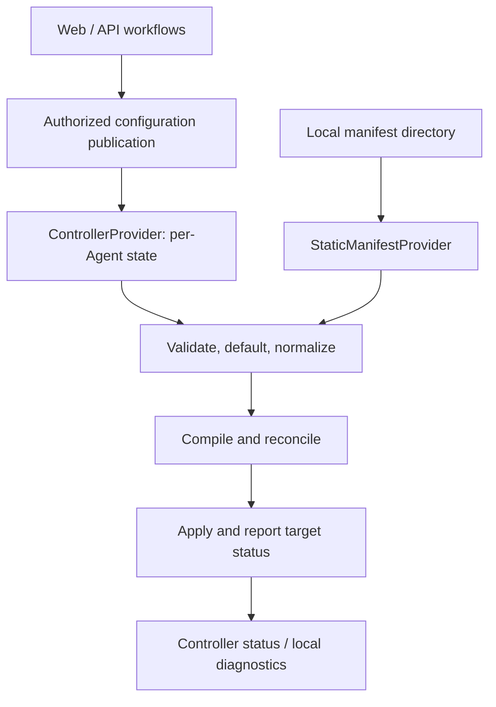

# PicketX Configuration and Domain Model

> English (default) | [简体中文](CONFIGURATION_MODEL.zh-CN.md)

| Field | Value |
| --- | --- |
| Version | v0.1.0 |
| Date | 2026-10-08 |
| Status | Agreed model boundaries and selection semantics; detailed schemas remain under design |
| Related documents | [Architecture v0.7.0](ARCHITECTURE.md), [Product v0.4.0](PRODUCT_DESIGN.md) |

This document records the modeling decisions made on 2026-10-07 and 2026-10-08. It is the focused design authority for configuration boundaries, Resource/Endpoint selection, and Agent bindings. YAML examples are proposed contract notation, not an implemented parser, published OpenAPI/protobuf schema, or production-ready configuration. Unsettled details are listed in section 13; examples must not silently settle them.

## 1. Three model boundaries

| Layer | Objects and information | Responsibility |
| --- | --- | --- |
| Control-plane business | Users, groups, management permissions, AccessRequest, approval records, workflow state, notifications, authorization provenance | Decide who may request, approve, create, or revoke access |
| Standard configuration | Resource, Endpoint, typed Subject, Scope, Grant, enforcement Policy, EnforcementBinding | Describe the desired protection and permissions through a versioned contract |
| Agent execution | Per-Agent desired snapshot, compiled plan, effective permissions, LKG, target status | Validate, compile, reconcile, apply, expire, recover, and report |

The Web/API and persistence models may evolve independently of Agent configuration. They must translate through an explicit contract boundary rather than serialize database rows or UI form state directly to Agents. Multi-step approvals, external tickets, and notifications do not become Agent responsibilities.

Independence does not permit divergent authorization semantics. Official Go components reuse shared validation, defaulting, selector, IP/CIDR, permission-union, and lifetime semantics. Other implementations need conformance checks against the public contract. An execution target must reject requirements it cannot fulfill rather than silently weaken them.

Example: a user asks for eight hours, an approver grants two, and the Controller publishes a two-hour Grant. The original request, approval comments, and workflow history remain in the control plane. The Agent receives the effective authorization declaration and necessary provenance identifiers. Approval, Grant validity, and confirmed application remain separate facts.

## 2. One contract, two authoritative providers



The two provider branches are alternatives. One Agent instance has exactly one authoritative Security Desired State provider at a time:

- **Controller Mode:** local runtime settings configure the process, but local Resource, Grant, Policy, or Binding manifests never add to or override Controller state. Ignore such manifests with a clear warning; no fallback merge on disconnection.
- **Static Manifest Mode:** the complete local YAML directory is authoritative. Parse all documents, validate references and capabilities, normalize, and compile before accepting a candidate. Invalid candidates retain the previous valid state; expiration of existing Grants continues independently of reload success.
- Provider changes replace complete state rather than layer sources. Bind LKG to provider type and identity. Retain the architecture's per-target atomicity and failure-reporting boundaries.

Both inputs converge on the same local desired-state semantics. They need not carry identical payloads: a Controller can resolve global selectors and send only a node projection; a static directory need not contain users or cluster-wide inventory. Every projection preserves the relevant constraints, provenance, deadlines, and owned-target inventory.

In static mode the local runtime supplies execution identity/capabilities without requiring Controller enrollment. The exact local Agent naming and binding-resolution convention remains to be specified. Remote snapshot/delta envelopes likewise remain separate from the manifest syntax.

## 3. Object form, identity, and defaults

Use Kubernetes-inspired `apiVersion`, `kind`, `metadata`, `spec`, and system-maintained `status`. This borrows an object pattern without requiring Kubernetes, etcd, or a generic CRD platform.

- `metadata.name` identifies an object within its kind; labels support grouping and selection, while annotations carry non-selection metadata.
- **No Namespace object or `metadata.namespace` in the current model.** Declarative keys are unique by `(kind, name)` after API-version normalization. File boundaries do not create separate identity domains, and duplicate definitions fail validation.
- Stable internal identifiers support provenance and references across display changes. Their exact wire representation and delete/recreate rules remain open.
- Defaults are applied consistently before semantic comparison and compilation. Omitting a default and spelling it explicitly should produce the same canonical intent.
- Missing, explicit `null`, and empty collections must remain distinguishable wherever they have different selection semantics. Decoders/serializers must not turn invalid emptiness into omission and thereby broaden access.
- Strict unknown-field validation is a required guard against misspelled restrictions being discarded. `status` is not a user-authored proof of successful enforcement.

## 4. Resource and Endpoint

A **Resource** is a logical protected service, such as development Gitea. It contains multiple named **Endpoints**, such as HTTPS and SSH. Endpoint names are unique within their Resource. Endpoints are initially embedded entries, not separately managed top-level objects.

| Field | Meaning |
| --- | --- |
| Resource metadata | Identity, labels, and descriptive metadata |
| `spec.endpoints` | The service's declared entries |
| Endpoint `name` | Reference name within the Resource |
| Endpoint `labels` | Labels used by Endpoint selectors |
| Endpoint `type` | Defaults to `network` |
| Endpoint `network.protocol` | Transport protocol; no protocol default has been agreed |
| Endpoint `network.port` | Destination port in the examples; ranges and alternate-port mapping remain open |
| Endpoint `network.addresses` | Optional destination IP/CIDR match set, not an upstream address list |

```yaml
apiVersion: picketx.io/v1alpha1
kind: Resource
metadata:
  name: dev-gitea
  labels:
    environment: development
spec:
  endpoints:
    - name: https
      labels:
        access: developer
        interface: web
      network:
        protocol: TCP
        port: 443
    - name: ssh
      labels:
        access: developer
        interface: git
      network:
        protocol: TCP
        port: 22
```

The omitted `type` is `network`. This configuration does not ask PicketXD to listen on these ports, connect to a backend, terminate TLS, or proxy traffic. The existing service continues handling connections.

### 4.1 Destination addresses

`addresses` is an array supporting individual IPv4/IPv6 addresses and CIDRs; entries form a union. Normalize individual addresses to `/32` or `/128` internally. Duplicates and overlapping prefixes may be deduplicated without changing the match set.

```yaml
network:
  protocol: TCP
  port: 443
  addresses:
    - 10.0.0.20
    - 10.0.0.21
    - 10.20.0.0/24
    - "2001:db8::20"
    - "2001:db8:20::/64"
```

- Omission means no destination-address restriction **inside the binding's enforcement scope**, for both IPv4 and IPv6. It never means taking ownership of all traffic on the machine.
- A nonempty array limits destinations to the listed union. IPv4-only entries do not also match IPv6.
- Explicit `[]`, `null`, invalid IP/CIDR, or a hostname are invalid in this address field. DNS-based destinations would require a separately designed capability.
- Subject IP/CIDR identifies the **source**; Endpoint addresses identify the **destination**.
- An address list is not paired positionally with Agent entries. Multiple hosts protecting their own TCP/443 normally omit addresses and use a multi-Agent binding.

### 4.2 Actions and changes

Actions belong to authorization Scope, not destination-address matching. Omitted actions use the default defined by the selected Endpoint type: `connect` for a network Endpoint. Omission never means every possible action. Each future type must define its default and capability requirements; mixed-type selections resolve defaults per Endpoint.

Adding an Endpoint expands a whole-Resource selection, while a named selection remains limited to its declared names. Destination/port edits, Endpoint renames, and delete/recreate identity behavior need a dedicated lifecycle decision before implementation; do not infer that every such change is automatically authorized.

## 5. Reusable resource selection and Grant

A resource-selection item contains exactly one of `resourceRef` or `resourceSelector`, plus optional Endpoint restrictions. Grant scopes and EnforcementBinding resources reuse this selection structure; only a Grant scope adds authorization actions and contributes access permission.

| Endpoint fields | Meaning |
| --- | --- |
| Both absent | All Endpoints of each selected Resource, including future additions |
| Nonempty `endpointNames` | Only the named Endpoints |
| Nonempty `endpointSelector` | Endpoints currently matching its label conditions |
| Both provided | Invalid |
| Explicit empty list, empty selector, or `null` | Invalid; omit the fields to express all |

There is no `allEndpoints` field. A selector with no current matches contributes no selected objects; it never becomes an unrestricted selection. Resource selection itself must be explicit. The exact support and validation for combining broad Resource selectors with Endpoint names remain a follow-up decision.

```yaml
scopes:
  - resourceRef:
      name: dev-gitea
    endpointNames: [https, ssh]
  - resourceRef:
      name: test-database
  - resourceRef:
      name: development-tools
    endpointSelector:
      matchLabels:
        access: developer
```

This is a selection fragment, not a complete Grant manifest. A Grant has **one typed Subject, one or more Scopes, and one shared validity/condition set**. Different subjects or lifetimes require separate Grants, though a single approved request can produce multiple Grants. Field names for the full Subject, validity, condition, and revocation schema remain open.

Each Grant retains its own identity and provenance. Effective network access is the union of active matching Grants constrained by explicit denies and conditions. Removing one contribution does not remove access supplied by another. Requester identity is not a network Subject, and packet inspection does not by itself establish a verified user identity.

Whole-Resource and label-selected grants deliberately have dynamic membership. UI and approval views must show that fact, current matches, and changes to the resolved scope. Selecting all currently visible entries and storing their names is different from omitting the Endpoint restriction.

## 6. Label selector semantics

Use `matchLabels` and `matchExpressions` with Kubernetes-style set operators. `matchLabels` expresses equality; all label requirements in one selector are ANDed. Values inside `In` are alternatives. Separate selection items form a union.

| Operator | Match | Values |
| --- | --- | --- |
| `In` | Key exists and its value belongs to the set | Nonempty |
| `NotIn` | Key is absent, or its value is outside the set | Nonempty |
| `Exists` | Key exists | Must not be supplied |
| `DoesNotExist` | Key is absent | Must not be supplied |

Combine `Exists` with `NotIn` on the same key when missing labels must not match. `NotIn` excludes candidates from this selection; it is **not** an explicit deny and cannot cancel a different Grant's allow.

Resource, Endpoint, and Agent labels are separate selection targets; labels are not implicitly inherited between them. Changing labels can change authorization or deployment membership. Such edits need appropriate management authorization and audit. Agent-controlled labels must not let a node assign itself to arbitrary protected deployments.

Empty selectors are rejected in this PicketX contract, even though other APIs may assign them a meaning. This is an intentional documented difference. More operators or nested Boolean expressions are not part of the current baseline.

## 7. EnforcementBinding and Agent selection

EnforcementBinding is an independent deployment relationship. Resource definitions do not embed Agent membership, and Agent runtime configuration does not become an additional policy source.

```yaml
apiVersion: picketx.io/v1alpha1
kind: EnforcementBinding
metadata:
  name: development-services
spec:
  resources:
    - resourceRef:
        name: dev-gitea
      endpointNames: [https, ssh]
    - resourceRef:
        name: test-database
  agents:
    - agentRef:
        name: development-01
    - agentSelector:
        matchLabels:
          environment: development
          role: application
```

Resource and Agent references in examples must exist in the applicable input/inventory when validation is implemented; this example does not define that inventory.

- `resources` and `agents` are nonempty lists. Each resource item has exactly one reference/selector; each Agent item has exactly one `agentRef`/`agentSelector`.
- Agent items form a union and matching Agents are deduplicated. This is not scheduling or load balancing: every matching Agent is a target.
- Selected resource entries apply to **every** selected Agent: a cross-product, never positional pairing. Different placements or execution settings require separate Bindings.
- Omitted Endpoint restrictions include all Endpoints within selected Resources. Missing Agent selection never means all Agents.
- Validate the Binding as a complete configuration object. Application outcomes across its targets are reported independently; configuration acceptance does not imply a cross-machine transaction.
- No Agent matches means no confirmed execution location. An offline Agent remains a desired target with stale/unknown status, rather than disappearing because its heartbeat was lost.

Identical contributions to the same Resource/Endpoint/Agent/execution context can share an implementation, but provenance must retain every contributing Binding. Removing one Binding preserves other contributions. Incompatible settings for the same target require a conflict result, never last-writer-wins.

## 8. Host and gateway enforcement

Host deployment is the default experience: install an Agent on the service host and protect declared entries. Omitted addresses cover matching destinations only within that host deployment's declared scope. Protecting container-published services on the host is also a target scenario; the adapter must account for their actual traffic path instead of assuming every local service uses one input hook.

Gateway support means installing an Agent on an existing traffic path and controlling transit access. PicketX does not create routing, DHCP, tunnels, or application forwarding. Gateway behavior must be explicitly selected, independent of Controller/Static mode; omitting addresses must never silently turn host enforcement into transit enforcement.

At a gateway, a populated destination set narrows downstream targets. Omitting it covers all destinations within the binding's declared transit scope, which must be visible to the operator. NAT observation stage, ingress/egress scope, translated ports, and exact `enforcement` fields require a separate adapter design. Unsupported gateway requirements must be rejected, not downgraded to host behavior.

The same Resource can be protected at both host and gateway positions through separate Bindings. Report both positions; success at one does not prove success at the other. Source matching always uses the address observed at the applicable enforcement point, which can differ from the portal's observation.

## 9. Per-Agent projection and rule growth

The Controller resolves bindings and sends each Agent only its relevant desired state. An Agent should not receive every global Grant and inject unrelated rules. Static mode resolves local relevance through the same model using local execution context.

Each projection must contain the complete local protection contract:

1. Protected Endpoint definitions and owned enforcement scope.
2. Relevant active Grant contributions, deadlines, and conditions.
3. Applicable restrictions, including broader denies that affect those entries.
4. Provenance and revision information sufficient for reconciliation.
5. Enough desired inventory/delta deletion information to withdraw obsolete owned state.

Projection must preserve relevant constraints, not merely copy allow rules that directly name a Resource. If the last Grant expires, protection remains and new connections are denied unless another valid allow applies. Removing the last Binding is different: it withdraws protection responsibility at that target and must be shown as such.

Do not generate one kernel rule per Grant. Aggregate effective permissions and use shared rules/sets where the backend supports them. Preserve independent contributions and lifetimes per effective permission; never widen addresses, actions, or expiry just to reduce rule count. Incremental transport is an optimization over a reconstructible complete desired state.

## 10. Isolation without Namespace

Current isolation is provided by object identity, management authorization, contribution tracking, explicit references, and conflict validation. Labels group/select objects; file layout, Binding names, and Agent names are not tenant boundaries.

No Namespace is introduced merely to prevent configuration collisions. Separate administrative spaces, duplicate names across tenants, cross-space sharing, and tenant-wide lifecycle operations are future requirements that would justify revisiting the decision.

Distinct logical Resources can still overlap in actual traffic space. Two services sharing the same destination/protocol/port cannot acquire independent L4 identities just from different names. Validate overlapping enforcement claims and reject incompatible isolation promises; a shared-protection model or richer protocol adapter requires explicit design. Sharing identical contributions to one Resource is different from silently combining unrelated Resources.

## 11. Workflow, runtime, and status models

| Concept | Placement and boundary |
| --- | --- |
| User, Group, Role/RoleBinding, IdentityProvider | Control-plane identity/management models; detailed schemas not settled |
| AccessRequest and Approval | Retain requested versus approved content; Agent does not run the approval workflow |
| Requester/Approver/Actor | Provenance of operations; not automatic packet identities |
| Policy | Separate request eligibility/grant issuance from runtime restrictions and request-time protocol authorization |
| AuthorizationContext and Decision | Request-time AuthZ integration; not the portal AccessRequest |
| AuditEvent | Configuration/authorization/execution lifecycle evidence, not application behavior recording |
| EffectivePermissionSet and compiled plan | Rebuildable execution results; not new authorization sources |
| Lease/activity state | Optional lifetime/renewal machinery; not another independent source of permission |

`AccessPolicy` and `RestrictionPolicy` are candidate names for different responsibilities, not finalized API kinds. Detailed Subject types, workflow states, policy expressions, renewal contracts, and plugin/WASM objects are subsequent modeling tasks. Do not require a SourceSession for every Grant merely because older architecture text discussed sessions.

Agents report desired/applied revisions, observation time, per-target outcomes, capability failures, and pending cleanup. The UI distinguishes valid authorization from confirmed current application, including partial, failed, offline, and stale outcomes. User input cannot set successful execution status.

Time-bounded configuration stores an absolute deadline. Reload, restart, Controller loss, or a failed candidate must not reset the authorization clock. Graceful/strict connection handling and any declared expiry delay retain the architecture's explicit contracts.

## 12. Conformance and validation targets

These are future implementation acceptance cases, not claims of passing runtime tests:

| Case | Required result |
| --- | --- |
| Explicit `type: network`/`connect` versus omitted defaults | Equivalent canonical network intent |
| Omitted Endpoint restrictions versus `[]`, `{}`, or `null` | All selected Resource entries versus validation error |
| Add Endpoint after named versus whole-Resource authorization | Named scope unchanged; whole-Resource scope expands visibly |
| `NotIn` with a missing label; with additional `Exists` | Match; no match |
| Dual-stack addresses, overlapping CIDRs, IPv4-only list | Correct union and family boundary, no source/destination confusion |
| Multiple resources and Agents, including duplicate matches | Cross-product with deduplication, no positional pairing |
| Binding removal with another contribution remaining | Preserve required protection and permissions |
| Last Grant expires while Binding remains | Keep protection; withdraw only expired access |
| Controller Mode with local policy manifests | No local policy contribution |
| Invalid static snapshot or restarted Agent | Keep valid state while honoring original deadlines |
| Dynamic selector change, offline or unsupported target | Reconcile additions/removals and report actual status |
| Equivalent remote and static input | Equivalent local semantics; global payloads need not be identical |

Before publishing schemas, verify presence-sensitive decoding and re-encoding, strict unknown-field handling, stable snapshot publication, and default/schema compatibility across Agent versions. A debounce interval alone is not a multi-file transaction.

## 13. Follow-up decisions

| Area | Still to specify |
| --- | --- |
| Identity and lifecycle | UID representation; rename/delete/recreate; dangling references; destination or port changes under existing Grants |
| Subject and Grant | Full field schemas, condition language, explicit permanent authorization, revocation, absolute validity and optional renewal |
| Policy and workflow | Eligibility versus restriction schemas, approval states, management RBAC and provenance retention |
| Selection | Reference-resolution rules, names under broad selectors, selector result limits and diagnostics |
| Agent/Binding | Enrollment versus static local identity, execution config fields, ownership conflict resolution and cleanup acknowledgments |
| Network adapter | Host/container coverage, gateway/NAT match stage, port translation, permitted transit scope |
| Protocol | Manifest schema, projected snapshot envelope, version negotiation, deletion/delta and capability conformance |

Resolve these topics incrementally and synchronize both language editions. Do not implement a generic tenancy framework, workflow engine, or arbitrary selector language in order to complete this model.

## Revision history

| Version | Date | Change |
| --- | --- | --- |
| v0.1.0 | 2026-10-08 | Recorded three model boundaries, shared providers, Resource/Endpoint defaults and selection, IP/CIDR destination arrays, multi-resource/multi-Agent bindings, projection, isolation without Namespace, and remaining design questions. |
