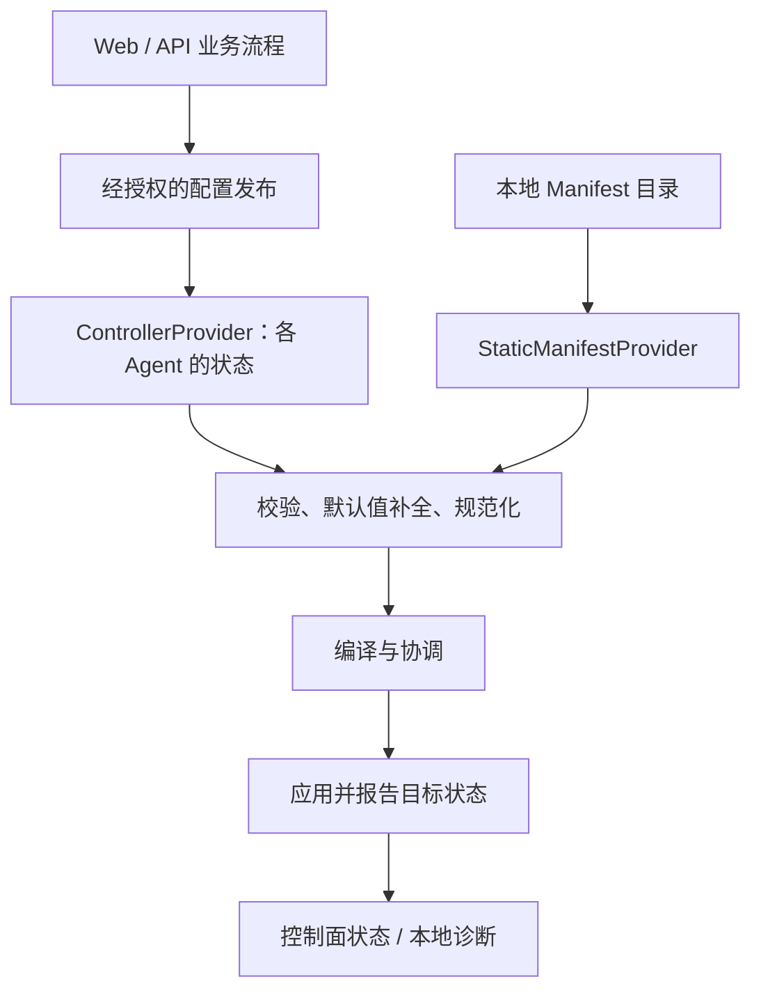

# PicketX 配置与领域模型设计

> [English (Default)](CONFIGURATION_MODEL.md) | 简体中文

| 字段 | 内容 |
| --- | --- |
| 版本 | v0.1.0 |
| 日期 | 2026-10-08 |
| 状态 | 模型边界与选择语义已确认；详细 Schema 继续设计 |
| 关联文档 | [架构 v0.7.0](ARCHITECTURE.zh-CN.md)、[产品 v0.4.0](PRODUCT_DESIGN.zh-CN.md) |

本文记录 2026-10-07 至 2026-10-08 的建模决策，作为配置边界、Resource/Endpoint 选择与 Agent 绑定的专项设计依据。YAML 示例是拟议契约表达，不代表已经实现的解析器、已发布的 OpenAPI/protobuf Schema 或可用于生产的完整配置。尚未确定的内容见第 13 节，不通过示例暗中定案。

## 1. 三层模型边界

| 层次 | 对象与信息 | 职责 |
| --- | --- | --- |
| 控制面业务层 | 用户、组、管理权限、AccessRequest、审批记录、流程状态、通知、授权来源 | 决定谁可以申请、审批、创建或撤销访问权限 |
| 标准配置层 | Resource、Endpoint、带类型的 Subject、Scope、Grant、执行策略 Policy、EnforcementBinding | 通过版本化契约表达期望的保护范围与权限 |
| Agent 执行层 | 各 Agent 的期望快照、编译计划、有效权限、LKG、目标状态 | 校验、编译、协调、应用、过期、恢复与反馈 |

Web/API 与持久化模型可以独立于 Agent 配置演进，但必须经过明确的契约转换边界，不能把数据库行或 UI 表单直接序列化后下发。多级审批、外部工单、通知不成为 Agent 的职责。

独立演进不允许授权语义分叉。官方 Go 组件复用校验、默认值、选择器、IP/CIDR、权限并集与有效期语义；其他实现需要通过公开契约的一致性验证。执行目标无法兑现要求时，应拒绝配置，不能静默降低要求。

例如，用户申请八小时、审批人批准两小时，Controller 发布两小时的 Grant。原始申请、审批意见与流程历史留在控制面，Agent 接收有效授权声明及必要的来源标识。审批通过、Grant 有效、确认实施仍是三个不同事实。

## 2. 一个契约，两种权威来源



两条 Provider 路径二选一。同一 Agent 实例同一时刻只有一个 Security Desired State 权威来源：

- **Controller Mode：**本地 Runtime Config 配置进程，但本地 Resource、Grant、Policy、Binding 不增加或覆盖控制面状态。忽略这类 Manifest 并明确告警，断连时也不回退为混合来源。
- **Static Manifest Mode：**完整 YAML 目录为权威来源。先解析所有文档，校验引用与能力，完成规范化、编译，再接纳候选。无效候选保留上一版有效状态；已有 Grant 的到期处理不依赖重载是否成功。
- 切换 Provider 替换完整状态，不叠加来源。LKG 绑定 Provider 类型与身份；原架构关于逐目标原子性及失败反馈的约束继续有效。

两类输入最终形成相同的本地期望状态语义，但不要求携带完全相同的数据：Controller 可以解析全局选择器后只发送节点投影，本地目录也不需要包含用户或整个集群清单。投影必须保留相关约束、来源、截止时间与自有目标清单。

Static Mode 下，本地 Runtime 提供执行身份和能力，不要求先向 Controller 注册。具体的本地 Agent 命名与绑定解析约定仍需细化；远程 Snapshot/Delta 封装同样独立于 Manifest 的书写格式。

## 3. 对象形式、身份与默认值

借鉴 Kubernetes 的 `apiVersion`、`kind`、`metadata`、`spec` 及系统维护的 `status`，不因此依赖 Kubernetes、etcd 或通用 CRD 平台。

- `metadata.name` 标识同一种类内的对象；标签用于分组与选择，annotations 承载不参与选择的元数据。
- **当前不引入 Namespace 对象或 `metadata.namespace`。** 声明对象在 API 版本规范化后以 `(kind, name)` 唯一；文件边界不创建独立身份域，重复定义校验失败。
- 稳定内部标识支持来源追踪及显示信息变化后的引用；具体线上表达和删除重建语义仍待确定。
- 默认值在语义比较、编译前统一补全；省略默认值与显式填写默认值应产生相同的规范化意图。
- 当选择语义不同，必须区分字段缺失、显式 `null` 和空集合。解析及重新序列化不能把无效空值变成省略，从而扩大权限。
- 必须严格校验未知字段，防止拼错的限制字段被丢弃。用户填写的 `status` 不能证明已经成功实施。

## 4. Resource 与 Endpoint

**Resource** 表示受保护的逻辑服务，例如开发 Gitea，包含 HTTPS、SSH 等多个具名 **Endpoint**。Endpoint 名称在所属 Resource 内唯一。初期作为内嵌条目，不作为独立管理的顶层对象。

| 字段 | 含义 |
| --- | --- |
| Resource metadata | 身份、标签和描述性元数据 |
| `spec.endpoints` | 服务声明的入口集合 |
| Endpoint `name` | 在 Resource 内用于引用的名称 |
| Endpoint `labels` | Endpoint 选择器匹配的标签 |
| Endpoint `type` | 默认 `network` |
| Endpoint `network.protocol` | 传输协议；尚未约定协议默认值 |
| Endpoint `network.port` | 示例中的目标端口；端口范围和部署端口映射待定 |
| Endpoint `network.addresses` | 可选目标 IP/CIDR 匹配集合，不是上游地址列表 |

```yaml
apiVersion: picketx.io/v1alpha1
kind: Resource
metadata:
  name: dev-gitea
  labels:
    environment: development
spec:
  endpoints:
    - name: https
      labels:
        access: developer
        interface: web
      network:
        protocol: TCP
        port: 443
    - name: ssh
      labels:
        access: developer
        interface: git
      network:
        protocol: TCP
        port: 22
```

省略的 `type` 为 `network`。该配置不要求 PicketXD 监听这些端口、连接后端、终止 TLS 或代理流量，已有服务继续自行处理连接。

### 4.1 目标地址

`addresses` 为数组，支持单个 IPv4/IPv6 地址与 CIDR，各项取并集。单 IP 在内部规范化为 `/32` 或 `/128`。重复地址和重叠前缀可以去重，但不能改变匹配集合。

```yaml
network:
  protocol: TCP
  port: 443
  addresses:
    - 10.0.0.20
    - 10.0.0.21
    - 10.20.0.0/24
    - "2001:db8::20"
    - "2001:db8:20::/64"
```

- 省略表示在**绑定的执行范围内**不限制目标地址，同时适用于 IPv4、IPv6；绝不表示接管主机全部流量。
- 非空数组将目标限制在列出的并集中；仅列出 IPv4 不会同时匹配 IPv6。
- 显式 `[]`、`null`、无效 IP/CIDR 或主机名均无效；基于 DNS 的目标需要单独设计能力。
- Subject IP/CIDR 表示**来源**，Endpoint addresses 表示**目标**。
- 地址数组不与 Agent 条目按位置配对。多台主机分别保护本机 TCP/443 时，通常省略地址并使用多 Agent 绑定。

### 4.2 动作与变更

Actions 属于授权 Scope，不属于目标地址匹配。省略 Actions 使用选中 Endpoint 类型定义的默认动作：网络入口为 `connect`，绝不表示全部可能动作。未来每种类型分别定义默认动作与能力要求，混合类型按每个 Endpoint 解析默认值。

新增 Endpoint 会扩展整个 Resource 的选择，具名选择仍受原有名称清单限制。目标地址/端口修改、Endpoint 重命名、删除重建身份，必须在实现前形成专门的生命周期决策，不能推断所有这类变化都已经得到自动授权。

## 5. 可复用资源选择与 Grant

每个资源选择项必须在 `resourceRef`、`resourceSelector` 中二选一，另可包含 Endpoint 限制。Grant 的 Scopes 与 EnforcementBinding 的 resources 复用该选择结构；只有 Grant Scope 增加授权动作并贡献访问权限。

| Endpoint 字段 | 含义 |
| --- | --- |
| 两个字段都省略 | 每个选中 Resource 的全部 Endpoint，包括未来新增入口 |
| 非空 `endpointNames` | 仅具名入口 |
| 有条件的 `endpointSelector` | 当前匹配标签条件的入口 |
| 两者同时提供 | 无效 |
| 显式空列表、空选择器或 `null` | 无效；表达全部时应省略字段 |

不保留 `allEndpoints` 字段。选择器当前无匹配对象时，贡献空选择，不能变成无限制选择。Resource 本身必须显式选择；宽泛 Resource 选择器与 Endpoint 名称组合的具体支持及校验规则留待后续确定。

```yaml
scopes:
  - resourceRef:
      name: dev-gitea
    endpointNames: [https, ssh]
  - resourceRef:
      name: test-database
  - resourceRef:
      name: development-tools
    endpointSelector:
      matchLabels:
        access: developer
```

这是选择片段，不是完整 Grant Manifest。一个 Grant 包含**一个带类型的 Subject、一个或多个 Scope、一套共享有效期与条件**。主体或有效期不同，需要拆成不同 Grant；同一次获批申请可以生成多份 Grant。完整 Subject、有效期、条件与撤销 Schema 的字段名仍待确定。

每份 Grant 保留自己的身份与来源。有效网络权限为当前有效且匹配的 Grant 并集，再受显式拒绝与条件约束；移除一份贡献不撤销其他贡献仍提供的权限。申请人身份不是网络 Subject，数据包解析本身也不建立可信用户身份。

整个 Resource 与标签选择授权有意采用动态成员关系。UI 和审批视图必须展示这一事实、当前匹配结果，以及解析范围的变化。“全选当前可见入口并保存名称”与“省略 Endpoint 限制”不同。

## 6. 标签选择器语义

使用 `matchLabels`、`matchExpressions` 与 Kubernetes 风格集合操作符。`matchLabels` 表示相等匹配，同一选择器内所有标签条件为 AND；`In` 的值是备选集合，不同选择项取并集。

| 操作符 | 匹配条件 | Values |
| --- | --- | --- |
| `In` | Key 存在，且值属于集合 | 非空 |
| `NotIn` | Key 不存在，或值不属于集合 | 非空 |
| `Exists` | Key 存在 | 不得提供 |
| `DoesNotExist` | Key 不存在 | 不得提供 |

如果缺少标签不得匹配，应对同一个 Key 同时使用 `Exists` 与 `NotIn`。`NotIn` 只从本次选择中排除候选，**不是**显式拒绝，不能取消另一份 Grant 的允许。

Resource、Endpoint、Agent 标签属于不同选择对象，不隐式继承。标签修改可能改变授权或部署范围，因此需要相应管理权限与审计；不能允许 Agent 通过自行声明标签，把自己加入任意受保护部署。

PicketX 契约拒绝空选择器，即使其他 API 可能为其赋予含义。这是有意且明确记录的差异；更多操作符或嵌套布尔表达式不属于当前基线。

## 7. EnforcementBinding 与 Agent 选择

EnforcementBinding 是独立部署关系。Resource 不内嵌 Agent 成员清单，Agent Runtime Config 也不成为额外的策略来源。

```yaml
apiVersion: picketx.io/v1alpha1
kind: EnforcementBinding
metadata:
  name: development-services
spec:
  resources:
    - resourceRef:
        name: dev-gitea
      endpointNames: [https, ssh]
    - resourceRef:
        name: test-database
  agents:
    - agentRef:
        name: development-01
    - agentSelector:
        matchLabels:
          environment: development
          role: application
```

实现校验时，示例中的资源和 Agent 引用必须存在于相应输入或节点清单中；本示例没有定义这些清单。

- `resources`、`agents` 均为非空列表。每个资源项的引用/选择器二选一，每个 Agent 项的 `agentRef`/`agentSelector` 二选一。
- Agent 列表取并集并去重。这不是调度或负载均衡，所有匹配 Agent 都是目标。
- 选中的资源入口应用于**所有**选中的 Agent，即笛卡尔积，不按数组位置配对。部署位置或执行参数不同，需要拆分 Binding。
- Endpoint 限制省略时包含所选资源的全部入口；缺少 Agent 选择绝不表示全部 Agent。
- Binding 作为完整配置对象校验，各目标的应用结果分别报告；配置接纳不代表跨机器事务。
- 没有匹配 Agent 表示没有确认的实施位置。Agent 离线仍是期望目标，状态为陈旧或未知，不能因为心跳丢失就从目标清单消失。

相同 Resource/Endpoint/Agent/执行上下文的相同贡献可以共用实施结果，但来源中必须保留每个 Binding。删除一份 Binding 保留其他贡献；同一目标的不兼容配置必须报告冲突，不能后写覆盖前写。

## 8. 主机与网关实施

默认体验是在服务所在主机安装 Agent，保护声明的入口。省略地址只在该主机部署声明的范围内匹配目标。在主机上保护容器发布服务也属于目标场景；适配器必须处理实际流量路径，不能假定所有本机服务都经过单一输入 Hook。

网关支持是在既有流量路径上安装 Agent，控制经过它的访问。PicketX 不创建路由、DHCP、隧道或应用转发。网关行为必须显式选择，与 Controller/Static Mode 无关；省略地址不能暗中把主机实施变成转发实施。

网关上的目标地址集合限制下游目标；省略地址覆盖绑定所声明转发范围内的所有目标，必须向管理员清楚展示。NAT 观察阶段、出入接口范围、转换后的端口及具体 `enforcement` 字段需要专门的适配器设计。不支持的网关要求必须拒绝，不能降级成主机行为。

同一 Resource 可通过不同 Binding 同时在主机和网关保护，并分别报告结果；一处成功不证明另一处成功。来源匹配始终使用相应执行点实际观察到的地址，可能不同于门户观察结果。

## 9. 按 Agent 投影与规则规模

Controller 解析绑定，只向每个 Agent 发送与其有关的期望状态。Agent 不应接收所有全局 Grant 并注入无关规则。Static Mode 通过相同模型及本地执行上下文确定相关范围。

每份投影必须包含完整的本地保护契约：

1. 被保护的 Endpoint 定义与自有执行范围。
2. 相关有效 Grant 贡献、截止时间与条件。
3. 适用限制，包括影响这些入口的宽范围拒绝策略。
4. 协调所需的来源和版本信息。
5. 足够的期望清单或增量删除信息，用于撤除过时的自有状态。

投影必须保留相关约束，不能只复制直接引用 Resource 的允许规则。最后一份 Grant 到期后，保护仍然存在；若无其他有效允许，新连接被拒绝。删除最后一份 Binding 则是撤除该执行位置的保护责任，必须按这一含义呈现。

不能每份 Grant 都生成一条内核规则。先聚合有效权限，再按后端能力使用共享规则或集合；同时保留每项有效权限的独立贡献与有效期，不能为减少规则而扩大地址、动作或延长到期时间。增量传输是对可重建完整期望状态的优化。

## 10. 不引入 Namespace 的隔离设计

当前隔离由对象身份、管理权限、贡献追踪、明确引用与冲突校验提供。标签用于分组和选择，文件布局、Binding 名称或 Agent 名称不是租户边界。

不为避免配置冲突而引入 Namespace。独立管理空间、租户内同名对象、跨空间共享、租户整体生命周期等明确需求出现时，再重新评估。

不同逻辑 Resource 仍可能在实际流量范围上重叠。同一目标地址/协议/端口上的两个服务，不会因为名称不同就得到独立的 L4 身份。应校验重叠的执行声明，拒绝无法兑现的隔离承诺；共享保护模型或更丰富的协议适配必须明确设计。同一 Resource 的重复贡献共享实施，与暗中合并无关 Resource 是两回事。

## 11. 业务流程、运行时与状态模型

| 概念 | 所属与边界 |
| --- | --- |
| User、Group、Role/RoleBinding、IdentityProvider | 控制面身份与管理模型，具体 Schema 待定 |
| AccessRequest 与 Approval | 保留申请内容与批准内容的区别；Agent 不执行审批流程 |
| Requester/Approver/Actor | 操作来源，不自动成为数据包身份 |
| Policy | 区分申请资格/授权产生、运行时限制、请求时协议授权 |
| AuthorizationContext 与 Decision | 请求时 AuthZ 集成，不是门户 AccessRequest |
| AuditEvent | 配置、授权、执行生命周期证据，不是应用行为记录 |
| EffectivePermissionSet 与编译计划 | 可重建执行结果，不是新授权源 |
| Lease/活动状态 | 可选的有效期与续期机制，不是另一套独立权限来源 |

`AccessPolicy`、`RestrictionPolicy` 是不同职责的候选名称，不是已定案的 API Kind。详细 Subject 类型、流程状态、策略表达、续约契约、Plugin/WASM 对象继续逐项建模。不能因为旧架构讨论过会话，就要求每个 Grant 必须存在 SourceSession。

Agent 报告期望/已应用版本、观察时间、逐目标结果、能力失败和待清理状态。UI 区分有效授权与确认的当前实施结果，包括部分成功、失败、离线和陈旧；用户输入不能设置成功执行状态。

限时配置保存绝对截止时间。重载、重启、Controller 断连、候选失败均不能重置授权时钟。Graceful/Strict 连接处理及声明的过期延迟继续遵循架构中的明确契约。

## 12. 一致性与校验目标

以下是未来实现验收用例，不代表运行时测试已经通过：

| 用例 | 要求 |
| --- | --- |
| 显式 `type: network`/`connect` 与省略默认值 | 相同规范化网络意图 |
| 省略 Endpoint 限制与 `[]`、`{}`、`null` | 所选资源全部入口，与校验错误，分别处理 |
| 具名授权与整个 Resource 授权后新增 Endpoint | 名称范围不变；整个资源范围可见地扩展 |
| 缺失标签的 `NotIn`，再附加 `Exists` | 前者匹配，后者不匹配 |
| 双栈地址、重叠 CIDR、仅 IPv4 列表 | 正确并集及地址族边界，不混同来源与目标 |
| 多资源、多 Agent，含重复匹配 | 笛卡尔积并去重，不按位置配对 |
| 删除 Binding，但仍有其他贡献 | 保留仍需要的保护与权限 |
| 最后一份 Grant 到期，Binding 仍在 | 保留保护，只撤销过期访问 |
| Controller Mode 存在本地策略 Manifest | 本地策略不贡献权限 |
| 无效静态快照或 Agent 重启 | 保持有效状态并遵守原有截止时间 |
| 动态选择变化、离线或不支持的目标 | 协调增删并反馈真实状态 |
| 等价远程与静态输入 | 本地语义一致，全局数据包不必完全相同 |

发布 Schema 前，验证字段存在性敏感的解码/重新编码、未知字段严格校验、稳定快照发布，以及不同 Agent 版本的默认值/Schema 兼容性。Debounce 时间本身不构成多文件事务。

## 13. 待决事项

| 领域 | 仍需确定 |
| --- | --- |
| 身份与生命周期 | UID 表达；重命名/删除/重建；悬空引用；已有 Grant 下目标地址或端口变化 |
| Subject 与 Grant | 完整字段、条件语言、显式永久授权、撤销、绝对有效期与可选续期 |
| 策略与流程 | 资格与限制 Schema、审批状态、管理 RBAC、来源保留 |
| 选择 | 引用解析、宽选择器下的名称、匹配规模限制与诊断 |
| Agent/Binding | 注册与静态本地身份、执行配置字段、所有权冲突处理、清理确认 |
| 网络适配器 | 主机/容器覆盖、网关/NAT 匹配阶段、端口转换、允许的转发范围 |
| 协议 | Manifest Schema、节点投影封装、版本协商、删除/增量、能力一致性 |

逐项确定并同步双语版本，不为完成当前模型而引入通用租户框架、流程引擎或任意选择器语言。

## 修订记录

| 版本 | 日期 | 变更 |
| --- | --- | --- |
| v0.1.0 | 2026-10-08 | 固化三层模型边界、双 Provider、Resource/Endpoint 默认值与选择、目标 IP/CIDR 数组、多资源/多 Agent 绑定、按节点投影、不引入 Namespace 的隔离及后续问题。 |
